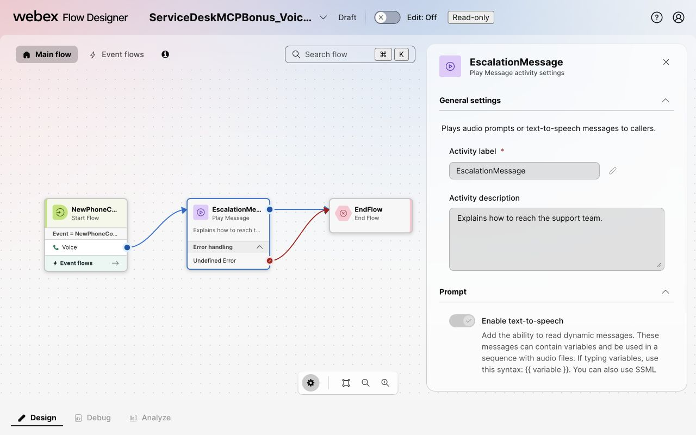
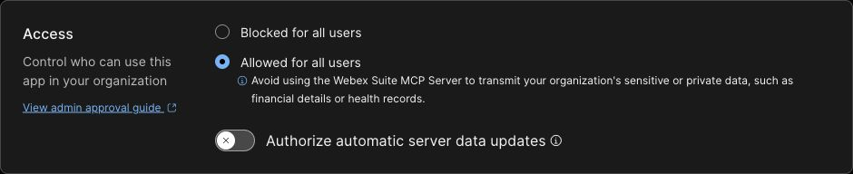
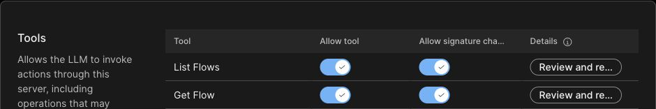
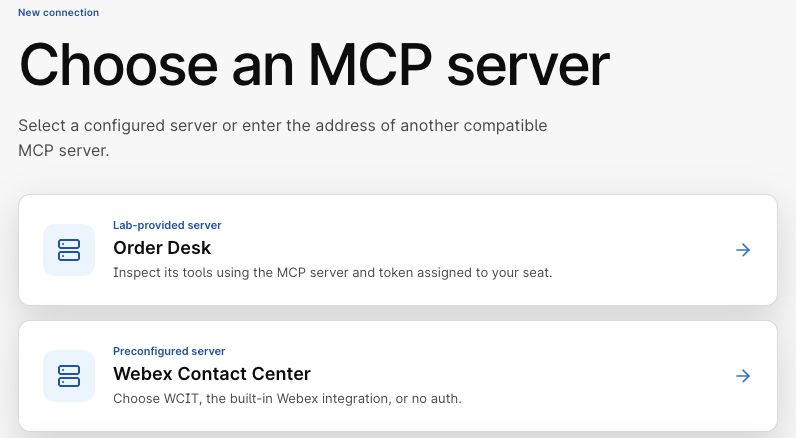
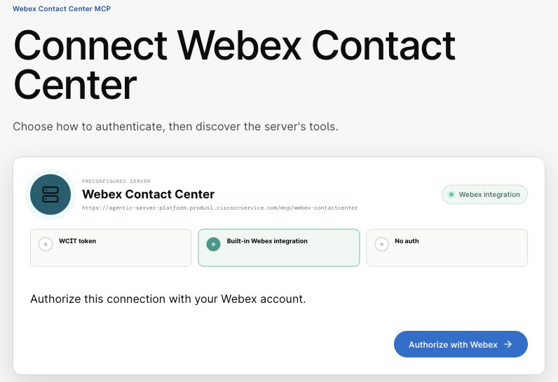
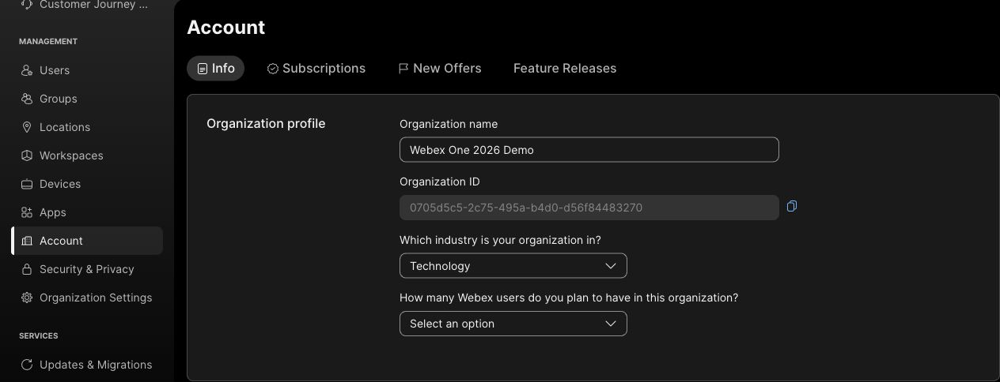
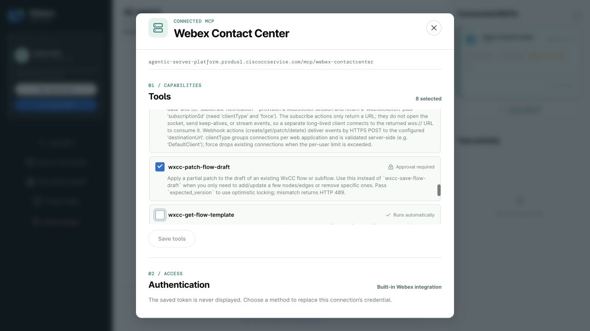
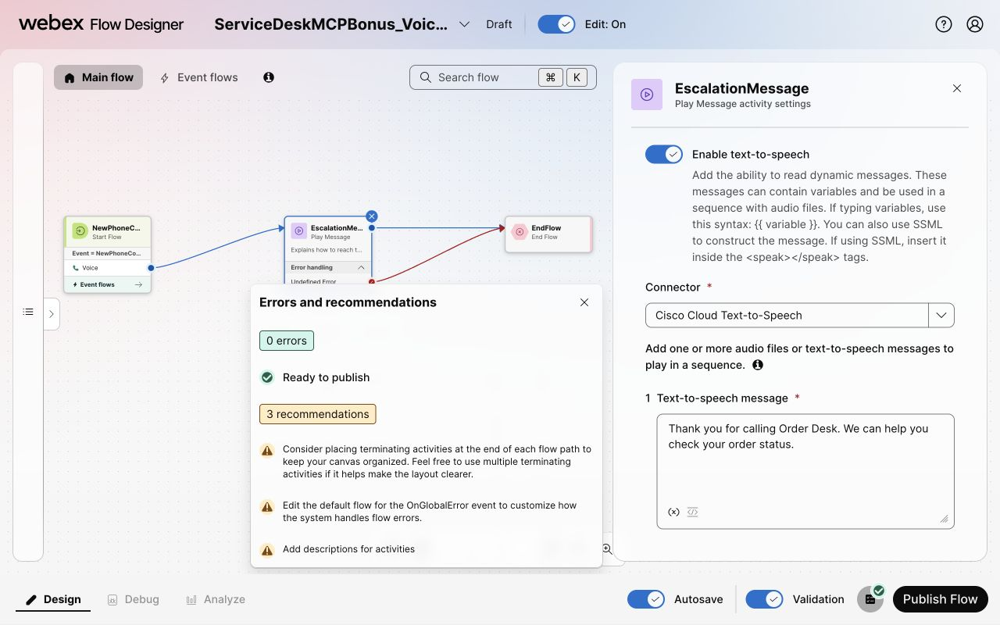
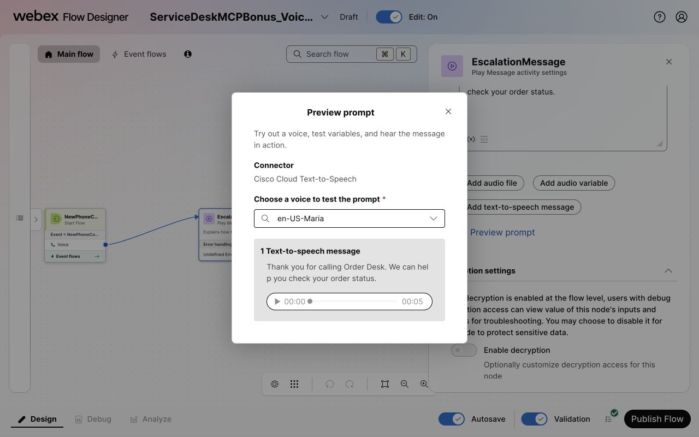

# Bonus: inspect and edit a draft through Contact Center MCP

Use the MCP Lab AI agent to inspect a small Contact Center flow, then change its spoken message through MCP. You will review and approve the change, check the saved message in Flow Designer, and optionally preview its audio. **You can do this bonus without completing the main lab.** Order Desk MCP reads a simulated business system; **Webex Contact Center MCP** reads and edits actual Contact Center flows.

Allow about **10–15 minutes** for inspection, plus **10–15 minutes** for the optional draft edit. If starting here, allow another **5–10 minutes** to sign in and import the practice flow. Use the administrator account assigned to your sandbox.

## Choose your starting point

- **Completed Checkpoint 9?** Keep your completed `ServiceDesk` and its routing unchanged. Import the separate practice flow below for this bonus; do not export or patch your completed flow.
- **Doing only the bonus?** Start below. You do not need an Order Desk connection, bearer token, Developer Portal registration, AI Agent Studio agent, queue setup, entry point, or phone call.

### Import the practice flow

1. Open [MCP Lab](https://mcp-lab.webexdevs.com/) and sign in with the lab token supplied by the facilitator. Open **Test tenant** and find your **Sandbox email** and **Sandbox password**.
2. [Download the bonus starter JSON](assets/lab-guide/ServiceDeskMCPBonus-starter.json){ download="ServiceDeskMCPBonus-starter.json" }. Save the file with its `.json` extension. Do not add credentials to it.
3. Open [Control Hub](https://admin.webex.com/) and sign in with those **Sandbox email** and **Sandbox password** details. Confirm that the organization is your assigned sandbox.
4. Open **Contact Center → Customer Experience → Flows → Manage Flows → Create Flows**. In Flow Designer, choose **Flow → Import a flow → Next**, then select the downloaded JSON.
5. Use `ServiceDeskMCPBonus` as the flow name and select **Create flow**. If that name already exists, use a different name and substitute it in the prompts below. Do not replace an existing flow.
6. Inspect the main canvas: `NewPhoneContact → EscalationMessage → EndFlow`. These are **Start Flow**, **Play Message**, and **End Flow** activities. Both the message's normal output and **Undefined Error** output connect to `EndFlow`. There is no queue, external data connection, or waiting loop. Leave the default **Event flows** unchanged.
7. Double-click `EscalationMessage`. Under **Prompt**, confirm **Enable text-to-speech** is on and **Connector** is **Cisco Cloud Text-to-Speech**. The **Text-to-speech message** reads: `Please contact our support team during business hours. Thank you for calling.` This is the spoken text you will change through MCP, not the activity description.
8. Turn on Flow Designer's **Validation** switch and open **Validation results**. Review the errors and recommendations; resolve any errors with the facilitator. Wait for Autosave, then turn **Edit: Off** before using MCP so the open editor cannot overwrite the MCP change. Keep the flow as a **Draft** and its tab open; **do not publish it or assign an entry point**. Continue with the Control Hub MCP setup below.

    { width="800" }

    *The imported starter passed Flow Designer validation with zero errors. Keep it as a draft despite the **Ready to publish** status; this exercise does not require publication.*

!!! success "Ready for the bonus"
    Your unpublished `ServiceDeskMCPBonus` is the flow you will inspect and edit. You can skip Checkpoints 1–9. You will change real text-to-speech configuration, but this exercise does not publish the flow or route a phone call to it.

## Enable Contact Center MCP in Control Hub

1. Open [Control Hub](https://admin.webex.com/). Sign in with the **Sandbox email** and **Sandbox password** from MCP Lab's **Test tenant** panel. Confirm that Control Hub shows your assigned organization, not your personal or company organization.
2. In the main navigation, select **Apps → Agentic Apps**. Find and open **Webex Contact Center**. Do not select **WebexCC Operation** or your external **Order Desk** app.
3. On **General**, under **Access**, select **Allowed for all users** in this sandbox organization.
4. **Click Save at the bottom of the General tab before opening another tab.** If access was already allowed and there are no unsaved changes, continue without changing it.

    { width="800" }

    *General → Access: select **Allowed for all users**, then save before opening Tools.*

5. Open **Tools**. In the **Allow tool** column, turn on **List Flows** and **Get Flow**. These are the minimum tools for flow inspection. You may enable other tools you are comfortable using in your assigned sandbox; selecting a tool does not run it.
6. **Click Save at the bottom of the Tools tab before leaving it.** If both tools were already enabled and there are no unsaved changes, continue without changing them.

    { width="800" }

    *Check the **Allow tool** column for both read tools. Save any changes before leaving Tools.*

7. Reopen **General** and confirm **Allowed for all users** is still selected. Reopen **Tools** and confirm **Allow tool** is still on for **List Flows** and **Get Flow**.

The Webex-hosted server's authentication is already configured. Do not enter the Order Desk access token or add a custom Authorization header in **Authentication**. You will sign in with your sandbox Webex account when connecting MCP Lab below. See [Provisioning on Control Hub](https://developer.webex.com/mcp/docs/provisioning-on-control-hub) for the product reference.

!!! success "Confirm before connecting"
    The **Webex Contact Center** app shows **Allowed**, and **List Flows** and **Get Flow** remain enabled after reopening **Tools**. If the app is missing, a setting cannot be saved, or your account lacks administrator access, stop and ask the facilitator.

## Keep your flow open

Keep the Flow Designer tab for `ServiceDeskMCPBonus` open with **Edit: Off**. If you closed it, open **Control Hub → Contact Center → Customer Experience → Flows → Manage Flows** and open that draft. You will compare the MCP result with its canvas.

!!! info "This lab uses ProdUS1"
    The MCP Lab **Webex Contact Center** preset points to the ProdUS1 server. Use it only for the assigned ProdUS1 sandbox. For another region, ask the facilitator for the regional URL from the signed-in [Contact Center MCP Server page](https://developer.webex.com/mcp/docs/contact-center-mcp-server).

## Connect with your sandbox Webex account

1. Return to the **AI agent** workspace in [MCP Lab](https://mcp-lab.webexdevs.com/). Select **Add MCP**, then **Webex Contact Center** under **Preconfigured server**. Do not use **Connect MCP** on the Order Desk card; that connects the simulated order system.

    { width="680" }

    *Choose the **Webex Contact Center** preconfigured server, not Order Desk.*

2. Under **Authentication method**, select **Built-in Webex integration**. The preset initially selects **WCIT token**, so change it explicitly. You do not need to copy a bearer token for this connection.
3. Select **Authorize with Webex**. Sign in with the **Sandbox email** and **Sandbox password** from MCP Lab's **Test tenant** panel—not your personal Webex account. If Webex is already signed in as another user, switch to your assigned sandbox account before authorizing.

    { width="680" }

    *Select **Built-in Webex integration**, then **Authorize with Webex** to sign in with your sandbox account.*

4. Review the Webex consent screen and select **Accept** for the sandbox integration. The built-in integration requests a fixed set of permissions, including configuration write access. MCP Lab separately controls which tools the agent can use and requires approval for write actions.
5. When MCP Lab returns to **Choose tools**, all discovered tools are initially selected. Keep `wxcc-list-flows` and `wxcc-get-flow` selected for the inspection steps below. Leave other tools selected if you are comfortable using them, or clear their checkboxes. Read tools say **Runs automatically**; write tools say **Approval required**. The enabled count depends on your selection—it does not need to be exactly two.
6. Select **Connect MCP**. On **Ready to use**, check that the tool count matches your selection, then select **Return to AI agent**. Confirm that **Connected MCPs** shows **Webex Contact Center** as **Connected**. To change your selection among the tools already listed, open that card, choose the tools, and **click Save tools before closing the dialog**. If you enable more tools in Control Hub later, first repeat Webex authorization as described in [Enable the draft tools you want to use](#enable-the-draft-tools-you-want-to-use).

## Set your organization once

1. Return to [Control Hub](https://admin.webex.com/) and confirm that you are still in your assigned sandbox organization. In the main navigation, select **Account**, then the **Info** tab.
2. Under **Organization profile**, find **Organization ID**. Click the **copy icon** to the right of the field to copy your organization's ID.

    { width="900" }

    *Account → Info → Organization profile: copy **your** Organization ID. The ID shown here belongs to the example sandbox; do not use it in your prompt.*

3. Return to MCP Lab. Replace `<your organization ID>` with the ID you copied from Control Hub. Replace `<your flow name>` with `ServiceDeskMCPBonus`, or your actual name if you renamed the imported draft. Paste the completed prompt into MCP Lab:

```text
For this bonus, my sandbox organization ID is <your organization ID>. Use this exact ID as org_id for every Contact Center MCP call in this conversation. Include it in your result summaries so I can check it. If you no longer have this ID, stop and ask me; do not guess or use another organization.

Use wxcc-list-flows to find flows named <your flow name> in this sandbox. Show each matching flow's name and ID. Do not create, change, or publish anything.
```

Use this same MCP Lab conversation for the rest of the bonus. The read prompts reuse the organization ID you provided here. For the patch and validation prompts, paste your organization ID directly into the placeholders below. If you reset the session or start a new conversation, repeat this setup before running tools.

## Find your flow

1. Wait for the tool call to finish. In **Tool activity**, look for `wxcc-list-flows completed`. Check that the response reports a matching flow, not an error, and refers to the organization ID you supplied above.
2. Find your chosen flow in the response. If there is more than one match, compare the flow ID with the value after `/flow/` in your Flow Designer URL. Do not select another attendee's flow.
3. Copy the returned flow ID for the next prompt.

!!! warning "Stop if access fails"
    A connected badge or a discovered catalog is not a successful flow read. If the call returns an authorization error, an empty result for a flow you can see in Flow Designer, or data from another organization, stop and show the facilitator the tool name and error. Do not switch to the Order Desk access token or try a different organization ID.

## Read and compare your flow

Replace `<your flow ID>`, then send:

```text
Use wxcc-get-flow to read the draft of flow <your flow ID> using the sandbox organization ID I provided at the start of this bonus. Report its name, current draft version, EscalationMessage properties.promptsTts, and only the main-flow connections as source -> output condition -> destination. Do not infer connections or describe runtime behavior beyond the returned edges. Do not create, change, validate, or publish anything.
```

1. In **Tool activity**, look for `wxcc-get-flow completed`. Confirm that the response contains flow connections rather than an error and reports your sandbox organization ID and chosen flow ID.
2. Confirm that the reported message matches the original text you saw in Flow Designer. Compare the three returned connections with the canvas:
    - `NewPhoneContact → out → EscalationMessage`
    - `EscalationMessage → default → EndFlow`
    - `EscalationMessage → error → EndFlow`

    There is no waiting loop. Default event entry nodes are separate from these main-flow connections.

3. If a connection is missing or the summary disagrees with the canvas, ask the facilitator to review the returned connections. Do not let the agent invent a path or repair the flow. A successful tool call confirms access; it does not guarantee an accurate AI explanation.

## Optional: change the spoken message through MCP

This stretch edits **EscalationMessage → Text-to-speech message** in the imported `ServiceDeskMCPBonus`. Its connections stay unchanged. Use only this practice draft, not your completed `ServiceDesk` or a copy of it.

!!! info "Use the supplied patch, not a generic edit prompt"
    The tested patch includes explicit Play Message defaults and preserves `EndFlow` as an end activity. These fields avoid serialization and unconnected-port problems seen with simpler patches. Keep them in the request, and verify the result in Flow Designer even if MCP validation reports valid. This workaround is specific to the supplied starter; it is not a general recipe for editing other flows.

### Enable the draft tools you want to use

Control Hub shows display names such as **Patch Flow Draft**. MCP Lab and the prompts below use tool names such as `wxcc-patch-flow-draft`.

1. In **Control Hub → Apps → Agentic Apps → Webex Contact Center → Tools**, enable **Allow tool** for **Patch Flow Draft** and **Validate Flow**. **Click Save at the bottom before leaving Tools.** Reopen the tab to confirm they remain enabled.
2. Return to MCP Lab. In **Connected MCPs**, open the **Webex Contact Center** card. Newly enabled Control Hub tools do not appear automatically in this existing connection.
3. Scroll to **Authentication**, select **Built-in Webex integration**, and click **Authorize with Webex** again.
4. Use the same assigned sandbox Webex account. If asked to sign in, use the **Sandbox email** and **Sandbox password** from **Test tenant**. Review the consent screen and select **Accept** if prompted. Wait for Webex to return you to MCP Lab. Continue in the same AI agent conversation; if the earlier messages are missing, repeat [Set your organization once](#set-your-organization-once) before continuing.
5. In the **Webex Contact Center** connection dialog, check **Tools**. Confirm that `wxcc-patch-flow-draft` (**Patch Flow Draft** in Control Hub) and `wxcc-validate-flow` (**Validate Flow** in Control Hub) now appear. Select both and keep `wxcc-list-flows` and `wxcc-get-flow` selected. **Click Save tools before closing the dialog.** If all four are already selected and there are no unsaved changes, continue without changing them. You may also select other tools you are comfortable using; they are not required for this stretch.
6. Confirm that patch says **Approval required**, while validation says **Runs automatically**. You do not need `wxcc-save-flow-draft` for this small patch; it replaces the whole draft rather than updating just one node. If either required tool is still missing after authorization, recheck the saved Control Hub settings and your sandbox account with the facilitator before continuing.

    { width="800" }

    *The example has eight selected tools. Your count may differ. The patch tool remains approval-gated even when it is enabled.*

### Prepare the message change

1. Confirm that the practice flow is still a **Draft**, has **Edit: Off**, and has a different flow ID from any flow receiving calls. Replace `<your ServiceDeskMCPBonus flow ID>` with the imported practice draft's flow ID, then send:

```text
Use wxcc-get-flow to read the draft of flow <your ServiceDeskMCPBonus flow ID> using the sandbox organization ID I provided at the start of this bonus. Report its name, current version, EscalationMessage properties.promptsTts and the main edges. Confirm it contains only NewPhoneContact, EscalationMessage and EndFlow in the main flow. Do not change anything. Stop if a node is missing or this is not the imported practice draft.
```

2. Check the read-back against your open Flow Designer tab. Copy the returned **current draft version**; do not assume it is zero. The replacement message will be:
{: value="2" }

```text
Thank you for calling Order Desk. We can help you check your order status.
```

### Apply the bounded patch

1. Copy the request below. Replace **your organization ID, the practice flow ID, and the current draft version**. Use the organization ID you copied from **Control Hub → Account → Info**. Keep the version as a number without quotes. Leave the patch fields unchanged. Confirm that no placeholders remain, then send the completed request:

```text
Invoke wxcc-patch-flow-draft for approval with these exact arguments. Only this unpublished practice draft may change. Preserve all remaining node properties, variables, edges and event handlers. Never publish or change routing. Do not merely print a proposal: invoke the tool and request approval.
{
  "org_id": "<your organization ID>",
  "flow_id": "<your ServiceDeskMCPBonus flow ID>",
  "flow_type": "FLOW",
  "expected_version": <current draft version>,
  "patch": {
    "upsert_nodes": [
      {
        "name": "EscalationMessage",
        "activityType": "action",
        "properties": {
          "promptsTts": [
            {
              "type": "tts",
              "value": "Thank you for calling Order Desk. We can help you check your order status.",
              "name": "Thank you for calling Order Desk. We can help you check your order status."
            }
          ],
          "volumeGainDb": "0",
          "speakingRate": "1",
          "toggleLanguage": "",
          "voiceLanguage_name": "",
          "flowDecryptAccess": ""
        }
      },
      {"name": "EndFlow", "activityType": "end"}
    ]
  }
}
```

2. Review the agent's request or plan. Confirm that its organization ID matches the one you copied from Control Hub and its flow ID matches your practice draft. It must update the message and supplied default fields, preserve the end activity's type, and leave all connections unchanged. If the agent only prints a proposal without an **Approval required** card, replace both placeholders in this follow-up and send: `Invoke wxcc-patch-flow-draft with org_id <your organization ID>, flow_id <your ServiceDeskMCPBonus flow ID>, and all other arguments above unchanged now and request tool approval.` This follow-up is only for a proposal that has not run, not a failed write.
{: value="2" }
3. At **Approval required**, confirm the tool is `wxcc-patch-flow-draft`, then select **Approve tool**. The card identifies the tool; it is not a detailed JSON diff. Select **Cancel** if the tool or preceding plan differs from your request. Wait for `wxcc-patch-flow-draft completed`; an approval alone is not proof of success. If the tool reports a version conflict, reread the draft for its current version and review the request again; do not force an overwrite.

### Verify the saved message

1. Replace `<your ServiceDeskMCPBonus flow ID>` and send this separate read-back:

```text
Use wxcc-get-flow to reread the draft of flow <your ServiceDeskMCPBonus flow ID> using the sandbox organization ID I provided at the start of this bonus. Report EscalationMessage properties.promptsTts and only the main-flow edges. Do not save, publish or change routing.
```

2. Confirm that the saved message is the replacement text and the three connections still match the canvas. Then request validation separately. Replace **both your organization ID and the practice flow ID** in this prompt:
{: value="2" }

```text
Call wxcc-validate-flow for org_id <your organization ID>, flow_id <your ServiceDeskMCPBonus flow ID>. Return valid, errors and warnings. Read-only; no changes.
```

3. Refresh the **practice draft's** Flow Designer tab and double-click `EscalationMessage`. Under **Prompt**, confirm **Text-to-speech message** contains the replacement text, not just an updated activity description. Check that both message outputs still reach `EndFlow`.
{: value="3" }
4. Turn **Edit: On**, enable **Validation**, and open **Validation results**. Wait for validation to finish and confirm **zero errors**. Recommendations may remain for default event handlers and descriptions. If Flow Designer reports errors even though MCP reported valid, stop and show both results to the facilitator; do not publish or attempt an automatic repair.

    { width="800" }

    *Check the saved text and native validation results. MCP validation alone is not sufficient.*

5. **Optional audio check:** with `EscalationMessage` selected and **Edit: On**, open **Preview prompt**. Under **Choose a voice to test the prompt**, select **en-US-Maria**, then select the play button to generate the preview. Once the audio player appears, play it and confirm that it reads the replacement message. Close the preview. This does not require publishing or changing entry-point routing.

    { width="800" }

6. Turn **Edit: Off** again. Leave the practice flow as a **Draft** for facilitator cleanup.

!!! warning "Stop if the patch or validation fails"
    If a tool returns an authorization error or a Flow Store/server error, do not assume the edit succeeded or repeatedly approve the same request. Read the draft to check what was saved, keep it unpublished, and ask the facilitator to review the error. Do not replace the whole flow as a workaround.

    If MCP Lab instead reports a generic **The lab service could not complete that request** during a read or validation, retry that read-only prompt once. If it fails again, ask the facilitator. Never repeat an approved patch just because a later read or validation failed.

!!! success "Draft edit verified"
    The replacement spoken message is visible in the MCP read-back and Flow Designer, the three connections are unchanged, and both validation checks report no errors. The practice draft remains unpublished. Your original `ServiceDesk` and entry-point routing, if present, are unchanged. The optional audio preview is not a routed phone-call test.

## Finish the bonus

1. In **Connected MCPs**, select the **Webex Contact Center** card.
2. Under **Remove this MCP**, select **Remove connection**, then **Delete MCP**. This removes the connection and its saved credential from your MCP Lab session, not the Webex server or your Contact Center flow.
3. Confirm the Contact Center card is gone. Keep your Order Desk connection if it is still present; do not reset the whole session to remove one MCP.

!!! success "Bonus complete"
    Both flow-read tools succeeded in your assigned sandbox, and their results match the practice flow. If you completed the edit, its new spoken message persists and native validation reports zero errors. Leave the imported practice draft unpublished and tell the facilitator it needs cleanup. If you completed the main lab, leave its original flow and entry-point routing in place.

Other tools are available for exploration in your assigned sandbox. Approve only changes you understand; this exercise does not require queue, entry-point, subscription or published-flow changes. The separate Contact Center Operations MCP is outside this exercise. See the [official references](references.md#bonus-webex-contact-center-mcp-services) for later exploration.

[Continue to troubleshooting and completion](troubleshooting.md){ .md-button .md-button--primary }
