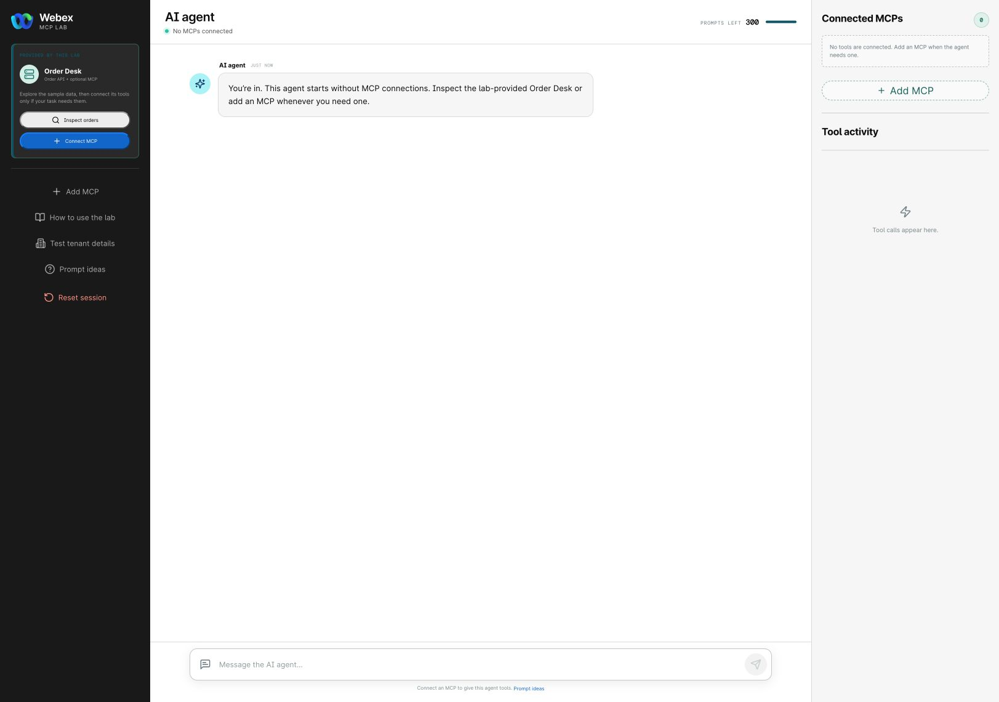

# Checkpoint 1: Open the lab and redeem your assignment

1. Open [MCP Lab](https://mcp-lab.webexdevs.com/).
2. Enter the lab token supplied by the facilitator.
3. Select **Continue**.
4. Confirm that the lab opens the assigned workspace.
5. Open **Test tenant details** and note the sandbox sign-in details, assignment expiration, Order Desk REST address, Order Desk MCP address, temporary bearer token, and sample order number.

<figure markdown>
  
  <figcaption>MCP Lab AI Agent workspace with the lab-provided Order Desk service.</figcaption>
</figure>

!!! success "Checkpoint complete"
    The MCP Lab AI Agent workspace opens and **Order Desk** appears under **Provided by this lab**. Keep the bearer token in **Test tenant details**.

[Continue to Checkpoints 2-3](lab2_flow_designer.md){ .md-button .md-button--primary }
