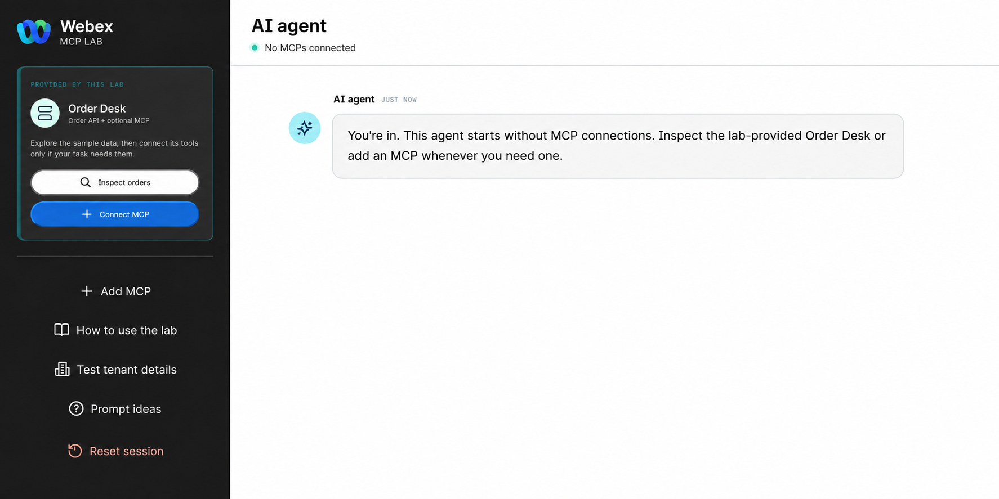

# Checkpoint 1: Open the lab and redeem your assignment

1. Open [MCP Lab](https://mcp-lab.webexdevs.com/).
2. Enter the lab token supplied by the facilitator.
3. Select **Continue**.
4. Check that the **AI agent** workspace opens with no MCPs connected and **Order Desk** on the left.
5. Open **Test tenant details**.
6. Keep this panel open. Later checkpoints use its sandbox sign-in details, expiration, Order Desk REST and MCP addresses, temporary bearer token, and sample order number.

<figure markdown>
  
  <figcaption markdown="span">The AI agent workspace shows Order Desk on the left. You have not connected an MCP yet.</figcaption>
</figure>

## Useful links and bookmarks

| Workspace | Link | Use it for |
| --- | --- | --- |
| Collaboration Control Hub | [admin.webex.com](https://admin.webex.com/) | Sign in to your assigned organization; check the entry point and queue. |
| Flow Designer | [flow-control.produs1.ciscoccservice.com](https://flow-control.produs1.ciscoccservice.com/) | Open the ProdUS1 canvas, or launch it from Control Hub. |
| AI Agent Studio | [studio.aiagent-us1.cisco.com](https://studio.aiagent-us1.cisco.com/) | Open this ProdUS1 lab's Studio, or launch it from **Control Hub → Contact Center → Customer Experience → AI Agents**. |
| Webex Developer Portal | [developer.webex.com](https://developer.webex.com/) | Register the MCP as an Agentic App. This is not the Flow Designer canvas. |
| MCP Lab | [mcp-lab.webexdevs.com](https://mcp-lab.webexdevs.com/) | Open **Test tenant details** and inspect Order Desk tools. |

If a direct link opens the wrong region or organization, use your assigned sandbox details and launch the tool from Control Hub.

!!! success "Checkpoint complete"
    Continue when **Test tenant details** shows your sandbox and Order Desk addresses. Keep the bearer token out of notes and screenshots.

[Continue to Checkpoints 2-3](lab2_flow_designer.md){ .md-button .md-button--primary }
