# Checkpoints 2-3: Build and call the starter flow

## Checkpoint 2: Learn Flow Designer with a queue template, then build `ServiceDesk`

### Part A: Publish your first flow from a template

Start with a small, working voice flow. You will inspect the Flow Designer canvas, replace the template's sample queue with your lab queue, publish the flow, and then use **Debug** and **Analyze** to understand what happened on test calls. Keep this practice flow separate from the `ServiceDesk` flow you will build in Part B.

#### Open Flow Designer and choose the template

1. Sign in to [Control Hub](https://admin.webex.com) with your lab account.
2. Open **Contact Center → Customer Experience → Flows**. Select **Manage Flows → Create Flows**. Flow Designer opens in a new tab. You can also bookmark the [ProdUS1 Flow Designer](https://flow-control.produs1.ciscoccservice.com/flow) for this lab tenant.
3. Choose **Flow**, then **Use a template**. Find **Simple Inbound Call to Queue** and select it.
4. Give the new flow a unique name without spaces, such as `LAB21170_SimpleQueue_<your_initials>`, then select **Create flow**. The screenshots below use `LAB21170_SimpleQueue_ARUN` as the example name; create your own flow if you are sharing the tenant.

<figure markdown>
  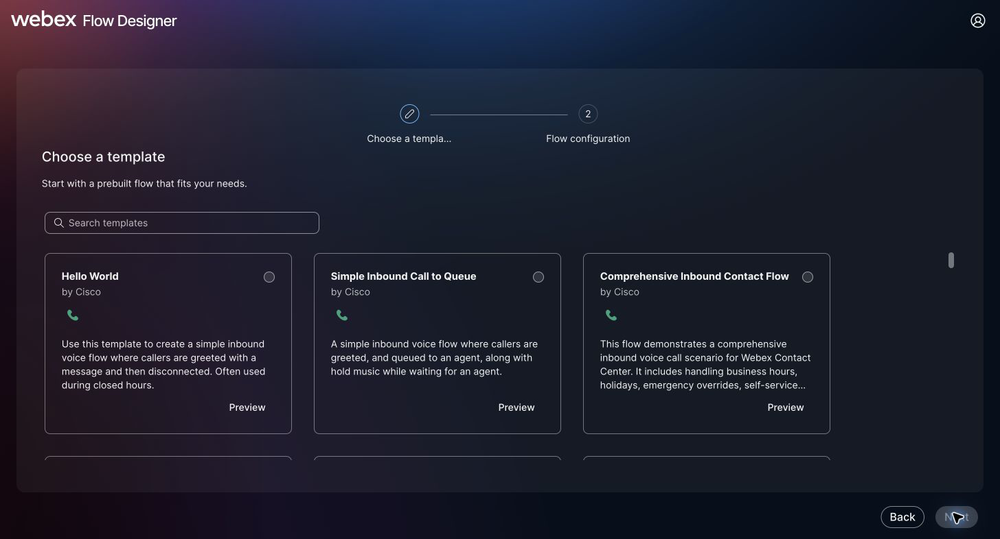
  <figcaption markdown="span">Select the Simple Inbound Call to Queue template.</figcaption>
</figure>

<figure markdown>
  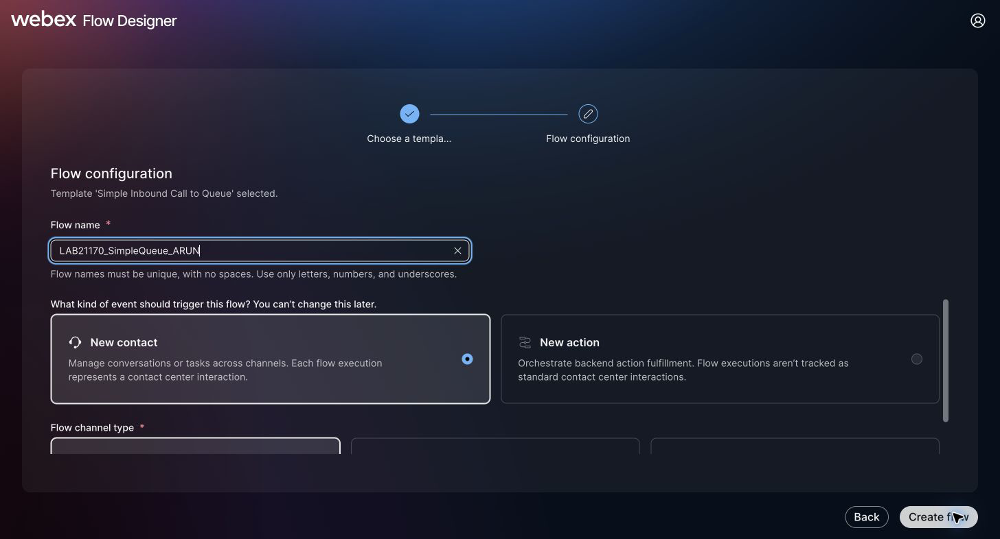
  <figcaption markdown="span">Name your practice flow before creating it.</figcaption>
</figure>

#### Inspect the caller path and configure the queue

1. Trace the connected activities on the canvas: **WelcomePrompt → Queue Contact → Music → PlayMessage**. The queue step places the caller in a human-agent queue; the music and follow-up message are treatment while the caller waits.
2. Select **WelcomePrompt**. In its prompt settings, confirm that text-to-speech is enabled and the connector is **Cisco Cloud Text-to-Speech**. Play or read the configured greeting so you know what to expect on the call.
3. Select **Queue Contact**. The template's sample queue `Q_arubhatt` is not the queue for this lab tenant. Replace it with **Queue-1**. Confirm the selected queue is saved before you publish.
4. Inspect the **Music** and **PlayMessage** activities. Follow the outgoing links so you can see how the waiting treatment repeats or ends. An agent may answer before every waiting activity plays.

<figure markdown>
  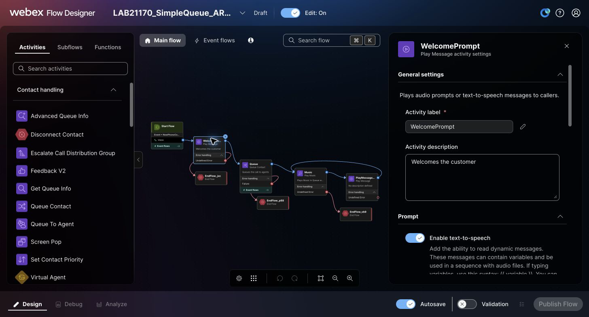
  <figcaption markdown="span">Check the greeting and text-to-speech connector.</figcaption>
</figure>

<figure markdown>
  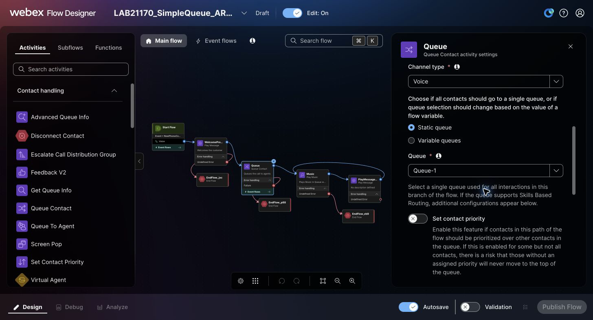
  <figcaption markdown="span">Route this lab flow to Queue-1.</figcaption>
</figure>

#### Validate and publish the practice flow

1. Turn on **Validation**. Resolve any errors shown on the canvas. The example flow shows **0 errors** after selecting `Queue-1`.
2. Select **Publish**. In the publish dialog, **Latest** is applied automatically. You may also select the offered **Test** version label and enter a short publish comment. The version label is selected from the dialog; it is not a free-text field.
3. Publish and confirm that the flow is **Published** at version `v1`. You can now open **Debug** and **Analyze** for this flow.

<figure markdown>
  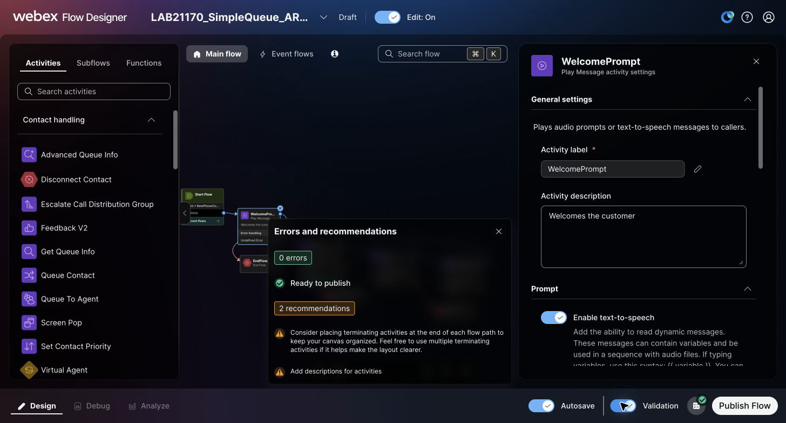
  <figcaption markdown="span">Publish only after Validation shows 0 errors.</figcaption>
</figure>

<figure markdown>
  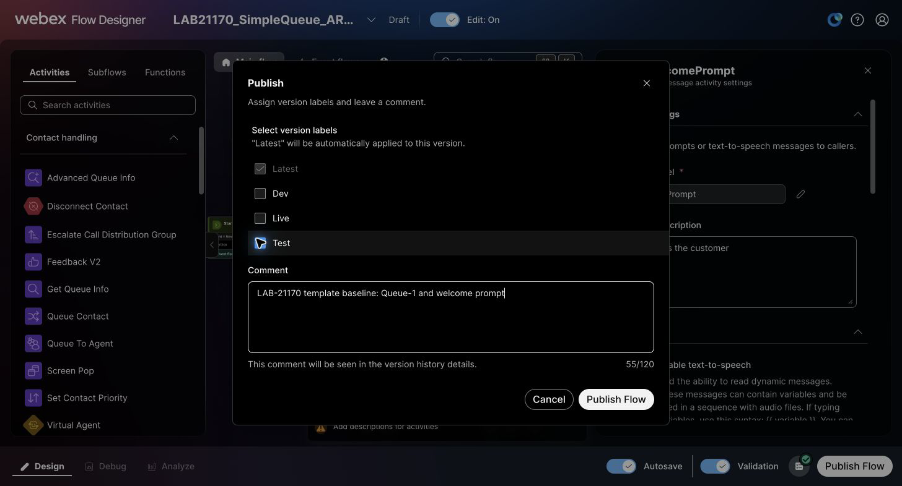
  <figcaption markdown="span">Latest is automatic; Test and a comment are optional.</figcaption>
</figure>

<figure markdown>
  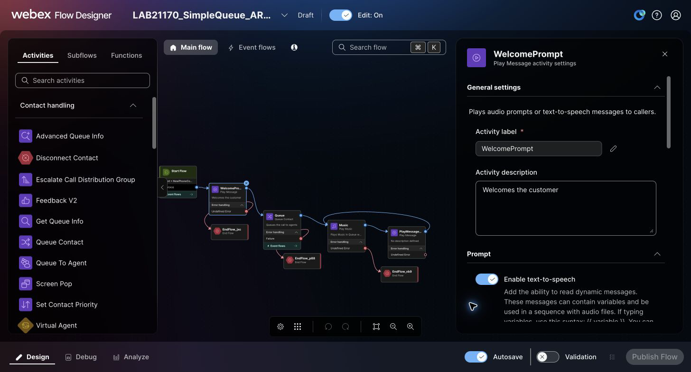
  <figcaption markdown="span">The practice flow is published as version 1.</figcaption>
</figure>

<figure markdown>
  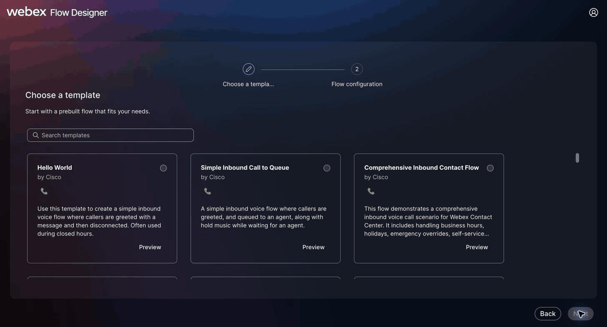
  <figcaption markdown="span">Screenshot sequence: choose the template, set the queue and greeting, validate, then publish.</figcaption>
</figure>

#### Route an entry point to the flow and make test calls

1. Return to **Control Hub → Contact Center → Customer Experience → Entry Points**. Open the inbound voice entry point assigned to your lab sandbox and note its phone number. This area may be called **Channels** in other versions of Control Hub.
2. In that entry point's routing configuration, select your newly published practice flow and the **Latest** version label, then save. Confirm the entry point now shows the practice flow before dialing. If the assigned entry point already serves another lab participant, use the entry point your facilitator assigned to you.
3. Call the entry point's phone number. Listen for the welcome prompt, then confirm that the call reaches `Queue-1`. If no agent is available, listen for the queue music and follow-up message. End the call after you have heard enough to identify the path.
4. Make two or three additional calls. Allow each call to finish so it can appear in Flow Analytics. Try changing how long you remain in queue to see whether the waiting treatment executes.

<figure markdown>
  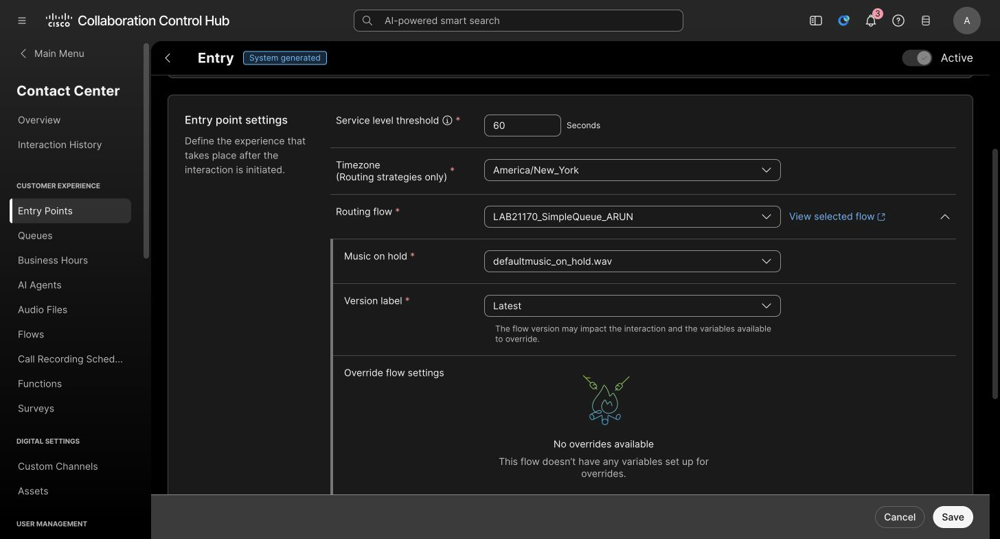
  <figcaption markdown="span">Assign the published practice flow to your lab entry point.</figcaption>
</figure>

<figure markdown>
  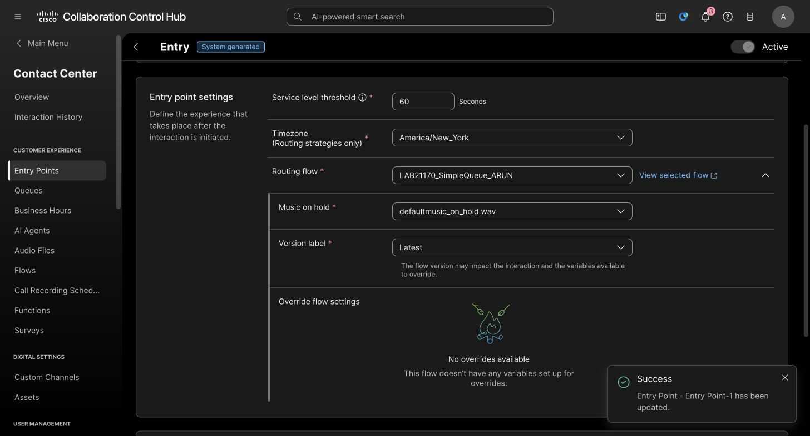
  <figcaption markdown="span">Confirm the routing assignment was saved before calling.</figcaption>
</figure>

#### Read a single call in Debug

1. Reopen your practice flow and select **Debug**. Flow Debugging is a postcall view, so look for a completed test interaction.
2. Find the call by its time or interaction ID and select it. Follow the highlighted path on the canvas from **WelcomePrompt** through **Queue Contact** and any waiting activities that ran.
3. Select an activity in the execution list to inspect its outcome, inputs, outputs, and modified variables. Compare two calls that spent different amounts of time in queue. When capturing a screenshot, hide caller numbers and other personal data.

<figure markdown>
  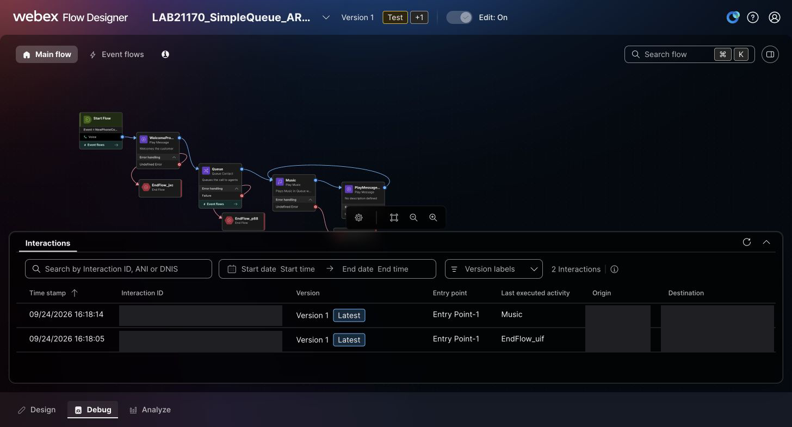
  <figcaption markdown="span">Completed test calls appear as separate interactions in Debug.</figcaption>
</figure>

<figure markdown>
  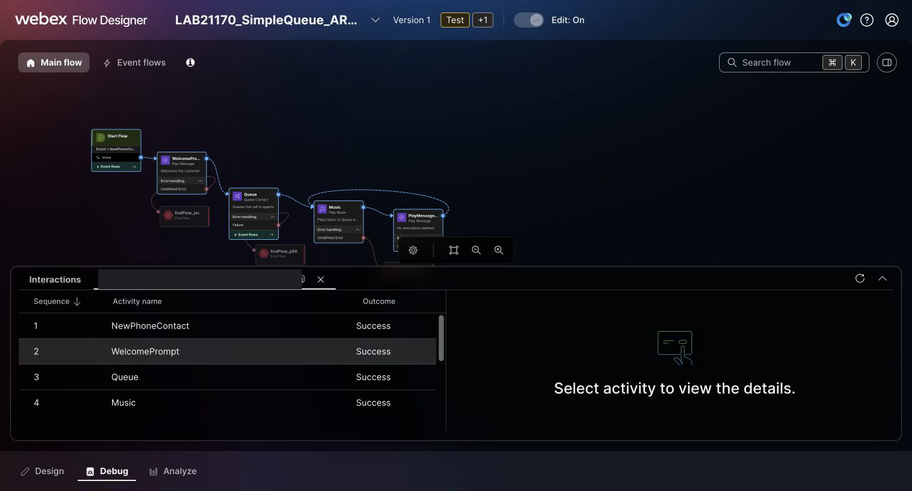
  <figcaption markdown="span">One observed call followed NewPhoneContact → WelcomePrompt → Queue → Music → PlayMessage_c24 → Music → ContactEnded → EndFlow.</figcaption>
</figure>

<figure markdown>
  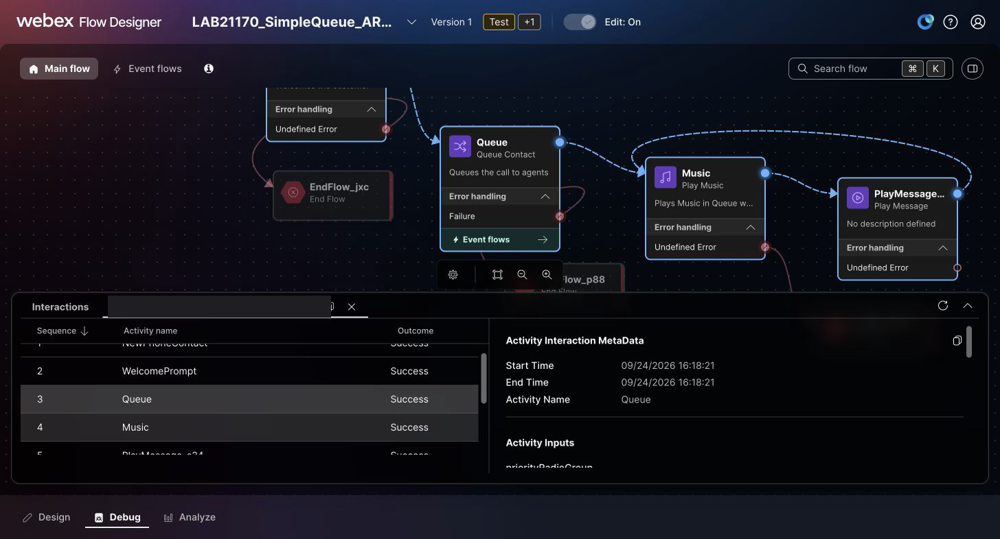
  <figcaption markdown="span">Inspect the Queue activity's outcome and details for the selected call.</figcaption>
</figure>

#### Compare the calls in Analyze

1. Select **Analyze** on the same flow. Choose a time window that includes your completed calls; **Last 15 minutes** is the default in the current Flow Analytics documentation.
2. Compare total flow executions and the counts or percentages on the canvas links. A loop may execute an activity more than once during one call, so an activity count can exceed the number of calls.
3. Check whether the welcome, queue, and waiting paths match what you heard and what Debug showed for each individual call. Analytics counts completed calls in the selected period; an active or unfinished call may not appear yet.

<figure markdown>
  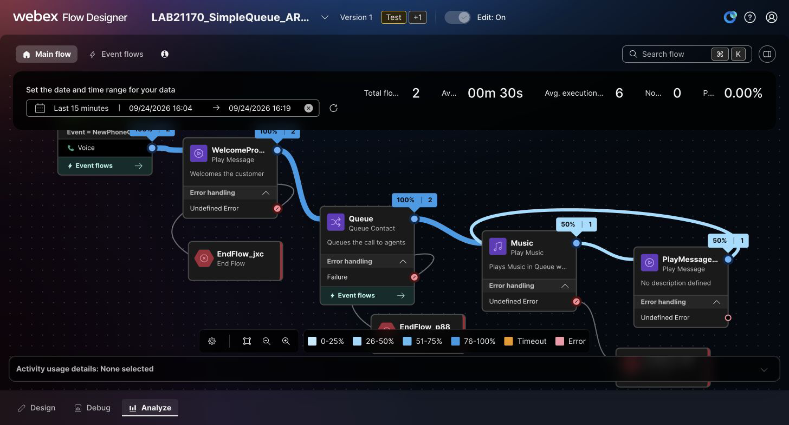
  <figcaption markdown="span">At this refresh, Analyze showed two completed executions, no node errors, and 100% usage for WelcomePrompt and Queue.</figcaption>
</figure>

<figure markdown>
  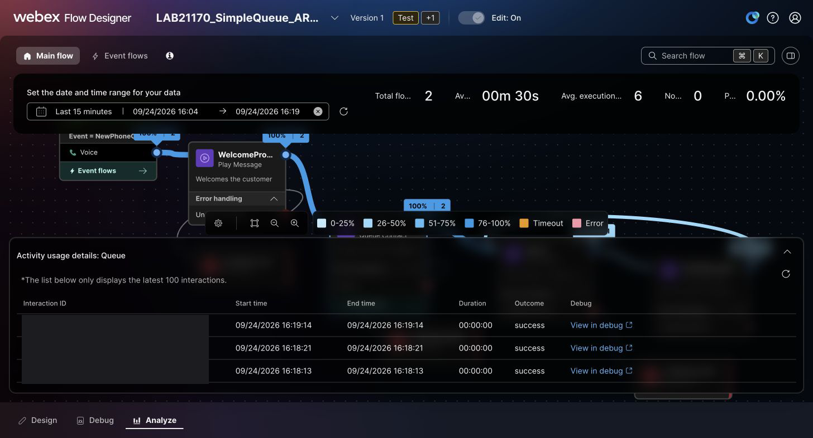
  <figcaption markdown="span">A later activity-usage view listed three call interactions for Queue. This is a later snapshot than the overview above.</figcaption>
</figure>

<figure markdown>
  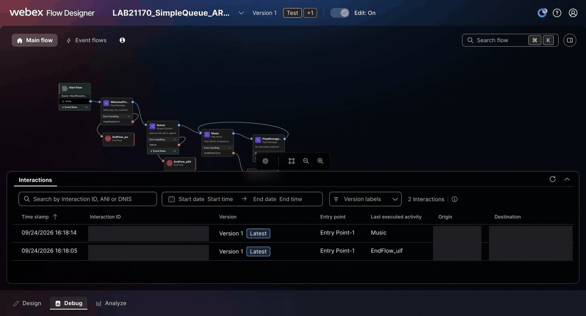
  <figcaption markdown="span">Screenshot sequence: inspect one call in Debug, then compare completed calls in Analyze.</figcaption>
</figure>

!!! success "Compare your calls with the example trace"
    `LAB21170_SimpleQueue_ARUN` version 1 was assigned to `Entry Point-1` and received at least three calls. Debug showed the welcome, queue, waiting treatment, and EndFlow. The first Analyze refresh showed two completed executions with no node errors: WelcomePrompt and Queue appeared on every path; Music and the waiting message appeared on half. A later Queue view listed three interactions. Your counts will depend on your calls and selected time window.

The detailed [Flow Designer guide](https://help.webex.com/article/nhovcy4) explains templates, entry point routing, Debug, and Flow Analytics.

### Part B: Build `ServiceDesk` and add queue treatment

#### Open the flow workspace

1. Sign in to the Webex sandbox listed in **Test tenant details**.
2. In **Control Hub**, open **Contact Center → Customer Experience → Flows**.
3. Select **Manage Flows → Create Flows**.
4. On the **Flow creation** screen, select **Flow** and **Start from scratch**, then select **Next**.

<figure markdown>
  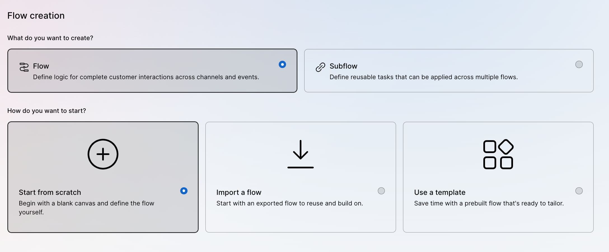
  <figcaption markdown="span">Create a voice flow from a blank canvas.</figcaption>
</figure>

#### Create the flow

1. Name the flow `ServiceDesk` and select **Create flow**.
2. Leave the new flow in **Draft** while you build it.

#### Confirm the blank canvas

1. Confirm that the canvas contains the `NewContact` start event.
2. Select `NewContact` and confirm that its channel type is **Voice**.
3. Confirm that **Autosave** is on. Flow Designer saves draft changes automatically; wait for the saved status before leaving the page.

<figure markdown>
  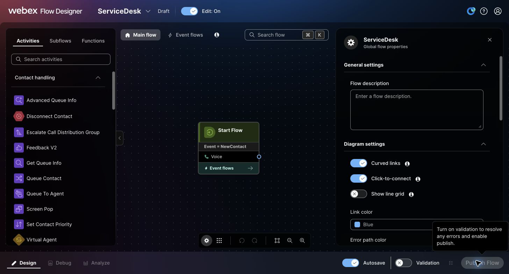
  <figcaption markdown="span">The new ServiceDesk draft starts with NewContact on the Voice channel.</figcaption>
</figure>

#### Build the starter IVR

Build both menu choices before publishing. Digit `2` must enter `Queue-1` directly.

1. Turn **Edit** on.
2. Under **Voice**, drag **Play Message** onto the canvas. In **General settings**, set **Activity label** to `WelcomeMessage`.
3. Connect `NewContact` to `WelcomeMessage`.
4. In the activity's **Prompt** settings, turn on **Enable text-to-speech**, set **Connector** to **Cisco Cloud Text-to-Speech**, select **Add text-to-speech message**, and enter: `Welcome to the order support lab.`

    <figure markdown>
      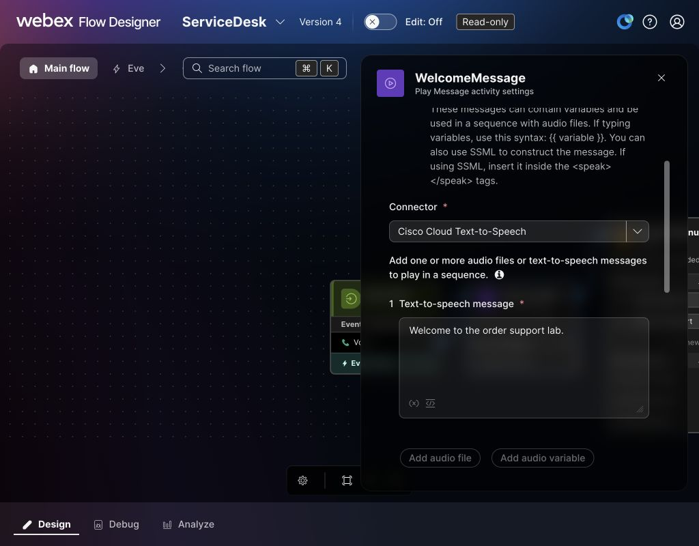
      <figcaption markdown="span">Check the welcome text and Cisco Cloud Text-to-Speech connector. This read-only capture is from the later menu version.</figcaption>
    </figure>

5. Drag **Menu** onto the canvas. In **General settings**, set **Activity label** to `SupportMenu`.
6. Connect `WelcomeMessage` to `SupportMenu`.
7. In the Menu's **Prompt** settings, turn on **Enable text-to-speech**, select **Cisco Cloud Text-to-Speech**, add a text-to-speech message, and enter: `Press 1 for order support. Press 2 for general support.`
8. Under **Custom links**, add digit `1` with the label **Order Support** and digit `2` with the label **General Support**.

    <figure markdown>
      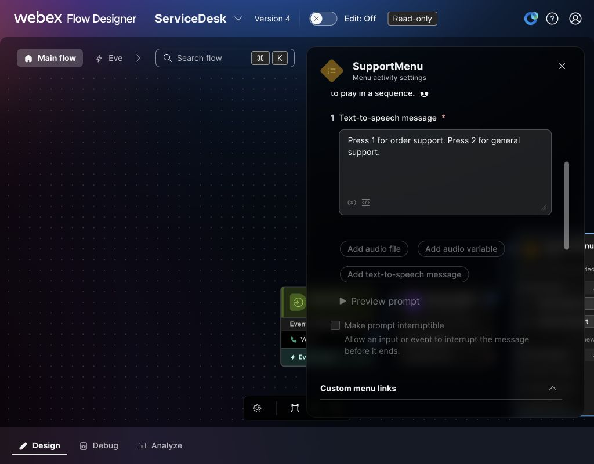
      <figcaption markdown="span">Set the spoken Menu prompt for both choices.</figcaption>
    </figure>

    <figure markdown>
      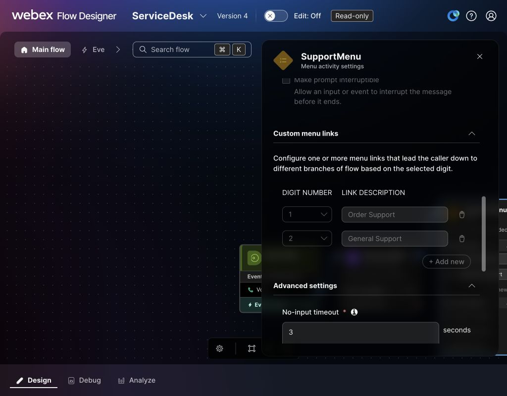
      <figcaption markdown="span">Add the two digit links before connecting their outgoing paths.</figcaption>
    </figure>

9. Add **Queue Contact**, select the assigned `Queue-1` queue, and connect the digit `2` **General Support** output directly to it. This choice is a request for a human agent; it should not play a placeholder message and disconnect.
10. After **Queue Contact**, add **Play Music** and a **Play Message** labeled `PleaseWait`. Use Cisco Cloud Text-to-Speech for a short prompt such as `Please wait while we connect you.` Connect the Queue Contact normal output to Play Music, Play Music to `PleaseWait`, and `PleaseWait` back to Play Music. An agent may answer before every treatment activity runs.
11. Add another **Play Message** labeled `QueueErrorMessage`. Use Cisco Cloud Text-to-Speech for: `I can't connect you to a person right now. Please try again later.` Connect Queue Contact **Failure** and any exposed treatment **Undefined Error** output to `QueueErrorMessage`.
12. Add a temporary **Play Message** activity named `OrderSupportPending`. Use Cisco Cloud Text-to-Speech for: `Order support will be added in the next checkpoint.` Connect the digit `1` output from `SupportMenu` to this message. You will replace this link with the HTTP Request in Checkpoint 3.
13. Add a **Play Message** named `MenuFallbackMessage` with: `I did not get a valid choice. Please call again.` Connect the Menu's **No-Input Timeout**, **Unmatched Entry**, and **Undefined Error** outputs to this safe fallback.
14. Add **Disconnect Contact** named `DisconnectContact`. Connect the outputs of `OrderSupportPending`, `MenuFallbackMessage`, and `QueueErrorMessage` to it. Connect `QueueErrorMessage`'s **Undefined Error** output directly to `DisconnectContact` as well. Keep the digit `2` normal queue route separate from this disconnect path.
15. Wait for Autosave, then confirm that both Menu choices and every fallback have a valid destination. Validate before publishing.

Your starter path should now look like this:

- **Order support:** `NewContact → WelcomeMessage → SupportMenu → 1 → OrderSupportPending → DisconnectContact`
- **General support:** `SupportMenu → 2 → Queue Contact (Queue-1) → wait treatment` until an agent answers or the call ends
- **Invalid or missing input:** `SupportMenu → MenuFallbackMessage → DisconnectContact`

<figure markdown>
  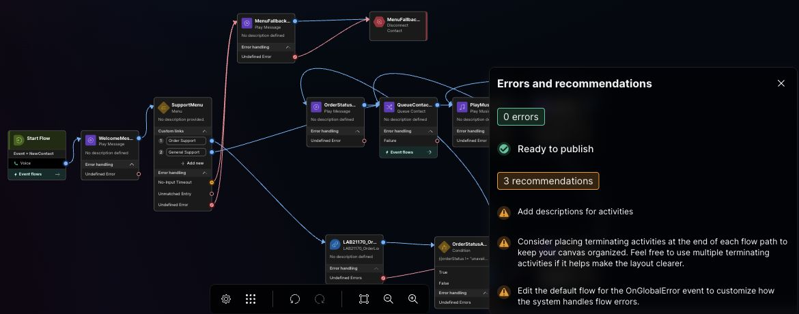
  <figcaption markdown="span">Check the digit `2` link into Queue Contact and **0 errors**. This capture includes later order-lookup nodes; your starter canvas has fewer activities.</figcaption>
</figure>

You will add the final **Virtual Agent V2** activity in Checkpoint 9. The published menu-based version remains available in version history as a recovery and learning reference; remove its starter IVR nodes from the final AI draft after reusing the queue treatment, then confirm zero-error Validation before publishing.

#### Publish the starter IVR

Publish this version so you can hear the flow after the queue-treatment exercise and before adding the API branch.

1. Turn on **Validation** and resolve any errors that prevent publication.
2. Select **Publish**. In the publish dialog, **Latest** is applied automatically. You can also select the offered **Test** label and add a comment. There is no free-text version-label field.
3. Publish and confirm that `ServiceDesk` has a published version. Do not change the entry-point routing yet; keep it on the practice flow for the queue-treatment exercise below.

#### Create a reusable queue-treatment subflow

First inspect the **Comprehensive Call Flow** main-flow template in the gallery. Trace **Queue → GetPositioninQueue → SetPIQvalue → AgentBusy → PlayPIQ → CallerMenu**. From `CallerMenu`, digit `1` goes to **Callback → Disconnect**, digit `2` to a voicemail **Blind Transfer**, and digit `3` through **MusicOnHold → CallLoopCycle** for another wait cycle. No input goes to **ThankYou → Disconnect**; invalid input returns to `CallerMenu`. The visible `FinalMenu` has no inbound link in the native draft, so it is outside the running path.

Use this as a design reference. **Callback** and **Blind Transfer** are absent from the subflow palette. Build the audible wait with the **Queue Treatment Subflow** template below. Keep **Queue Contact**, **Callback**, and any voicemail transfer in the main flow. Your phone test later in this checkpoint checks the subflow you publish.

<figure markdown>
  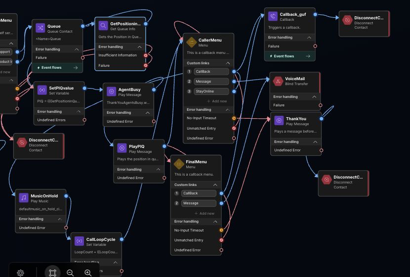
  <figcaption markdown="span">The native template's `CallerMenu` offers callback, voicemail transfer, or another music loop. It is a design reference; the reusable subflow below contains only the supported waiting treatment.</figcaption>
</figure>

The [Queue Treatment Subflow template](https://help.webex.com/article/nhovcy4) provides an audible wait: music, a text-to-speech message, more music, and a bounded repeat. It does not place the call in a queue. The **Queue Contact** activity stays in the main flow, before the subflow.

1. Return to **Control Hub → Contact Center → Customer Experience → Flows → Subflows**. Select **Manage Subflows → Create Subflow**.
2. Choose **Subflow → Use a template**, select **Queue Treatment Subflow**, and continue. The gallery also offers **Collect Callback Info Subflow**; this exercise uses a simple callback menu in the main flow instead.
3. Enter a unique name without spaces, such as `LAB21170_QueueTreatment_<your_initials>`, then select **Create subflow**.

<figure markdown>
  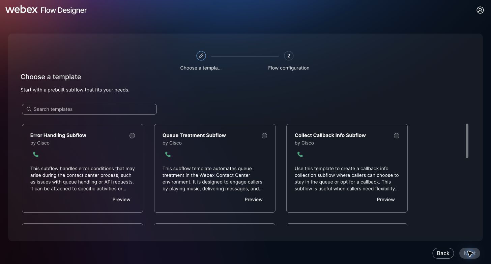
  <figcaption markdown="span">Choose Queue Treatment Subflow for the reusable waiting path.</figcaption>
</figure>

<figure markdown>
  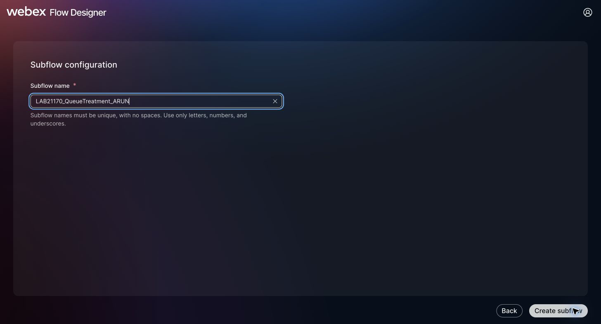
  <figcaption markdown="span">Name the subflow before opening its canvas.</figcaption>
</figure>

On the subflow canvas:

1. Follow the template path from **Start Subflow** through its **Condition**, two **Play Music** activities, **Play Message**, **Set Variable**, and **End Subflow**. The condition and counter bound the internal music/message loop. Keep those links intact.
2. In the subflow variable definitions, inspect its four exposed inputs: `queueMessage` (String), `queueMusic1` (String), `queueMusic2` (String), and `musicDuration` (Integer). The live template defaults are `Please wait`, `defaultmusic_on_hold.wav` for both music inputs, and `10` seconds. You may change the waiting message to `Please stay on the line while we connect you.` before publishing. The `counter` variable starts at `0` but is internal to this template, so it is not a main-flow input to map. The template exposes no output variable.
3. Check that the **Play Message** activity uses Cisco Cloud Text-to-Speech and reads `queueMessage`. Confirm that each **Play Music** activity uses the intended audio file and duration.
4. Turn on **Validation**. Resolve errors, then select **Publish Subflow**. Confirm the subflow has a published version before you add it to a main flow.

<figure markdown>
  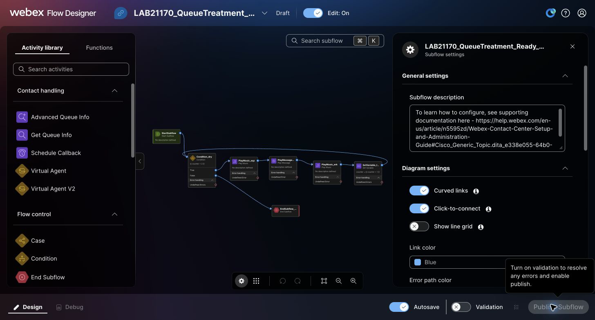
  <figcaption markdown="span">The template draft repeats music and a message before End Subflow.</figcaption>
</figure>

<figure markdown>
  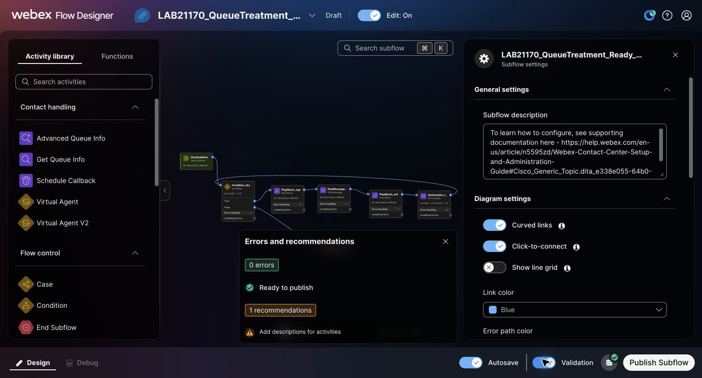
  <figcaption markdown="span">The inspected draft showed 0 validation errors and one optional description recommendation. Publish your own configured copy.</figcaption>
</figure>

<figure markdown>
  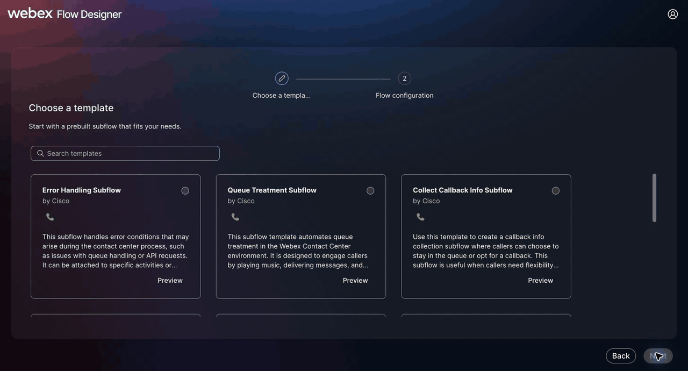
  <figcaption markdown="span">Screenshot sequence: select the queue-treatment template, inspect its draft, validate, and confirm the published version.</figcaption>
</figure>

Publish your configured subflow before selecting it in a main flow. The validation screenshot shows a draft; confirm its call behavior after you connect the published subflow below.

#### Offer a callback or another wait cycle in the practice flow

Return to the practice flow from Part A. It already has **Queue Contact** configured for `Queue-1`, so you can add treatment without changing `ServiceDesk` or the Order Desk branch used in Checkpoint 3. Webex places the [Courtesy Callback](https://help.webex.com/article/nhovcy4) activity in a main flow after **Queue Contact**; the subflow canvas does not provide that activity. Courtesy Callback requires the queue and enterprise callback feature to be enabled. If **Callback** is unavailable in your main flow, ask the facilitator to check that setup before publishing this branch. **Schedule Callback** is a different activity for a chosen future time and needs a callback entry point and scheduling inputs.

1. Open the Part A practice flow and turn **Edit** on. Disconnect **Queue Contact** from the template's **Music** activity. Keep the original **Music → PlayMessage** pair while you wire the replacement, then remove it after the new path validates.
2. Open the **Subflows** tab of the main-flow activity library, add your published queue-treatment subflow, and select its **Latest** version label. Its four exposed inputs can remain unmapped when you want the published defaults: `musicDuration = 10`, `queueMessage = Please wait`, and `queueMusic1` and `queueMusic2` both use `defaultmusic_on_hold.wav`. The example version below uses these defaults. If you need different prompts, music, or duration per caller, create matching main-flow variables and map only the inputs you override. The template's `counter` is internal; it is not a fifth input. The subflow has no output to map. Connect **Queue Contact → Queue Treatment Subflow**.
3. Add a **Menu** after the subflow and label it `CallbackOrWait`. Use Cisco Cloud Text-to-Speech for: `Press 1 to receive a callback at the number you are calling from. Press 2 to keep waiting.` Add custom links for digit `1` (**Callback**) and digit `2` (**Keep Waiting**).
4. Connect digit `2`, **No-Input Timeout**, and **Unmatched Entry** directly back to **Queue Treatment Subflow**. Do not loop to **Queue Contact**; the caller is already queued. A caller who stays in queue can be offered to an agent while treatment runs.
5. Add **Callback** from the main-flow **Voice** activities and connect digit `1` to it. Set **Callback dial number** to `NewPhoneContact.ANI` so the return call goes to the caller. Select the lab's approved **Static Callback ANI** for the outbound return call. If Validation flags Callback, turn on **Register callback to different destination?** and set **Static queue** explicitly to `Queue-1`, even if Queue Contact already uses that queue. Follow your facilitator's queue policy.
6. Add a short Cisco Cloud Text-to-Speech confirmation **Play Message**, then **Disconnect Contact**. Connect **Callback → confirmation → Disconnect Contact**. The disconnect is required after registering a Courtesy Callback.
7. For a flow you will route to callers, connect exposed error paths to a safe fallback or an error message followed by **Disconnect Contact**. Check that a successful callback does not return to waiting treatment. Flow Designer may show **0 errors** even when optional error outputs remain open, so inspect those links yourself.
8. Wait for Autosave, turn on **Validation**, and resolve errors. Publish a new version of the practice flow. The example subflow uses **Latest** with automatic updates enabled; if you change the subflow later, validate the parent flow again and publish a new parent version before relying on the changed behavior.

The validated main-flow path is `Queue Contact → Queue Treatment Subflow → CallbackOrWait`. Digit `2`, no input, or an unmatched digit returns to the subflow without queueing the caller again; digit `1` goes to `Callback → confirmation → Disconnect Contact`. This follows the [Cisco subflow mapping](https://help.webex.com/article/nhovcy4) and [Courtesy Callback](https://help.webex.com/article/nhovcy4) requirements.

<figure markdown>
  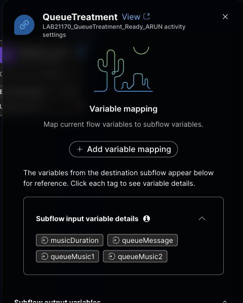
  <figcaption markdown="span">The example parent flow maps no inputs. Flow Designer uses the four defaults configured in the published subflow; <code>counter</code> is internal.</figcaption>
</figure>

<figure markdown>
  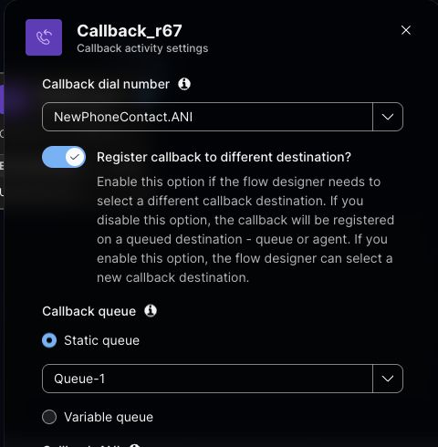
  <figcaption markdown="span"><code>NewPhoneContact.ANI</code> supplies the return-call number. In this example, Callback also requires an explicit <code>Queue-1</code> destination; the outbound Callback ANI is selected separately.</figcaption>
</figure>

<figure markdown>
  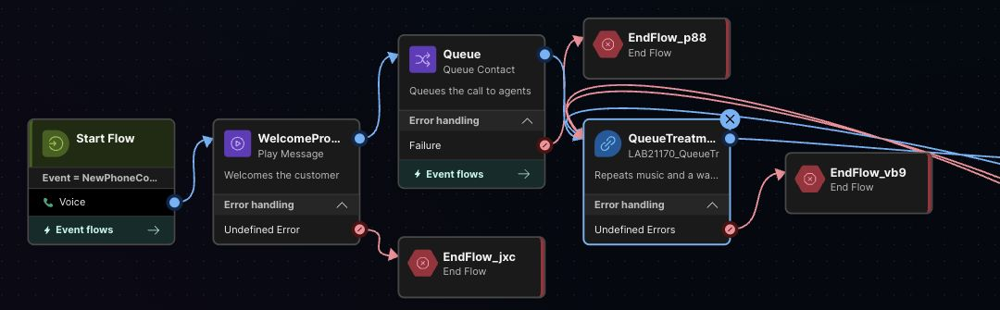
  <figcaption markdown="span">In the published practice flow, Queue Contact enters the reusable treatment subflow. The queue failure and subflow error paths lead to the existing End Flow activities.</figcaption>
</figure>

<figure markdown>
  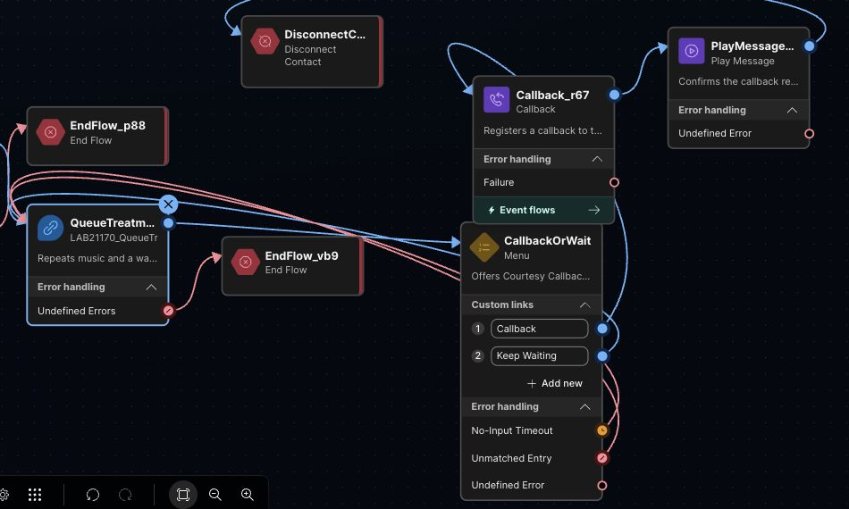
  <figcaption markdown="span">Digit 1 is wired to register Courtesy Callback, play a confirmation, and disconnect the original call. Digit 2, no input, and unmatched input are wired back to Queue Treatment without queueing again.</figcaption>
</figure>

??? example "Show me: wire the parent callback loop"
    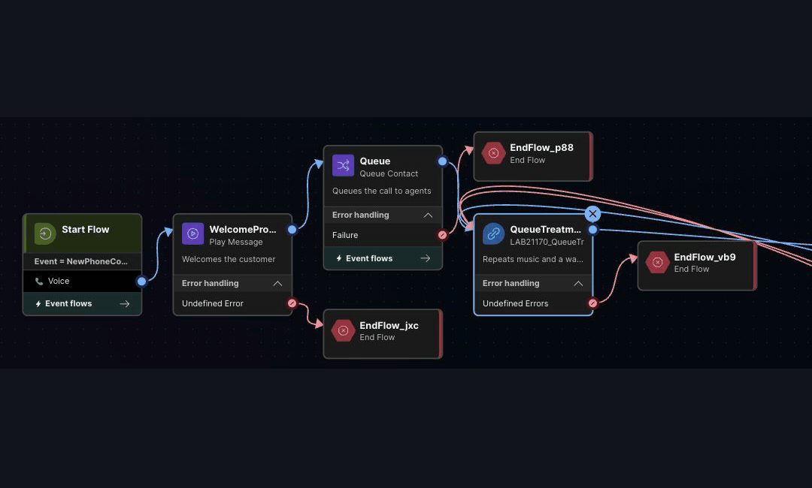

    Follow the published parent flow from **Queue Contact** into **Queue Treatment**, inspect its four unmapped inputs, then trace the **CallbackOrWait** branches and the explicit callback queue. This sequence shows configuration, not a completed call.

<figure markdown>
  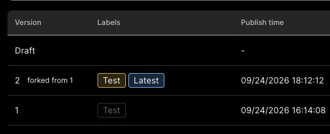
  <figcaption markdown="span">The example <code>LAB21170_SimpleQueue_ARUN</code> was published as version 2 with Test and Latest labels after Validation showed 0 errors.</figcaption>
</figure>

The version 2 screenshot shows the queue-treatment and callback design before its error paths were finished. The example flow was later repaired and published as version 3. Its Menu **Undefined Error**, Callback **Failure**, and confirmation Play Message **Undefined Error** now share a spoken fallback and **Disconnect Contact**. Validation reports **0 errors**. Neither version 2 nor version 3 has a completed phone test; the Part A Debug and Analyze screenshots show version 1.

<figure markdown>
  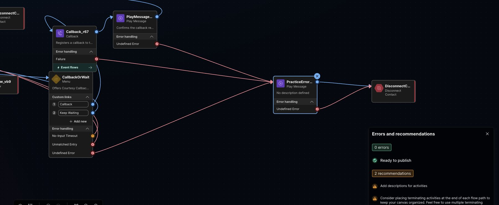
  <figcaption markdown="span">Connect all three open error outputs to a short fallback message, then disconnect. The repaired draft passed Validation with **0 errors**.</figcaption>
</figure>

<figure markdown>
  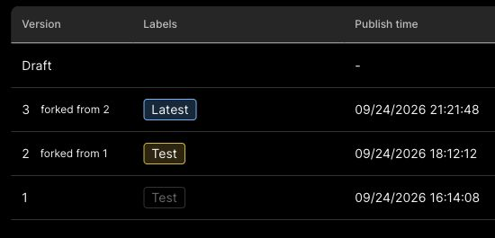
  <figcaption markdown="span">The repaired practice flow is published as version 3 **Latest**. This proves publication; the caller test below still needs to be run.</figcaption>
</figure>

#### Test the queue treatment

1. Before a call, connect the Menu **Undefined Error**, Callback **Failure**, and confirmation Play Message **Undefined Error** outputs to a short fallback message and a **Disconnect Contact**. Connect the fallback message's own error output directly to **Disconnect Contact**. Validate and publish; compare with the repaired version 3 screenshots above.
2. Check that your assigned entry point routes to the Part A practice flow on **Latest**. If it now routes to `ServiceDesk` or another participant's flow, coordinate with the facilitator before changing that shared route. Call the practice flow's number and stay on the line long enough to hear music and the waiting message, then press `2` at `CallbackOrWait`. Confirm that the wait treatment plays again.
3. On a second call, press `1` only if the facilitator has enabled Courtesy Callback for the lab queue. Listen for the confirmation and confirm the original call disconnects. If an agent accepts the queued callback task, confirm that a return call arrives at the caller number.
4. In **Debug**, compare the completed main-flow interaction paths. In **Analyze**, check the subflow invocation and the chosen menu branch. [Flow Analytics](https://help.webex.com/article/nhovcy4) does not report activities inside a subflow, and it excludes calls registered for callback from its completed-call counts. Your results depend on queue staffing, call duration, and whether callback is enabled.

#### Route the entry point to `ServiceDesk`

1. Return to **Control Hub → Contact Center → Customer Experience → Entry Points**. Open the inbound voice entry point assigned to your sandbox. This area may be called **Channels** in another Control Hub version.
2. In its routing configuration, select the published `ServiceDesk` flow and the **Latest** version label, then save. Reassigning a shared entry point changes which flow receives its next call, so coordinate with other lab participants.
3. Confirm the entry point displays `ServiceDesk` as its routing flow and note its assigned phone number. Use that number for the starter IVR test and the Checkpoint 3 API test.

#### Call the starter IVR

1. Call the phone number assigned to your lab entry point.
2. Confirm that you hear the welcome message followed by the two menu options.
3. Press `2` and confirm that the call reaches `Queue-1`; if no agent answers immediately, listen for music and the waiting message. The menu must not play a general-support placeholder and disconnect.
4. On a second call, press `1` and confirm that the temporary `OrderSupportPending` message plays before the call ends. Checkpoint 3 replaces this branch with the Order Desk lookup.

!!! success "Checkpoint 2 complete when your calls confirm both paths"
    In the separate practice flow, digit `2` on `CallbackOrWait` should repeat the waiting treatment; if Courtesy Callback is enabled, digit `1` should register a callback and end the original call. After routing the entry point to `ServiceDesk`, the front-door menu's digit `1` should reach the temporary order-support message, while digit `2` should enter `Queue-1` directly. Check each result in Debug before proceeding.

## Checkpoint 3: Call the Order Desk REST API from Flow Designer

Call Order Desk directly from Flow Designer first. In Checkpoints 4–9, you will use the same business data through MCP and an AI agent. This REST path is temporary; publication alone does not prove that the HTTP request ran on a call. If you published the starter IVR in Checkpoint 2, your direct-REST version will have a later number than the version 1 reference screenshot below.

1. Return to `ServiceDesk` in Flow Designer and turn **Edit** on.
2. Open **Global Flow Properties** from the canvas controls.
3. Scroll to **Configuration → Custom variables → Flow variables**, then select **+ Create flow variable**.
4. Create a variable named `orderStatus`, set its type to **String**, leave its default value blank, and add it to the flow.

    <figure markdown>
      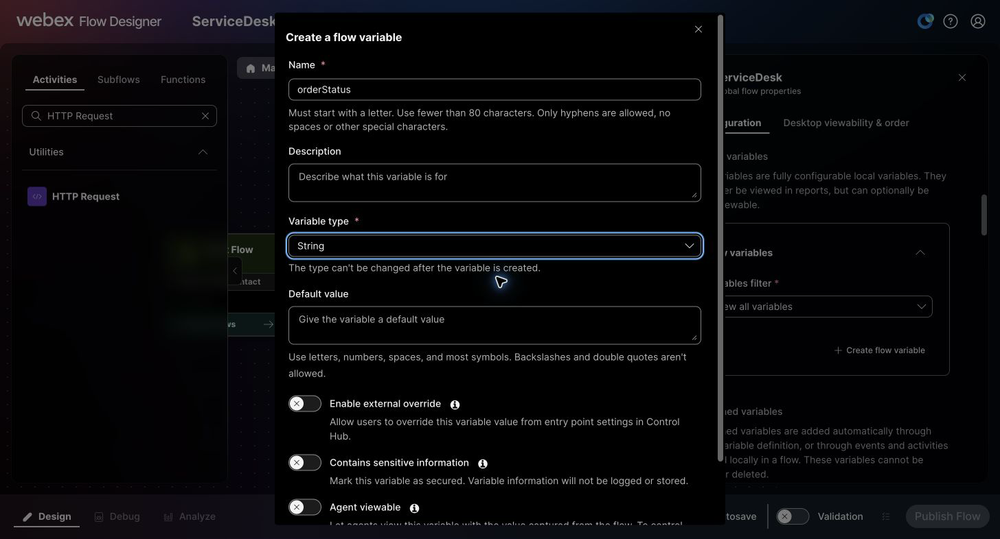
      <figcaption markdown="span">Create `orderStatus` as a String variable. Leave the default value blank so the API response supplies it.</figcaption>
    </figure>

5. Wait for Autosave, then close **Global Flow Properties**.
6. Find **HTTP Request** under **Utilities** and drag it onto the canvas.
7. In **General settings**, set **Activity label** to `GetOrder`.
8. Disconnect the digit `1` **Order Support** output from `OrderSupportPending` and connect it to `GetOrder`. Remove the temporary message and its end link after the replacement path validates.
9. Open **Test tenant details** in MCP Lab and find the Order Desk REST API details and temporary bearer token.
10. In `GetOrder`, turn **Use authenticated endpoint** off. When it is on, Flow Designer asks for a configured connector and **Request path**; turning it off reveals the full **Request URL** field used for this temporary lab endpoint.
11. Set **Method** to `GET` and **Request URL** to `https://mcp-lab.webexdevs.com/order-desk/api/orders/ORD-10482`. Use the assigned URL from **Test tenant details** if it differs.

    <figure markdown>
      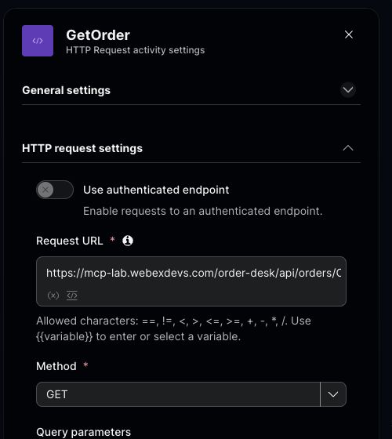
      <figcaption markdown="span">The published version 1 activity is named `GetOrder`. Turning off the authenticated endpoint option exposes the Request URL field. The complete URL is in step 11; keep the Authorization value out of screenshots and GIFs.</figcaption>
    </figure>

12. Under **HTTP request headers**, add **Key** `Authorization` and **Value** `Bearer <temporary Order Desk token>`. Include the word `Bearer`, one space, and then the token copied from **Test tenant details**. Keep this temporary value only in the assigned sandbox; never put it in a screenshot, GIF, source file, or notes.
13. Set the request **Content type** to **Application/JSON**.
14. Under **Parse settings**, set **Content type** to **JSON**.
15. Under **Parse settings**, select **+ Add new**. Set **Output variable** to `orderStatus` and **Path expression** to `$.order.status`.

    <figure markdown>
      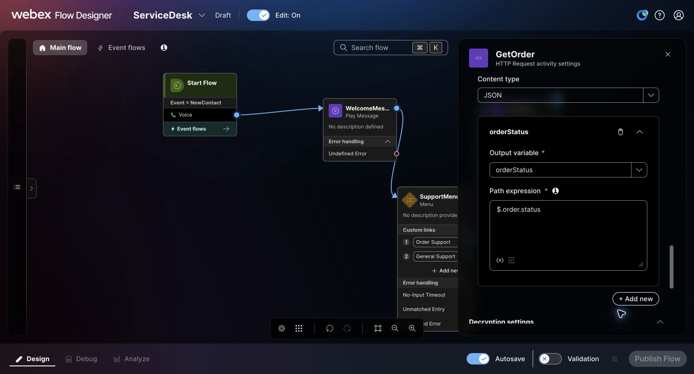
      <figcaption markdown="span">Parse the JSON response and map <code>$.order.status</code> into the flow's String `orderStatus` variable.</figcaption>
    </figure>

16. Add a **Play Message** activity and set **Activity label** to `OrderStatusMessage`.
17. In its **Prompt** settings, enable text to speech, select **Cisco Cloud Text-to-Speech**, add a text-to-speech message, and enter: <code>Your order status is &#123;&#123;orderStatus&#125;&#125;.</code> Open **Test expression**, enter `processing` as a sample `orderStatus`, and confirm the resolved sentence before applying the changes.

    <figure markdown>
      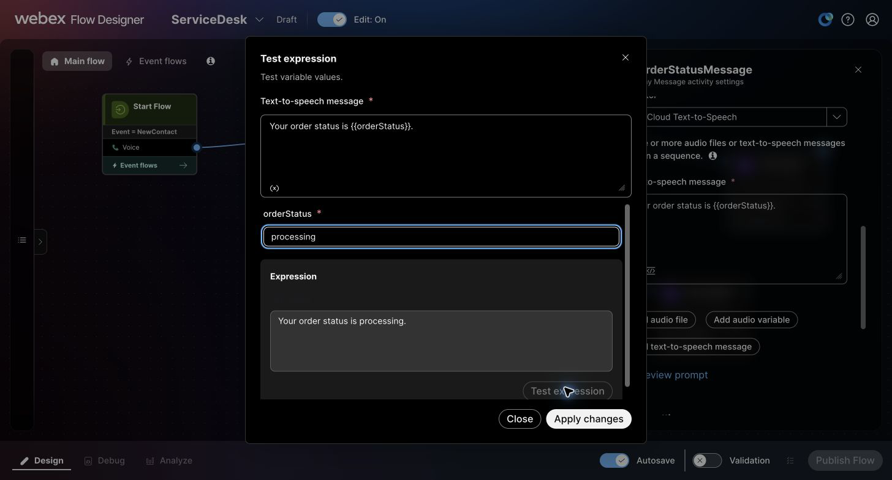
      <figcaption markdown="span">The expression preview resolves sample `orderStatus` to “Your order status is processing.” This checks the prompt expression; the phone call test comes after publication.</figcaption>
    </figure>

    <figure markdown>
      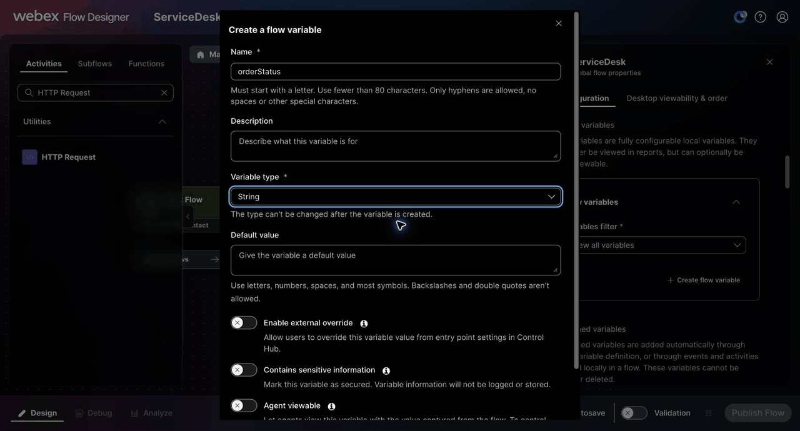
      <figcaption markdown="span">Screenshot sequence: create `orderStatus`, configure the direct GET, map `$.order.status`, and preview the spoken expression. These setup screens do not show a successful HTTP response.</figcaption>
    </figure>

18. Connect the single outgoing `GetOrder` port to `OrderStatusMessage`, then connect the message to the same `Queue Contact` used by menu digit `2`. Confirm it still selects `Queue-1` and reaches the **Play Music** wait treatment. In this tenant, HTTP Request has no separate error port. This direct version tests a known order; the subflow below adds a status guard and an `unavailable` result for failures.
19. Wait for Autosave, turn on **Validation**, resolve blocking errors, and select **Publish**. **Latest** is applied automatically; add the offered **Test** label and a comment such as `Order Desk REST lookup` if you want to identify this checkpoint. Confirm the entry point still routes to `ServiceDesk` on the intended version.

    <figure markdown>
      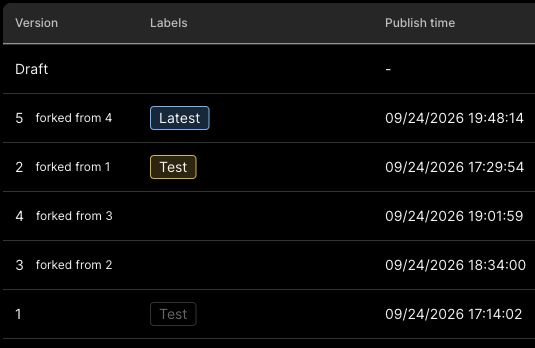
      <figcaption markdown="span">The direct REST build is retained as published version 1 in this example. The version-history row proves publication; test its caller result separately below.</figcaption>
    </figure>

Trace both practice paths: digit `1` runs `GetOrder → OrderStatusMessage → Queue Contact → Play Music`; digit `2` goes straight to `Queue Contact → Play Music`. Both can reach the human queue. The final AI flow removes the menu and direct REST nodes; the earlier published versions remain in version history.

!!! warning "Temporary Order Desk credential"
    Use the manual bearer header only in your assigned sandbox. After the REST exercise, remove the direct HTTP activity or clear its header. At lab cleanup, clear the header in the order-lookup subflow too; an unused published subflow retains its configuration. A production HTTP integration should use a [Control Hub custom connector](https://help.webex.com/article/n4u702ab) to manage authentication.

### Test the API branch by phone

1. Call the same inbound phone number from Checkpoint 2 after the new `ServiceDesk` version is published and active at the entry point.
2. Listen to the welcome message and menu, then press `1`.
3. Confirm that the flow reads the order status returned for `ORD-10482`. If it is blank or the request fails, stop the comparison test and inspect the HTTP activity in Debug. Do not present an empty status as a successful lookup; the refactored subflow adds the failure guard.
4. Press `2` on a second call and confirm that general support enters `Queue-1` directly, without running the order lookup or playing a placeholder message.

### Explore Flow Debugging and Flow Analytics

**Debugging** shows one completed interaction's activity sequence. **Analytics** aggregates completed calls for a selected flow version and time period.

1. Open `ServiceDesk` in Flow Designer and select **Debug**. Find the call that used digit `1` by its timestamp and published version, then open its **Interaction ID**. Keep the caller's number out of screenshots.
2. Follow the highlighted path from `NewContact` through `SupportMenu`, `GetOrder`, and `OrderStatusMessage`. Select `GetOrder` to inspect its outcome, HTTP status, response shape, and modified `orderStatus` variable where permitted. Leave decryption off when capturing guide media so the authorization header and other sensitive fields stay masked.
3. Open the digit `2` call and compare its path. It should reach **Queue Contact** and wait treatment without invoking `GetOrder`.
4. Make two or three more short test calls, ending each call cleanly. Select **Analytics**, choose a time range covering those calls, and compare the Menu's digit `1` and digit `2` execution counts. If the totals have not appeared yet, wait for completed-call data to arrive and check the selected flow version and time range.

!!! tip "Read the right evidence"
    Debugging follows one Interaction ID. Analytics counts completed flow executions and activity ports; ongoing calls and callback calls may be excluded. After you move the lookup into a subflow, Analytics shows the subflow activity in the main flow but not the subflow's internal nodes.

### Create a Function to read the Order Desk response

The direct HTTP activity uses JSONPath to select one field. Next, move that lookup into a subflow and use a Function there to read the parsed response, check whether it contains a usable status, and return a small result contract. Publish the direct-HTTP flow version first so you can compare both designs.

1. In Control Hub, open **Contact Center → Customer Experience → Functions** and select **Create a function**. Choose **Start Fresh**, name it `LAB21170_ParseOrderStatus_<your_initials>`, and choose **Python** with the runtime offered by your sandbox.
2. Add an input variable named `order_data` with type **JSON**. In **Output variable definition**, enter the sample JSON `{"status":"processing","lookupSucceeded":true}`. This area is a JSON example, not two separate typed-variable forms; its keys and value types must match the code and output mappings below.
3. Replace the starter code with this parser. It extracts `order.status` from the parsed JSON, returns `unavailable` when the field is missing, and does not make a network call or use a credential:

    ```python
    from models import Request, Response


    def handle(request: Request, response: Response):
        payload = request.data['inputs'].get('order_data') or {}
        order = payload.get('order', {}) if isinstance(payload, dict) else {}
        status = order.get('status', '') if isinstance(order, dict) else ''
        status = status.strip() if isinstance(status, str) else ''
        response.data = {
            'status': status or 'unavailable',
            'lookupSucceeded': bool(status),
        }
        return response
    ```

4. In the Function test panel, use `{"order":{"status":"processing"}}` for `order_data` and select **Test**. Confirm that the result has `statusCode: 200`, `data.status: processing`, and `data.lookupSucceeded: true`. Test `{}` as well; `data.status` should be `unavailable` and `data.lookupSucceeded` should be `false`. Then test the valid JSON object `{"order":{"status":42}}`: a non-string status must also return `unavailable` and `false`. If you type malformed JSON syntax such as `{bad`, the JSON input rejects it and disables **Test**; correct the input before testing the Function. Fix code or output definitions before publishing.

    <figure markdown>
      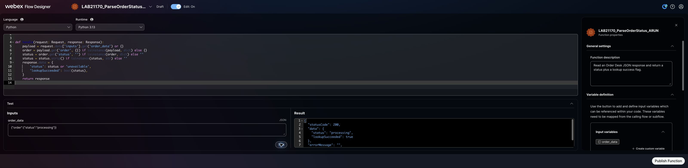
      <figcaption markdown="span">The dedicated Function's live test returns a typed status and lookup flag from the sample order JSON. Repeat with `{}` to verify the missing-field fallback.</figcaption>
    </figure>

    <figure markdown>
      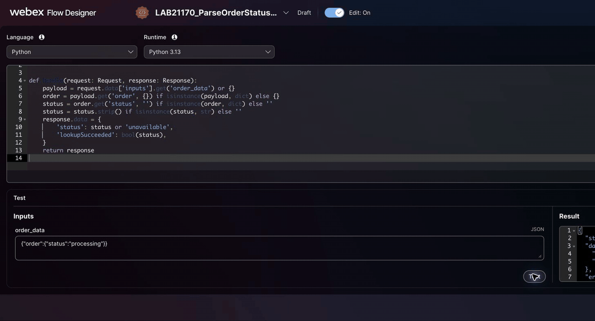
      <figcaption markdown="span">Screenshot sequence: local Function tests return `processing` for sample order JSON and `unavailable` for `{}`, then the Function publish dialog opens. This is not a caller test.</figcaption>
    </figure>

    <figure markdown>
      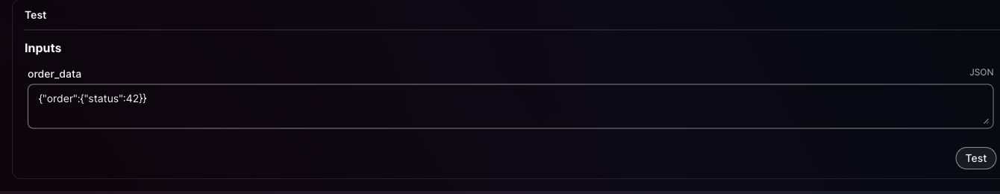
      <figcaption markdown="span">Malformed-shape input: valid JSON with a numeric `status` field.</figcaption>
    </figure>

    <figure markdown>
      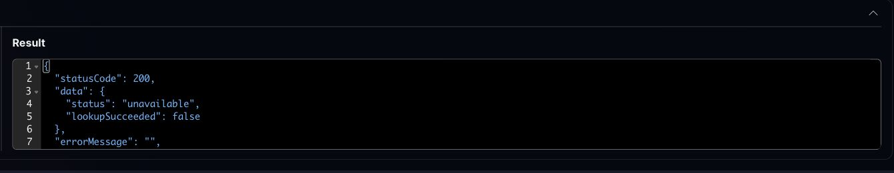
      <figcaption markdown="span">The same live test returns `unavailable` and `lookupSucceeded: false` without a runtime error. Syntactically invalid JSON is stopped by the test form before the Function runs.</figcaption>
    </figure>

5. Select **Publish Function** and note the published version label. A draft Function is not available for use by the subflow.

### Refactor `GetOrder` into a subflow

1. In **Control Hub → Contact Center → Customer Experience → Flows → Subflows**, select **Manage Subflows → Create Subflow**. Start from a blank subflow and name it `LAB21170_OrderLookup_<your_initials>`; subflow names cannot contain spaces.
2. In the subflow's variable definitions, create `orderNumber` as a **String input** with sample value `ORD-10482`, `orderStatus` as a **String output**, `lookupSucceeded` as a **Boolean output**, and `orderResponseJson` as a local **JSON** variable. The String `orderStatus` output is the required contract with `ServiceDesk`; the Boolean output can be used where a tenant offers it in the parent-flow mapping selector.
3. Add an **HTTP Request** activity, label it `FetchOrderRecord`, and connect it from **Start Subflow**. Turn **Use authenticated endpoint** off, set **Method** to `GET`, and set **Request URL** to <code>https://mcp-lab.webexdevs.com/order-desk/api/orders/&#123;&#123;orderNumber&#125;&#125;</code>. Flow Designer's URL field accepts <code>&#123;&#123;variable&#125;&#125;</code>; its expression preview should resolve the sample order number to `/ORD-10482`.
4. Add the same temporary Order Desk **Authorization** header from **Test tenant details**, set request content type to **Application/JSON**, then set **Parse settings → Content type** to **JSON**. Select **+ Add new**, choose local **Output variable** `orderResponseJson`, and enter `$` as the **Path expression**. This makes the whole response object available to the Function without mixing up the HTTP String body and a JSON input.

    <figure markdown>
      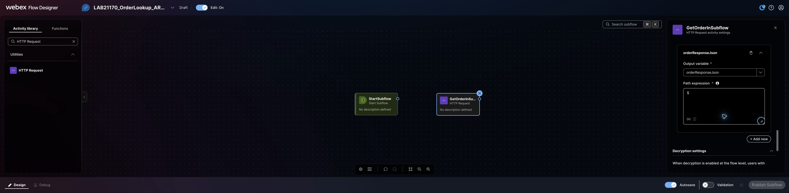
      <figcaption markdown="span">During draft assembly, `$` maps the whole response into local JSON `orderResponseJson`. Complete the links and status guard before publishing.</figcaption>
    </figure>

5. Add a **Condition** activity labeled `HttpStatusIs200` between `FetchOrderRecord` and the parser Function. Enter <code>&#123;&#123;FetchOrderRecord.httpStatusCode == 200&#125;&#125;</code> as the **Condition expression**. In **Test expression**, sample `200` must resolve to `true` and `404` to `false`. HTTP Request exposes one outgoing canvas port in this tenant, so this Condition prevents a non-200 response from reaching the parser.

    <figure markdown>
      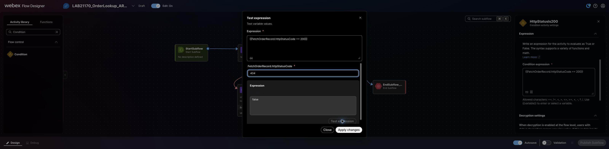
      <figcaption markdown="span">The expression preview checks the guard with sample status `404`. It is a local expression test, not an Order Desk HTTP result.</figcaption>
    </figure>

6. Open the subflow's **Functions** tab, drag your published `LAB21170_ParseOrderStatus_<your_initials>` Function onto the canvas, and choose its published version. Connect the `HttpStatusIs200` **True** output to the Function. Map its JSON input `order_data` to `orderResponseJson`.
7. Map Function output `$.status` to subflow output `orderStatus` and `$.lookupSucceeded` to subflow output `lookupSucceeded`. Connect the Function's successful output to **End Subflow**. Add a **Set Variable** activity labeled `SetLookupUnavailable` that sets `orderStatus` to `unavailable` and `lookupSucceeded` to Boolean `false`; connect the Condition's **False** and **Undefined Errors** outputs and the Function's **Undefined Errors** output to it, then connect it to a second **End Subflow**. A non-200 status or parser failure follows this fallback. Check timeout and network-error behavior with Debug rather than assuming those failures use the same port.
8. Turn on **Validation**, resolve blocking errors, and **Publish Subflow**. Keep the earlier direct-HTTP main-flow version as a recovery point.

    <figure markdown>
      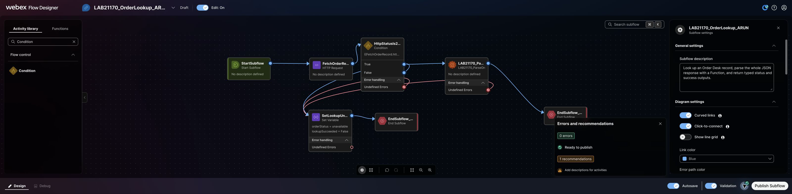
      <figcaption markdown="span">The complete draft routes status `200` through the parser and other status codes through `SetLookupUnavailable`. Flow Designer reports zero structural errors and “Ready to publish”; the phone test still verifies runtime behavior.</figcaption>
    </figure>

    <figure markdown>
      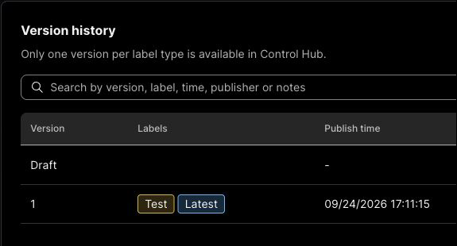
      <figcaption markdown="span">The validated OrderLookup subflow was published as version 1 with `Test` and automatic `Latest` labels. The parent `ServiceDesk` flow must still be republished after it invokes this subflow.</figcaption>
    </figure>

    <figure markdown>
      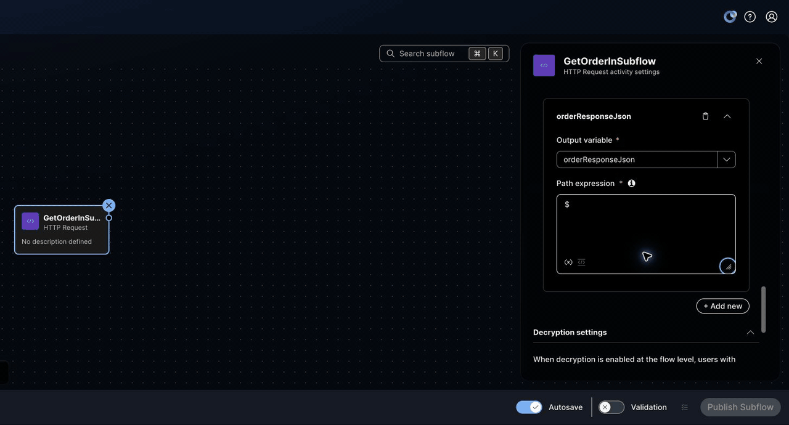
      <figcaption markdown="span">Screenshot sequence: map the whole response, test the HTTP status guard, map the Function result, validate, and publish OrderLookup. The validation and version screens prove structure and publication; a phone call still has to verify the runtime lookup.</figcaption>
    </figure>

### Use the subflow from `ServiceDesk`

1. In `ServiceDesk`, add a String flow variable `orderNumber` with default `ORD-10482`. Keep the existing String `orderStatus` variable and set its default to `unavailable` for this refactored version so an unset result cannot be spoken as a successful status. A Boolean `lookupSucceeded` variable may appear in Global Flow Properties, but this tenant did not offer the subflow's Boolean output in the parent mapping selector; do not depend on it.
2. Open the **Subflows** tab, drag the published order-lookup subflow onto the canvas, and choose its published version. Map main-flow `orderNumber` to the subflow input and map the subflow's String `orderStatus` output to the parent String `orderStatus` variable. If your tenant also offers `lookupSucceeded` as a matching Boolean output mapping, you may map it to a parent Boolean variable, but the path below uses `orderStatus`.
3. Move the digit `1` link from the direct `GetOrder` activity to the new subflow. After it returns, add a **Condition** on <code>&#123;&#123;orderStatus != "unavailable"&#125;&#125;</code>: **True** reaches `OrderStatusMessage`; **False** plays a short message such as `Order information is temporarily unavailable.` Both paths can then reach the assigned human queue and its wait treatment. Remove the now-disconnected direct `GetOrder` activity if validation requires it; the earlier published version still preserves the comparison exercise.

    <figure markdown>
      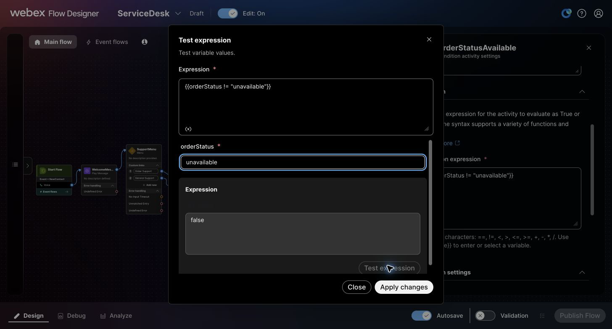
      <figcaption markdown="span">The parent Condition's expression preview rejects sample `unavailable`; it is a local expression check, not a phone result.</figcaption>
    </figure>

4. Validate and publish `ServiceDesk` again. Publishing only the subflow does not update the routed main flow. Check that the entry point uses the intended `ServiceDesk` version before calling.

    <figure markdown>
      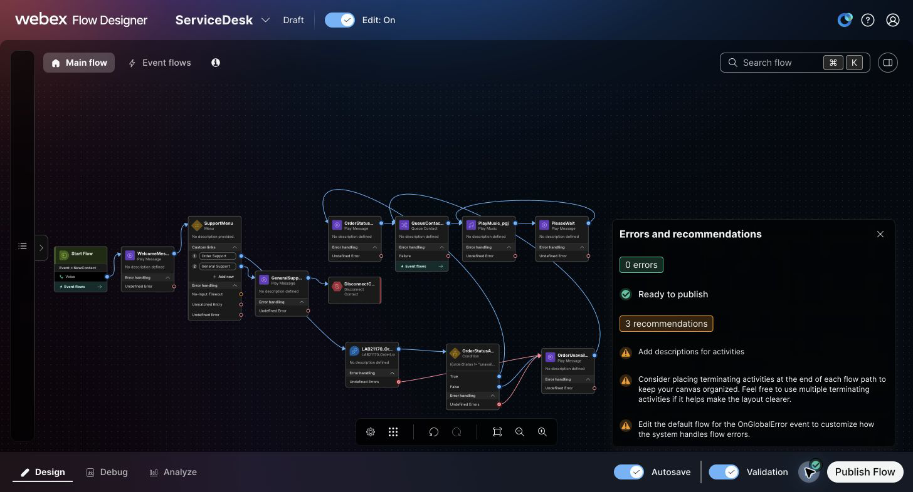
      <figcaption markdown="span">The refactored parent draft passed structural validation with zero errors before publication. This does not show a completed call.</figcaption>
    </figure>

    <figure markdown>
      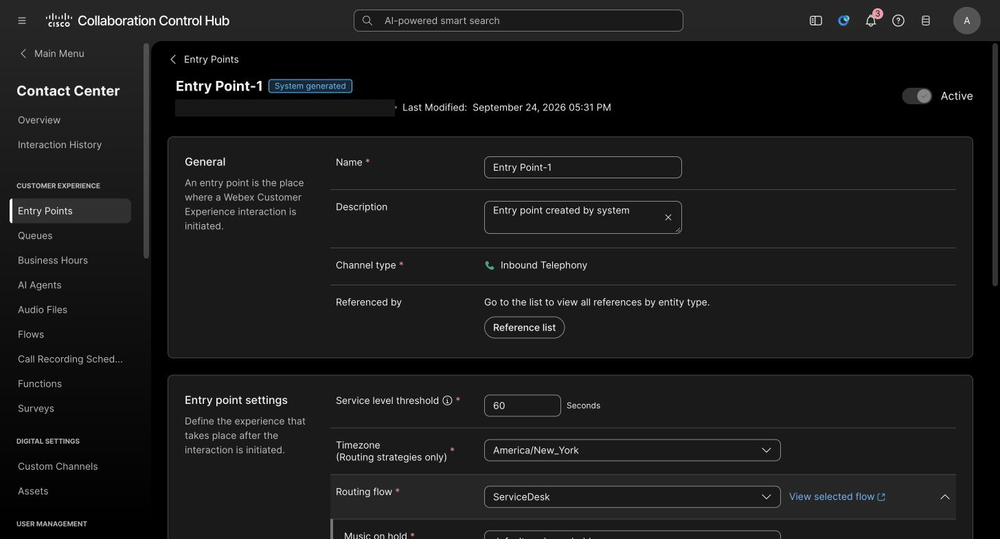
      <figcaption markdown="span">Entry Point-1 is routed to the published `ServiceDesk` **Latest** version. Routing configuration alone does not verify the order response on a call.</figcaption>
    </figure>

5. Call the assigned number, press `1`, and compare the spoken status with the earlier direct-HTTP design. In **Debug**, confirm the path enters the order-lookup subflow and returns a non-`unavailable` `orderStatus`, or plays the temporary-unavailability message. Make a second call on digit `2` and confirm that it enters the same human queue without running OrderLookup. Use **Analytics** to compare the main-flow branch counts after both completed calls; it does not display the subflow's internal activity counts.

!!! info "Use the reference versions"
    - **Version 2:** The example call stopped at `SupportMenu` with **Error**. If yours stops there, inspect the prompt, digit links, and fallback outputs before calling again.
    - **Version 3:** After adding the Menu fallback, a digit `1` call ran the OrderLookup subflow, returned `Shipped` for `ORD-10482`, and reached queue treatment. Analyze showed two completed calls and zero node errors in the selected window.
    - **Version 4:** Digit `2` was rewired directly to `QueueContact_4b7` on `Queue-1`. Validation showed **0 errors** and the version was published. Make your own digit `2` call to confirm the human queue in **Debug**.
    - **Version 5:** Checkpoint 9 replaces the numbered menu with the AI agent. The menu versions remain in version history for comparison.

<figure markdown>
  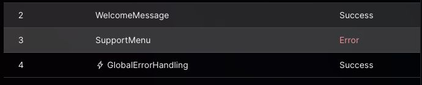
  <figcaption markdown="span">Version 2 stopped at `SupportMenu` with **Error**. Debug did not identify the cause or a selected digit.</figcaption>
</figure>

<figure markdown>
  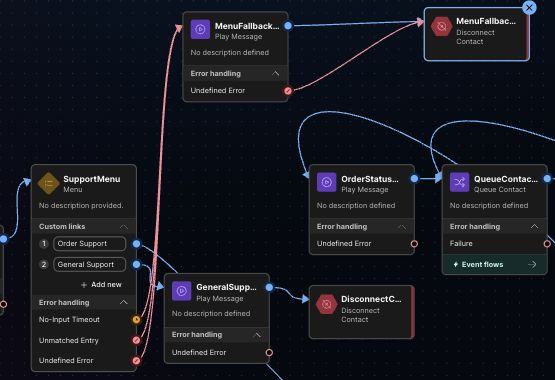
  <figcaption markdown="span">Version 3 connects menu timeout, unmatched entry, and undefined error to a spoken fallback and disconnect. The next trace shows a separate digit `1` call.</figcaption>
</figure>

<figure markdown>
  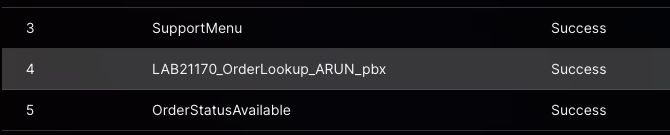
  <figcaption markdown="span">A version 3 call completed the order-lookup subflow. The crop omits caller and interaction IDs.</figcaption>
</figure>

<figure markdown>
  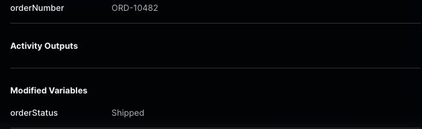
  <figcaption markdown="span">The subflow returned <code>Shipped</code> for <code>ORD-10482</code>; the same call later reached the status message and queue treatment.</figcaption>
</figure>

<figure markdown>
  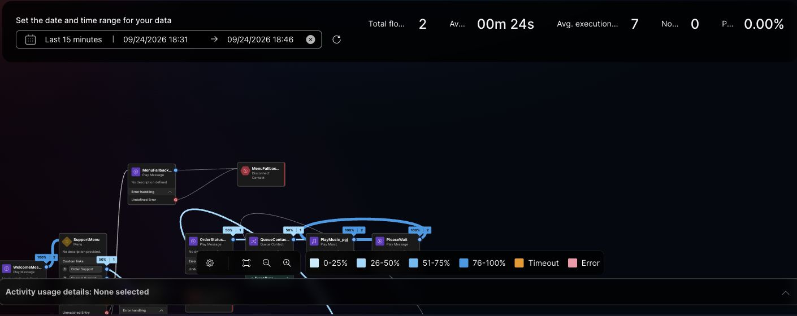
  <figcaption markdown="span">Analyze shows two completed version 3 calls in 15 minutes. One used the order path; zero node errors does not mean both menu choices were tested.</figcaption>
</figure>

??? example "Show me: correct the general-support route"
    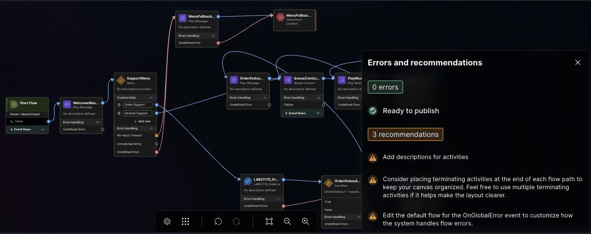

    Digit `2` joins the same queue activity as the order path. The first frame shows **0 errors**; the second shows the corrected queue and wait-treatment links. Checkpoint 9's version history shows this menu version was published.

    Publish your corrected menu version, then call again and confirm in **Debug** that digit `2` enters `Queue-1`. Zero-error Validation alone does not confirm what a caller hears.

!!! tip "If the API branch fails"
    For the first version, check the full request URL, the temporary `Authorization` header, and the `$.order.status` JSON path. For the refactored version, also check the subflow input/output mappings, the `$` JSON mapping, `HttpStatusIs200`, and Function result paths. Keep the starter IVR connected until Checkpoint 9; the earlier published version preserves the direct-HTTP comparison.

!!! success "Finish Checkpoint 3 after your calls prove the paths"
    Call the direct REST version and confirm in Debug that digit `1` reaches `GetOrder` and reads the status for `ORD-10482`. Call the refactored version and confirm that digit `1` runs the HTTP subflow and Function, then reads the status or the temporary-unavailability message. Confirm that digit `2` enters `Queue-1` without the lookup or placeholder. Compare the completed paths in Debug and Analytics before marking the checkpoint complete.

[Continue to MCP inspection and testing](lab3_agent_registration.md){ .md-button .md-button--primary }
