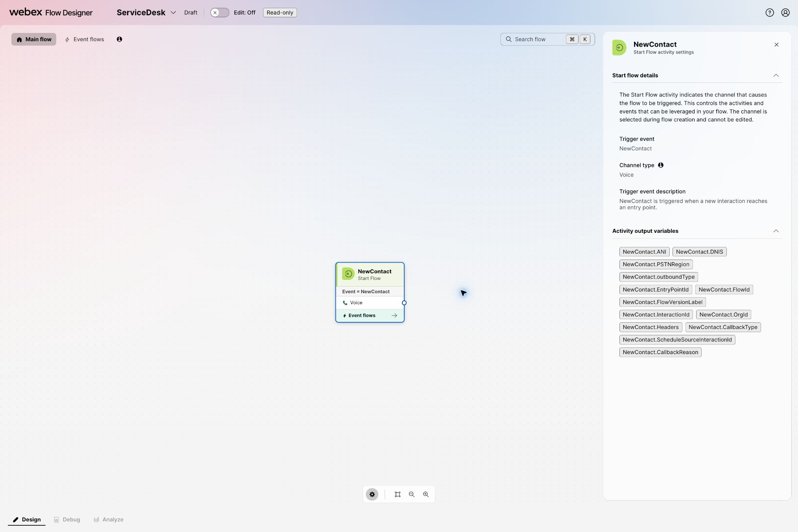
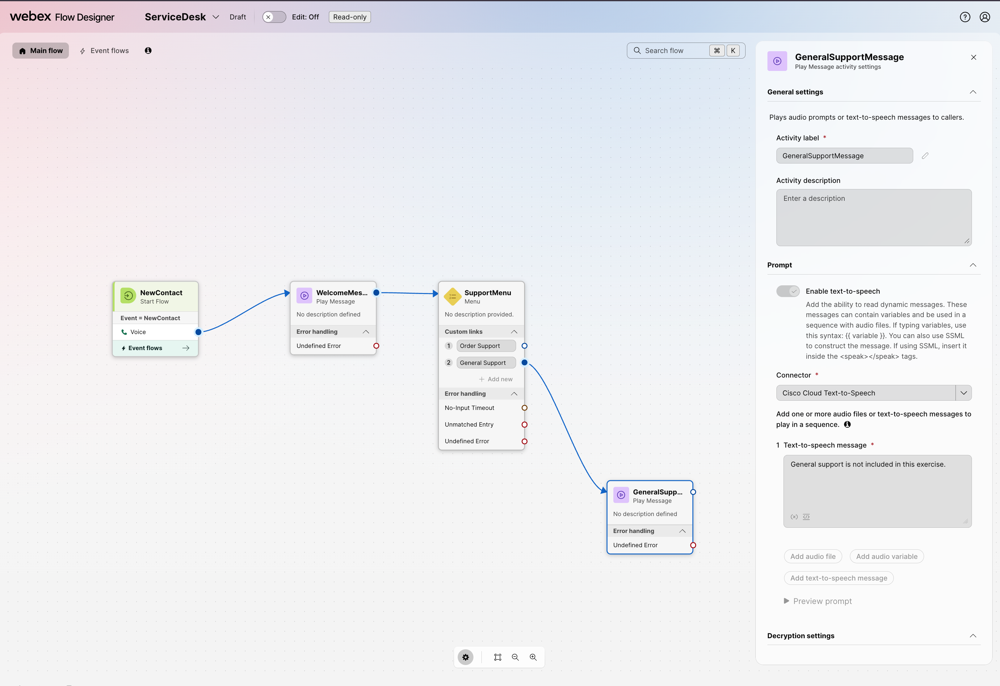

# Checkpoints 2-3: Build and call the starter flow

## Checkpoint 2: Create the ServiceDesk flow in Flow Designer

### Open the flow workspace

1. Sign in to the Webex sandbox listed in **Test tenant details**.
2. In **Control Hub**, open **Contact Center → Customer Experience → Flows**.
3. Select **Manage Flows → Create Flows**.
4. On the **Flow creation** screen, select **Flow** and **Start from scratch**, then select **Next**.

<figure markdown>
  
  <figcaption>Create a voice flow from a blank canvas.</figcaption>
</figure>

### Create the flow

1. Name the flow `ServiceDesk` and select **Create flow**.
2. Leave the new flow in **Draft** while you build it.

### Confirm the blank canvas

1. Confirm that the canvas contains the `NewContact` start event.
2. Select `NewContact` and confirm that its channel type is **Voice**.
3. Save the draft.

<figure markdown>
  
  <figcaption>The blank ServiceDesk flow starts with NewContact.</figcaption>
</figure>

### Build the starter IVR

1. Turn **Edit** on.
2. Under **Voice**, drag **Play Message** onto the canvas. In **General settings**, set **Activity label** to `WelcomeMessage`.
3. Connect `NewContact` to `WelcomeMessage`.
4. In the activity's **Prompt** settings, turn on **Enable text-to-speech**, set **Connector** to **Cisco Cloud Text-to-Speech**, select **Add text-to-speech message**, and enter: `Welcome to the order support lab.`
5. Drag **Menu** onto the canvas. In **General settings**, set **Activity label** to `SupportMenu`.
6. Connect `WelcomeMessage` to `SupportMenu`.
7. In the Menu's **Prompt** settings, turn on **Enable text-to-speech**, select **Cisco Cloud Text-to-Speech**, add a text-to-speech message, and enter: `Press 1 for order support. Press 2 for general support.`
8. Under **Custom links**, add digit `1` with the label **Order Support** and digit `2` with the label **General Support**.
9. Add another **Play Message** activity. Set **Activity label** to `GeneralSupportMessage`.
10. In **Prompt**, turn on **Enable text-to-speech**, select **Cisco Cloud Text-to-Speech**, add a text-to-speech message, and enter: `General support is not included in this exercise.`
11. Connect the digit `2` output from `SupportMenu` to `GeneralSupportMessage`.
12. Leave the digit `1` output unconnected. You will connect it to the temporary **HTTP Request** in Checkpoint 3.
13. Save the draft.

<figure markdown>
  
  <figcaption>Expected Checkpoint 2 flow. Digit 1 remains unconnected; digit 2 reaches GeneralSupportMessage.</figcaption>
</figure>

Your starter path should now look like this:

- **Order support:** `NewContact → WelcomeMessage → SupportMenu → 1` (unconnected until Checkpoint 3)
- **General support:** `SupportMenu → 2 → GeneralSupportMessage`

You will add the final **Virtual Agent V2** activity in Checkpoint 9. At that point, the starter IVR remains on the canvas only as a disconnected reference.

### Publish the starter IVR

Publish this version so you can hear the flow before adding the API branch.

1. Select **Validation** and resolve any errors that prevent publication.
2. Select **Publish Flow**.
3. When prompted, enter a version label such as `starter-ivr-v1`, then publish the flow.
4. Wait until Flow Designer confirms that the published version is available.

### Create an inbound voice channel

1. Return to **Control Hub → Contact Center → Customer Experience → Channels**.
2. Select **Create a channel**.
3. On **Configure channel details**, enter a unique name such as `ServiceDesk-Inbound`.
4. Set **Channel type** to **Inbound Telephony**.
5. Set **Service level threshold** to `300` seconds, unless your facilitator provides another value.
6. Keep the assigned sandbox timezone.
7. For **Routing Flow**, select `ServiceDesk`.
8. Under **Phone numbers**, select **Add** and choose the number assigned to your sandbox.
9. Select **Create**.
10. Confirm that the channel is **Active**, the routing flow is `ServiceDesk`, and the assigned phone number appears on the channel.

### Call the starter IVR

1. Call the phone number assigned to the inbound channel.
2. Confirm that you hear the welcome message followed by the two menu options.
3. Press `2` and confirm that you hear: “General support is not included in this exercise.”
4. Do not test digit `1` yet; that branch is intentionally unconnected until Checkpoint 3.

!!! success "Checkpoint 2 complete"
    A live call reaches `ServiceDesk`, plays the welcome and menu prompts, and digit `2` reaches `GeneralSupportMessage`.

## Checkpoint 3: Call the Order Desk REST API from Flow Designer

This comparison step proves that Flow Designer can retrieve external data directly before the agent uses the same data through MCP. The temporary API test is separate from the final caller path.

1. Return to `ServiceDesk` in Flow Designer and turn **Edit** on.
2. Find **HTTP Request** under **Utilities** and drag it onto the canvas.
3. In **General settings**, set **Activity label** to `GetOrder`.
4. Connect the digit `1` **Order Support** output from `SupportMenu` to `GetOrder`. This is a temporary comparison branch, not the final caller path.
5. Open **Test tenant details** in MCP Lab and find the Order Desk REST API details and temporary bearer token.
6. In `GetOrder`, set **Method** to `GET` and **Request URL** to `https://mcp-lab.webexdevs.com/order-desk/api/orders/ORD-10482`.
7. Under **HTTP request headers**, add **Key** `Authorization` and **Value** `Bearer <temporary Order Desk token>`. Include the word `Bearer`, one space, and then the token copied from **Test tenant details**. Do not paste the token into this guide or your notes.
8. Set the request **Content type** to **Application/JSON**.
9. Under **Parse settings**, set **Content type** to **JSON**.
10. Select **Add parsed variable**. Set **Variable** to `orderStatus` and **JSON path** to `$.order.status`.
11. Add a **Play Message** activity and set **Activity label** to `OrderStatusMessage`.
12. In its **Prompt** settings, enable text to speech, select **Cisco Cloud Text-to-Speech**, add a text-to-speech message, and enter: `Your order status is {{orderStatus}}.`
13. Connect `GetOrder` to `OrderStatusMessage`.
14. Save, validate, and publish a new flow version with a label such as `order-api-v1`.

### Test the API branch by phone

1. Call the same inbound phone number from Checkpoint 2.
2. Listen to the welcome message and menu, then press `1`.
3. Confirm that the flow reads the order status returned for `ORD-10482`.
4. Press `2` on a second call and confirm that the general-support branch still works.

!!! tip "If the API branch fails"
    Check the full request URL, the `Authorization` header, and the `$.order.status` JSON path. Keep the starter IVR and HTTP branch connected until Checkpoint 9 so you can compare it with the final agent-led path.

!!! success "Checkpoint 3 complete"
    On a live call, digit `1` reaches `GetOrder` and reads the status for `ORD-10482`; digit `2` still reaches `GeneralSupportMessage`.

[Continue to Checkpoints 4-5](lab3_agent_registration.md){ .md-button .md-button--primary }
