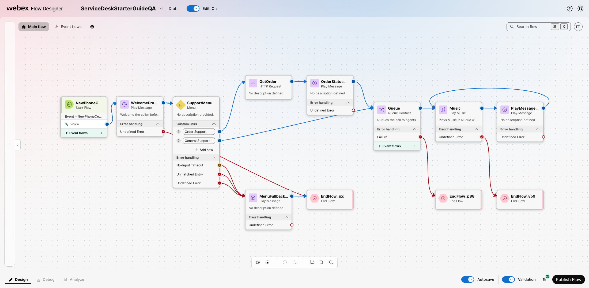

# Checkpoints 2–3: Import the Service Desk flow and test a direct lookup

You run an order-processing contact center. A caller can choose order support or general support. In this first version, Flow Designer uses a conventional phone menu and a direct HTTP request to retrieve the status of sample order `ORD-10482`. Later, you will give an AI agent access to the same order data through MCP and replace this menu-based caller path.

The starter saves canvas construction time, but leaves the important work visible: inspect the routing, add your own temporary bearer token, and verify what the REST response does. It contains **no working credential**.

## Checkpoint 2: Import and inspect `ServiceDesk`

1. [Download the ServiceDesk starter JSON](assets/lab-guide/ServiceDesk-starter.json). Save the file with its `.json` extension. Do not paste a token into the downloaded file.
2. Sign in to the Webex sandbox shown in the **Test tenant** panel in [MCP Lab](https://mcp-lab.webexdevs.com/). In [Control Hub](https://admin.webex.com/), open **Contact Center → Customer Experience → Flows** and select **Manage Flows → Create Flows**. Flow Designer opens in a new tab.
3. Choose **Flow → Import a flow → Next**. Select the downloaded JSON. Flow Designer shows the uploaded filename and proposes `ServiceDesk` as the flow name. If your organization already has a `ServiceDesk` flow, choose another clear name and use it throughout the guide. Select **Create flow**.
4. Turn **Edit** on if needed. On the canvas, trace both menu choices:

    - **Order support:** `NewPhoneContact → WelcomePrompt → SupportMenu → 1 → GetOrder → OrderStatusMessage → Queue`.
    - **General support:** `SupportMenu → 2 → Queue` (no order lookup).
    - **No input or invalid choice:** `SupportMenu → MenuFallbackMessage → End Flow`.

    The existing `Queue → Music → PlayMessage` loop is the waiting treatment. The start event may appear as `NewContact` in another Flow Designer view; it is the same voice entry to the flow.

5. Select **SupportMenu**. Confirm that digit `1` is **Order Support** and digit `2` is **General Support**. Its Cisco Cloud Text-to-Speech prompt explains both choices. Select **Queue** and confirm that the queue field shows **Queue-1**. The import normally matches this queue by name, but if the field is blank in your sandbox, select your assigned `Queue-1` before publishing.
6. Select **GetOrder**. Confirm that **Use authenticated endpoint** is off, **Method** is `GET`, and **Request URL** is `https://mcp-lab.webexdevs.com/order-desk/api/orders/ORD-10482`. Under **HTTP request headers**, the `Authorization` value should be `Bearer REPLACE_WITH_LAB_TOKEN`. That placeholder is intentionally invalid; do not publish or test the lookup until you replace it in Checkpoint 3.
7. Scroll to **Parse settings**. Confirm **Content type → JSON** and the parsed output `orderStatus` with path `$.order.status`. The String flow variable `orderStatus` is already present and defaults to `unavailable`, so a missing value is not presented as a successful order status. `OrderStatusMessage` says <code>Your order status is &#123;&#123;orderStatus&#125;&#125;.</code>
8. Turn on **Validation**. The imported, still-uncredentialed draft should show **0 errors / Ready to publish**. This checks configuration and wiring only; it does **not** authenticate the request or prove a caller can hear the returned value. If your queue was not rebound, set it as in step 5 and validate again.

<figure markdown>
  
  <figcaption markdown="span">This QA import uses a different flow name to avoid a collision. Your imported flow is named `ServiceDesk`; the starter does not contain a usable bearer token.</figcaption>
</figure>

!!! tip "Want to build every activity yourself?"
    The [optional Flow Designer deep dive](optional_flow_designer_deep_dive.md) preserves the earlier from-scratch, queue-treatment, subflow, and Function exercises. They are not prerequisites for the main lab.

## Checkpoint 3: Authenticate and test the direct REST lookup

The temporary bearer in this step is the **Order Desk API bearer** assigned to your lab seat. It is not the token you used to sign in to MCP Lab.

1. In MCP Lab, select **Inspect orders** on the **Order Desk** card. Find sample order `ORD-10482` and compare the displayed `GET /order-desk/api/orders/{orderNumber}` reference with `GetOrder` in Flow Designer. The sample response shows where `order.status` appears; it is a reference, not evidence that your Flow Designer request has run.
2. Open **Test tenant** in MCP Lab and copy the assigned **Order Desk bearer token**. Keep it private. Return to the `ServiceDesk` draft, select **GetOrder**, and scroll to **HTTP request headers**.
3. Leave the header **Key** as `Authorization`. Replace the entire **Value** `Bearer REPLACE_WITH_LAB_TOKEN` with `Bearer ` followed immediately by your Order Desk bearer. Include the single space after `Bearer`. Do not change the URL, method, request content type **Application/JSON**, or **Parse settings → JSON → `$.order.status`**.
4. Wait for **Autosave**. Turn on **Validation** and confirm **0 errors**. Select **Publish Flow**; **Latest** is applied automatically. Use the optional **Test** label and a comment such as `Direct Order Desk lookup` if helpful. Note the published version number for Debug later.
5. In Control Hub, open the inbound voice **Entry Point** assigned to your sandbox. Set its **Routing flow** to your newly published `ServiceDesk` and **Version label** to **Latest**, then save. Confirm the saved routing assignment before calling. If the entry point is shared, coordinate with the facilitator before changing it.
6. With a phone or Webex desktop client that can dial the entry point's inbound number, make two calls:

    - Press `1`. You should hear the order status for `ORD-10482` (the sample is **Shipped**) before the call enters `Queue-1`.
    - Press `2`. The call should enter `Queue-1` directly, without running `GetOrder`.

    The browser-only Webex **Call on Webex** view may not support external dialing. If you cannot make a real inbound call, continue the lab but mark the caller, Debug, and Analyze checks as **not verified**; neither draft validation nor the MCP Lab sample response substitutes for that call.

7. For a completed call, open your published flow's **Debug** view and select the interaction by time. On the digit `1` call, inspect `GetOrder → Modified Variables` for `orderStatus`. Compare it with the spoken response. On the digit `2` call, confirm the path bypasses `GetOrder`. In **Analyze**, choose a window containing the completed calls and compare the two menu branches. Do not include caller numbers or the bearer in screenshots.

!!! warning "If the caller hears 'unavailable' or no status"
    Do not count that as a successful lookup. In Debug, check whether `GetOrder` populated `orderStatus`. A stale bearer may produce HTTP `401` even when the activity outcome says **Success**. Copy the current Order Desk bearer from MCP Lab **Test tenant**, replace only the `Authorization` value, validate, publish a new version, and call again. If it remains unset, check the JSON path `$.order.status`.

!!! warning "Temporary lab credential"
    Use the manual bearer only in your assigned sandbox. Do not export or share a flow after inserting it. In Checkpoint 9 you will remove the direct `GetOrder` activity and its header from the final AI flow. In a production integration, use a [Control Hub custom connector](https://help.webex.com/article/n4u702ab) for managed authentication.

You have now seen the direct-API pattern. [Checkpoint 4](lab3_agent_registration.md) starts the comparison: connect the external Order Desk MCP to the lab agent and inspect the `lookup_order` tool.
