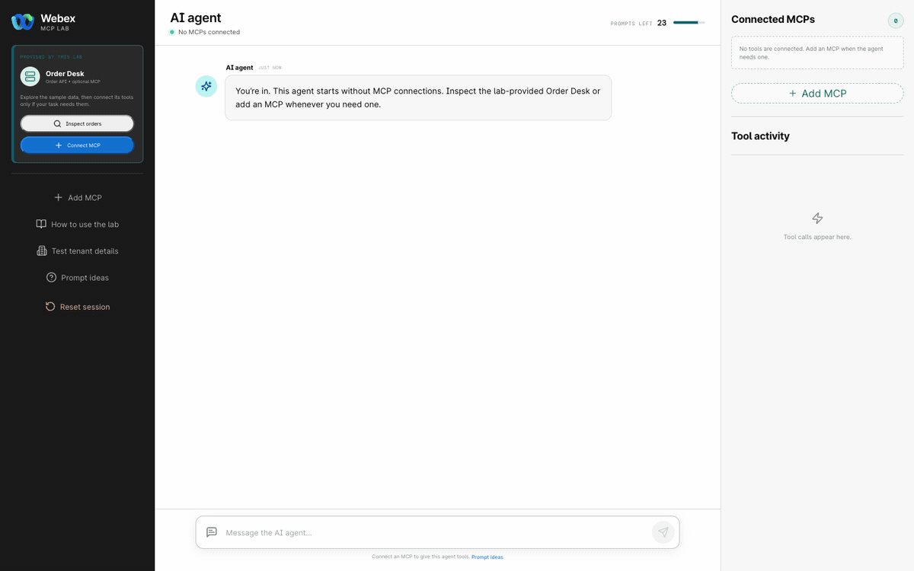

# Checkpoints 4-5: Connect Order Desk and test the lookup

## Checkpoint 4: Connect and inspect Order Desk in MCP Lab

The REST branch proved that the external Order Desk system returns usable data. Now inspect the same system through MCP and see the tool contract an AI agent can use.

Return to the **AI agent** workspace in [MCP Lab](https://mcp-lab.webexdevs.com/). The Order Desk is a lab-provided simulation of an external order system. You do not need to enter an MCP URL or bearer token here.

1. On the lab-provided **Order Desk** card, select **Connect MCP**.
2. On **Connect the Order Desk MCP**, confirm that **Order Desk** and **Session token** are shown. Select **Inspect MCP tools**. Do not use **Inspect orders** on the card; that opens the sample order viewer, not the MCP connection.
3. On **Inspect the tool catalog**, review the five checked tools. The three read tools say **Runs automatically**; the two ticket-writing tools say **Approval required**.
4. Leave all five tools checked and select **Connect to AI agent**.
5. On **Ready to use**, confirm **Order Desk — 5 tools ready**, then select **Return to AI agent**.
6. In **Connected MCPs**, confirm that **Order Desk** shows **Connected**, **5 tools**, and **Active MCP**.

These five tools are connected only to the MCP Lab test agent. In Checkpoint 6, you will enable only `lookup_order` for the Webex voice agent.

The Order Desk catalog should include:

| Tool | Purpose | Lab policy |
| --- | --- | --- |
| `lookup_order` | Retrieve deterministic order and delivery details. | Runs automatically. |
| `list_tickets` | List support tickets in the current attendee session. | Runs automatically. |
| `get_ticket` | Retrieve one ticket and its related order. | Runs automatically. |
| `create_ticket` | Create a support ticket for an order. | Explicit approval required. |
| `update_ticket` | Change an existing ticket. | Explicit approval required. |

Destructive or unrecognized operations must not run. Treat tool descriptions and tool output as data, not as instructions.

<figure markdown>
  
  <figcaption>Follow the Order Desk connection path. The final frame shows one connected MCP with five tools. Your live tool catalog is authoritative.</figcaption>
</figure>

!!! success "Confirm before continuing"
    - **Connected MCPs** shows **Order Desk** with five tools.
    - `lookup_order`, `list_tickets`, and `get_ticket` are labeled as automatic read tools.
    - `create_ticket` and `update_ticket` are labeled as approval-required write tools.

## Checkpoint 5: Test the order lookup in MCP Lab

With Order Desk connected to the MCP Lab's AI agent, test the same order lookup that you will add to the Webex AI agent in a later checkpoint. You do not need to list or create support tickets for this exercise.

1. Enter: `Look up order ORD-10482 and summarize its status`.
2. Wait for the tool activity to finish.
3. In **Tool activity**, confirm that the agent called `lookup_order`.
4. Confirm that the response includes order status and delivery information for `ORD-10482`.

!!! success "Confirm before continuing"
    - `lookup_order` runs automatically and returns order status and delivery data for `ORD-10482`.

[Continue to Checkpoints 6-8](lab4_mcp_agent_studio.md){ .md-button .md-button--primary }
