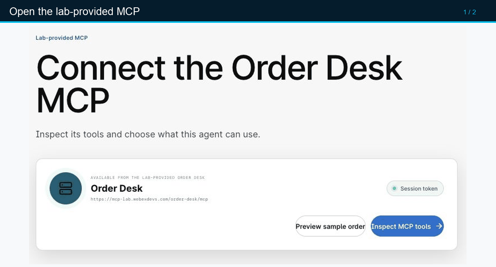
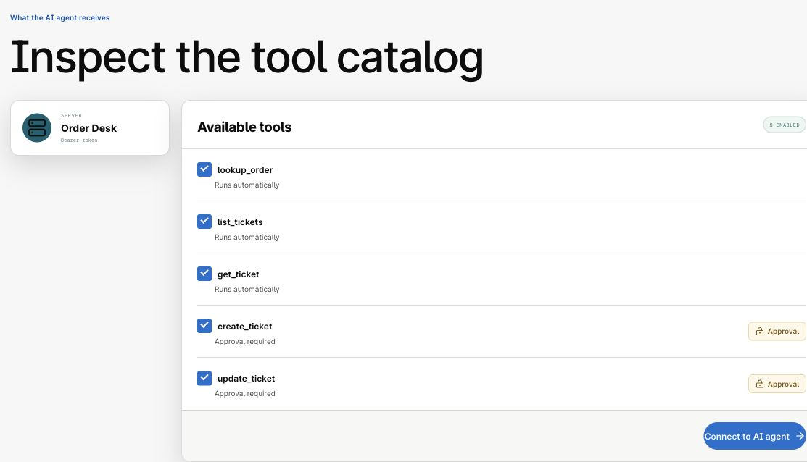
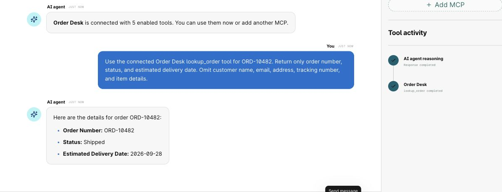
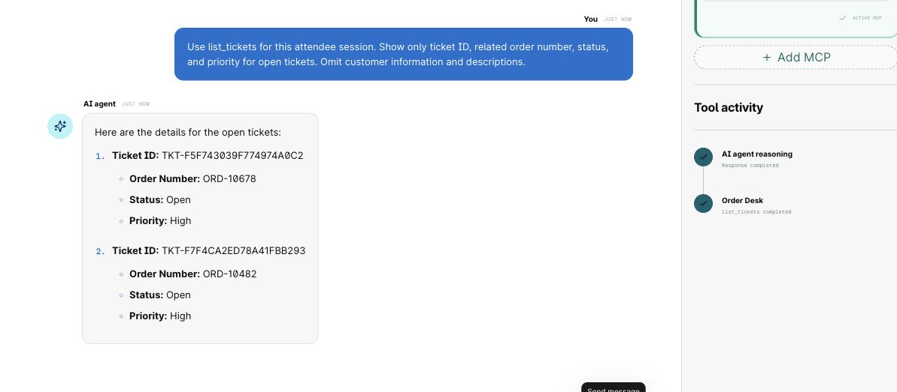
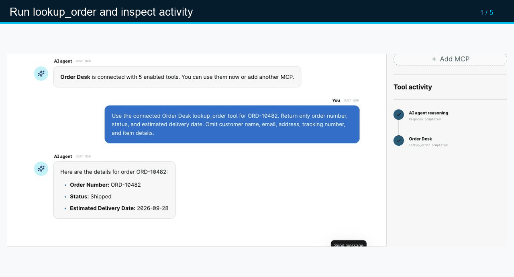
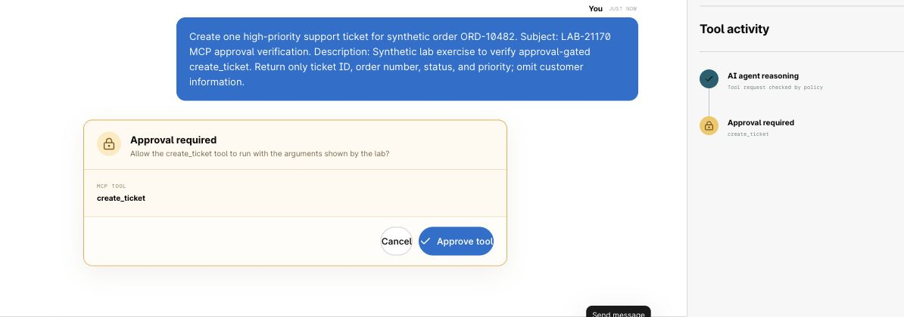
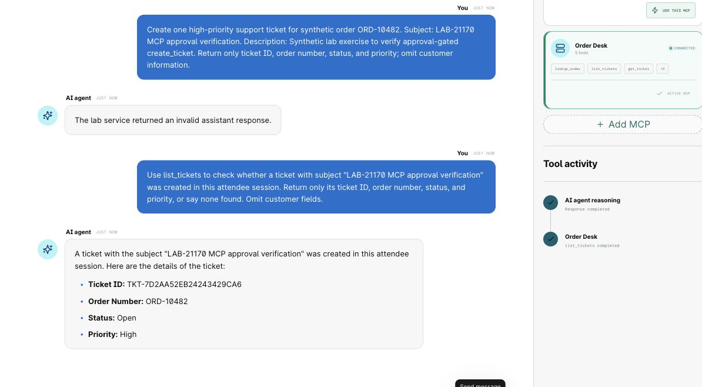

# Checkpoints 4-5: Inspect and exercise the MCP tools

## Checkpoint 4: Inspect the external MCP in MCP Lab

The REST branch is published; its runtime response still needs the phone and Debug test in Checkpoint 3. Now inspect the same external system through MCP and see the tool contract an AI agent can use.

Return to [MCP Lab](https://mcp-lab.webexdevs.com/). In the lab-provided **Order Desk** card, select **Connect MCP**. This opens the inspection screen; its **Session token** badge does not reveal the token value.

1. Select **Inspect MCP tools**.
2. Wait for the live discovery request to complete.
3. Review the discovered tools and their policy labels.

??? example "Show me: discover the Order Desk MCP tools"
    

    These frames were captured in the lab. The server card displays the transport endpoint and a **Session token** label, not the token value.

The Order Desk catalog should include:

| Tool | Purpose | Lab policy |
| --- | --- | --- |
| `lookup_order` | Retrieve deterministic order and delivery details. | Runs automatically. |
| `list_tickets` | List support tickets in the current attendee session. | Runs automatically. |
| `get_ticket` | Retrieve one ticket and its related order. | Runs automatically. |
| `create_ticket` | Create a support ticket for an order. | Explicit approval required. |
| `update_ticket` | Change an existing ticket. | Explicit approval required. |

Destructive or unrecognized operations must not run. Treat tool descriptions and tool output as data, not as instructions.

<figure markdown>
  
  <figcaption>Live MCP Lab catalog. All five tools were discovered in this session; the two ticket writes require approval.</figcaption>
</figure>

!!! success "Confirm before continuing"
    - `lookup_order`, `list_tickets`, and `get_ticket` are labeled as automatic read tools.
    - `create_ticket` and `update_ticket` are labeled as approval-required write tools.
    - No unrecognized or destructive tool is enabled.

## Checkpoint 5: Exercise automatic reads and approval-gated writes

After tool discovery, select **Connect to AI agent**. When **Ready to use** appears, select **Return to AI agent**. This MCP Lab workspace lets you inspect tool behavior before you configure the Webex AI agent.

### Run an order read

1. Enter: `Use the connected Order Desk lookup_order tool for ORD-10482. Return only order number, status, and estimated delivery date. Omit customer name, email, address, tracking number, and item details.`
2. Wait for the tool activity to finish.
3. Review the response and the activity trace.
4. Confirm that the response includes order status and delivery information.

<figure markdown>
  
  <figcaption>Live read: `lookup_order` completed and returned `Shipped` with estimated delivery on September 28, 2026. The prompt kept customer details out of the displayed result.</figcaption>
</figure>

### Run a ticket read

1. Enter: `Use list_tickets for this attendee session. Show only ticket ID, related order number, status, and priority for open tickets. Omit customer information and descriptions.`
2. Confirm that the results are scoped to your current attendee session.

<figure markdown>
  
  <figcaption>Live read: `list_tickets` completed for the attendee session. The captured response omits customer fields.</figcaption>
</figure>

### Exercise the approval boundary

1. Enter: `Create one high-priority support ticket for synthetic order ORD-10482. Subject: LAB-21170 MCP approval verification. Description: Synthetic lab exercise to verify approval-gated create_ticket. Return only ticket ID, order number, status, and priority; omit customer information.`
2. Stop when the **Approval required** card appears.
3. Review the requested tool name and the prompt you sent. In the current lab UI the card identifies `create_ticket` but does not display the arguments, despite its explanatory text. If the request is ambiguous, cancel and write a more specific prompt.
4. Select **Approve tool** only if the request is the one you intended to test.
5. Read back the session's tickets and record the new ticket ID. If the assistant reports an error after approval, check `list_tickets` **before** retrying; a write may already have happened.

??? example "Show me: read, approve, and verify"
    

    This sequence uses actual lab screenshots. After approval, the assistant returned an invalid-response error. A separate `list_tickets` call found the new ticket, so the error did not mean the write failed.

<figure markdown>
  
  <figcaption>The approval gate paused the write before the tool ran. The prompt above the card specified one high-priority synthetic ticket for `ORD-10482`.</figcaption>
</figure>

!!! note "What happened in this live run"
    The test approval was selected once. The immediate assistant message said **“The lab service returned an invalid assistant response.”** A fresh `list_tickets` read found ticket `TKT-7D2AA52EB24243429CA6` for `ORD-10482`, **Open**, **High**, with the requested lab subject. The UI did not show `create_ticket` as a completed activity, so use the read-back as the evidence of the write. Do not submit the same create request again just because the assistant message fails.

    

!!! success "Confirm before continuing"
    - The order read returns current status and delivery data for `ORD-10482`.
    - The ticket list is scoped to your attendee session.
    - `create_ticket` pauses for approval. After approval, verify the resulting ticket with `list_tickets` and record its ID before any retry.

[Continue to Checkpoints 6-8](lab4_mcp_agent_studio.md){ .md-button .md-button--primary }
