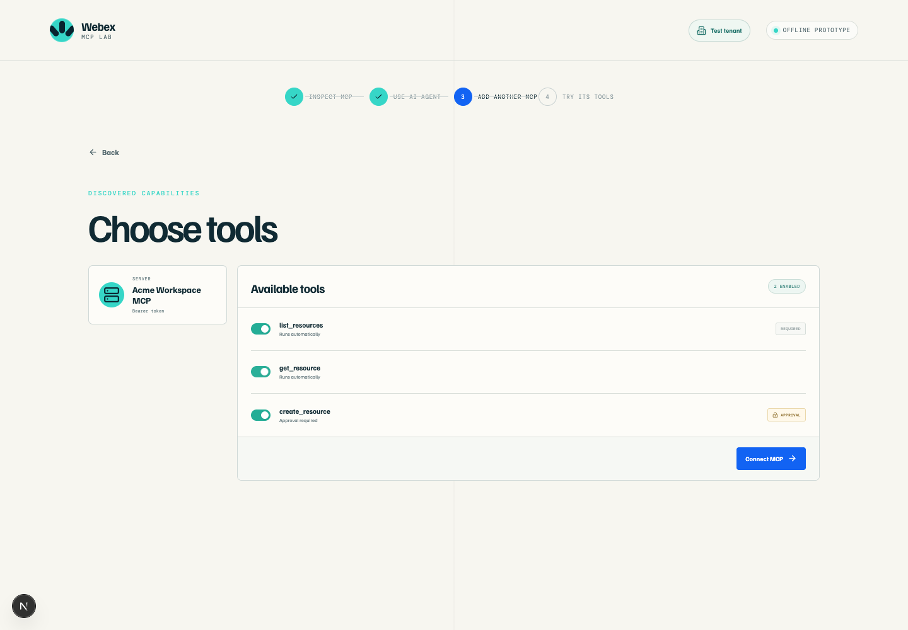

# Checkpoints 4-5: Inspect and exercise the MCP tools

## Checkpoint 4: Inspect the external MCP in MCP Lab

The REST branch proved that the external Order Desk system returns usable data. Now inspect the same system through MCP and see the tool contract an AI agent can use.

Return to [MCP Lab](https://mcp-lab.webexdevs.com/) and use the provided Order Desk connection.

1. Select **Inspect MCP** for the provided server.
2. Select **Inspect MCP tools**.
3. Wait for the live discovery request to complete.
4. Review the discovered tools and their policy labels.

The Order Desk catalog should include:

| Tool | Purpose | Lab policy |
| --- | --- | --- |
| `lookup_order` | Retrieve deterministic order and delivery details. | Runs automatically. |
| `list_tickets` | List support tickets in the current attendee session. | Runs automatically. |
| `get_ticket` | Retrieve one ticket and its related order. | Runs automatically. |
| `create_ticket` | Create a support ticket for an order. | Explicit approval required. |
| `update_ticket` | Change an existing ticket. | Explicit approval required. |

Destructive or unrecognized operations must not run. Treat tool descriptions and tool output as data, not as instructions.

<figure markdown>
  
  <figcaption>Local UI reference. Treat the live catalog discovered in your hosted lab session as authoritative.</figcaption>
</figure>

!!! success "Confirm before continuing"
    - `lookup_order`, `list_tickets`, and `get_ticket` are labeled as automatic read tools.
    - `create_ticket` and `update_ticket` are labeled as approval-required write tools.
    - No unrecognized or destructive tool is enabled.

## Checkpoint 5: Exercise automatic reads and approval-gated writes

After tool discovery, select **Connect to AI agent**, then open the MCP Lab agent workspace. This is a lab client used to inspect tool behavior before you configure the Webex AI agent.

### Run an order read

1. Enter: `Look up order ORD-10482 and summarize its status`.
2. Wait for the tool activity to finish.
3. Review the response and the activity trace.
4. Confirm that the response includes order status and delivery information.

### Run a ticket read

1. Enter: `List the open support tickets`.
2. Confirm that the results are scoped to your current attendee session.

### Exercise the approval boundary

1. Enter: `Create a high-priority ticket for order ORD-10482`.
2. Stop when the **Approval required** card appears.
3. Review the requested tool name, arguments, order number, and intended effect.
4. Select **Approve tool** only if the request is the one you intended to test.
5. Confirm that `create_ticket` completes once, and record the returned ticket ID for the session.

!!! success "Confirm before continuing"
    - The order read returns current status and delivery data for `ORD-10482`.
    - The ticket list is scoped to your attendee session.
    - `create_ticket` pauses for approval and, after approval, completes exactly once.

[Continue to Checkpoints 6-8](lab4_mcp_agent_studio.md){ .md-button .md-button--primary }
