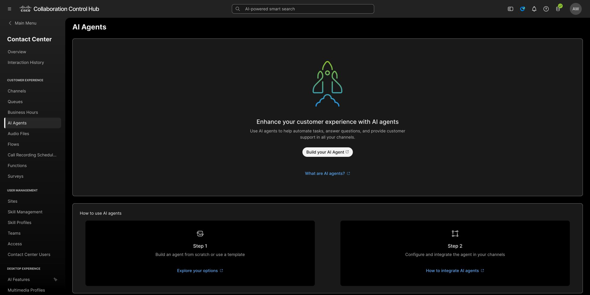
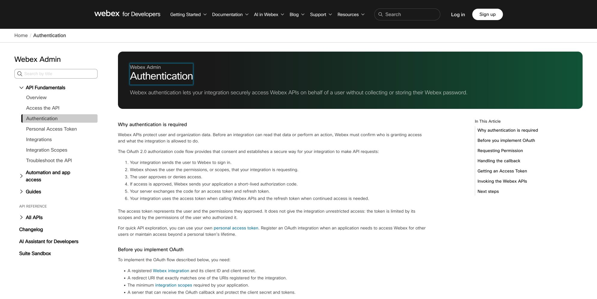

# Checkpoints 4-5: Configure the agent and registration

## Checkpoint 4: Configure the AI agent

1. In Control Hub, open **Contact Center → Customer Experience → AI Agents**.
2. Select **Build your AI Agent**.
3. Start from the lab template if one is provided; otherwise create a new agent.
4. Give the agent a clear name such as `LAB-21170 Order Support`.
5. Configure the conversation instructions so the agent:
    - identifies itself as an order-support assistant;
    - asks for an order number when one is missing;
    - uses the connected Order Desk read action to retrieve order and delivery information;
    - summarizes the result in plain language;
    - does not create or update a ticket without explicit caller and policy approval; and
    - escalates when the request is outside the exercise or the tool cannot answer it.
6. Save the agent as a draft.

<figure markdown>
  
  <figcaption>Open AI Agent Studio from the AI Agents area in Control Hub.</figcaption>
</figure>

**Suggested test request:**

> I need an update on order `ORD-10482`.

!!! success "Checkpoint 4 complete"
    The agent asks for a missing order number and is saved as a draft. You will connect the external action in Checkpoint 8.

## Checkpoint 5: Register or confirm the external MCP in Developer Portal

Use Developer Portal to complete the MCP registration handoff before connecting it in AI Agent Studio. The lab supplies the synthetic Order Desk endpoint and temporary bearer token.

<figure markdown>
  
  <figcaption>This is the portal's authentication reference. Use the facilitator-provided registration screen or details for the actual MCP setup.</figcaption>
</figure>

For this lab:

- Use the pre-created MCP registration or external action configuration supplied by the facilitator when one is provided.
- If the facilitator asks you to create a Webex integration, use the assigned sandbox, the exact redirect URI, and only the minimum scopes required for the exercise.
- Do not create a personal production integration for the lab.
- Do not place client secrets or access tokens in the agent prompt.
- The synthetic Order Desk endpoint and temporary bearer token come from the lab assignment. They describe the exercise service, not a production Webex service.

!!! success "Checkpoint 5 complete"
    The external MCP registration is available in Developer Portal, or you have the facilitator-provided registration details. You can distinguish the Webex integration credentials from the external Order Desk credentials.

!!! note
    If your tenant has no MCP-registration action, stop at this checkpoint and use the facilitator-provided AI Agent Studio action configuration.

[Continue to Checkpoints 6-8](lab4_mcp_agent_studio.md){ .md-button .md-button--primary }
