# Checkpoint 9: Attach the agent and test end to end

In the reference screenshots, published `ServiceDesk` version 5 sends callers directly to `LAB-21170 Order Support`. It passed Validation with **0 errors**, and Control Hub routes the active **Entry Point-1** to `ServiceDesk` **Latest**. Your version number may differ. Verify the order lookup and human queue handoff by phone after publishing your flow.

Before starting, confirm that `lookup_order` succeeds in AI Agent Studio Preview and the agent shows **Published**. In Preview, ask for general support, accept the offer of a human agent, and check **Sessions** for **Agent handover**. This checks the agent action; the phone test below checks the voice queue. If the MCP action is missing, finish Checkpoint 6 first.

## Replace the starter caller path

1. Open `ServiceDesk` in Flow Designer and turn **Edit** on.
2. Disconnect `NewContact` from `WelcomeMessage`. Keep the queue and wait-treatment nodes for reuse. Delete the direct **HTTP Request** activity so its temporary Authorization header does not remain in the draft.
3. Find **Virtual Agent V2** under **Contact handling** and drag it onto the canvas.
4. Set **Activity label** to `AIAgent`.
5. Connect `NewContact` directly to `AIAgent`.
6. In the activity settings, set **Contact Center AI Config** to **Webex AI Agent (Autonomous)**.
7. For **Virtual agent**, select the published `LAB-21170 Order Support` agent. Reopen the activity to confirm both selections saved.
8. Add a **Disconnect Contact** activity labeled `DisconnectContact`, or reuse one already on your canvas.
9. Connect the `AIAgent` **Handled** outcome to `DisconnectContact`.
10. Add a **Play Message** activity and label it `EscalationMessage`. Enable text to speech, select **Cisco Cloud Text-to-Speech**, and enter: `I'll connect you with a human agent.`

    <figure markdown>
      
      <figcaption markdown="span">Set the escalation prompt before the queue handoff.</figcaption>
    </figure>

11. Reuse `QueueContact_4b7` if it remains on the canvas. Remove its old incoming links from menu digit `2` and `OrderStatusMessage`, rename it `HumanAgentQueue`, and set **Voice → Static queue → Queue-1**. Connect `AIAgent` **Escalated → EscalationMessage → HumanAgentQueue**. If the activity is missing, add **Queue Contact** with those settings. If `Queue-1` is unavailable, stop here and check the assigned queue before publishing.

    <figure markdown>
      
      <figcaption markdown="span">Set `HumanAgentQueue` to **Voice → Static queue → Queue-1**. Connect **Failure** to `QueueErrorMessage`.</figcaption>
    </figure>

12. From `HumanAgentQueue`'s normal output, connect **Play Music** (`PlayMusic_pgj` in this flow), then the **Play Message** activity `PleaseWait`. Connect `PleaseWait` back to Play Music so treatment repeats while the caller waits for an agent.
13. Reuse `QueueErrorMessage` if it is already on the canvas; otherwise add a **Play Message** activity with that label. Enable text to speech, select **Cisco Cloud Text-to-Speech**, and enter: `I can't connect you to a person right now. Please try again later.` Connect the Queue Contact **Failure** output to this message, then to `DisconnectContact`.

    <figure markdown>
      
      <figcaption markdown="span">Set the Queue Contact **Failure** prompt.</figcaption>
    </figure>

14. Add another **Play Message** activity and label it `AgentErrorMessage`. Enable text to speech, select **Cisco Cloud Text-to-Speech**, and enter: `Order support is temporarily unavailable. Please try again later.`

    <figure markdown>
      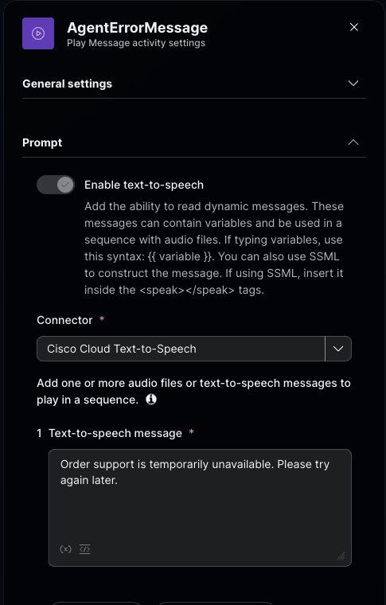
      <figcaption markdown="span">Set the AI agent **Errored** prompt.</figcaption>
    </figure>

15. Connect the `AIAgent` **Errored** outcome to `AgentErrorMessage`, then connect `AgentErrorMessage` to `DisconnectContact`.
16. Remove unused starter IVR and API nodes. Wait for **Autosave**, turn on **Validation**, and resolve any errors. Confirm the final canvas has only the connected AI route and **0 errors**.

<figure markdown>
  
  <figcaption markdown="span">Set **Contact Center AI Config** to **Webex AI Agent (Autonomous)** and **Virtual agent** to `LAB-21170 Order Support`.</figcaption>
</figure>

<figure markdown>
  
  <figcaption markdown="span">Check the three AI outcomes, queue failure path, and `PlayMusic_pgj → PleaseWait → PlayMusic_pgj` loop.</figcaption>
</figure>

<figure markdown>
  
  <figcaption markdown="span">Confirm **0 errors** and **Ready to publish**. The three recommendations do not block publication.</figcaption>
</figure>

<figure markdown>
  
  <figcaption markdown="span">Use this branch diagram with the live canvas above. Loop `PleaseWait` back to Play Music.</figcaption>
</figure>

!!! info "Before you call"
    Confirm that your published flow is **Latest** and **Entry Point-1** routes to `ServiceDesk` **Latest**. Validation confirms the wiring; the two phone tests below confirm what callers experience.

## Publish and test the final caller path

1. Select **Publish Flow** after validation. In the dialog, **Latest** is applied automatically; optionally select **Test** and enter a comment such as `AI agent with human queue`. Select **Publish Flow**, then confirm the new version is **Latest** in version history.

    <figure markdown>
      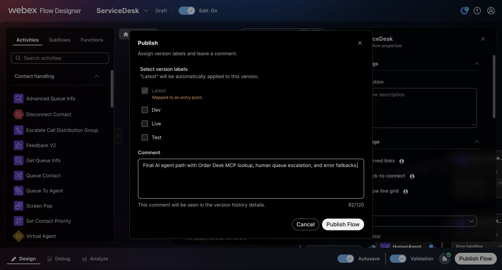
      <figcaption markdown="span">Check **Latest**, add an optional label and comment, then select **Publish Flow**.</figcaption>
    </figure>

2. In Control Hub, open the assigned inbound **Entry Point** from Checkpoint 2 and confirm that **Routing flow** is `ServiceDesk` and **Version label** is `Latest`. In Flow Designer version history, confirm that **Latest** is on your newly published version. If the entry point uses an older fixed label, update the routing assignment before calling.

    <figure markdown>
      
      <figcaption markdown="span">Set **Routing flow** to `ServiceDesk` and **Version label** to `Latest`.</figcaption>
    </figure>

3. Call the same inbound phone number used in Checkpoints 2 and 3.
4. Say: `I need an update on order ORD-10482.`
5. If the agent asks for the order number, provide `ORD-10482`.
6. Confirm that the agent retrieves the order data through the external action and explains the status and delivery information.
7. Make a second call and say: `I need general support.` When the agent offers a human handoff, say: `Yes, please connect me to a human agent.` Confirm that `EscalationMessage` plays and the call enters `Queue-1`. If a test agent is available, answer in Agent Desktop. Otherwise, listen for the wait treatment.
8. In **Debug**, inspect both Interaction IDs. Confirm the order call reached `AIAgent` and the general-support call followed `AIAgent → EscalationMessage → HumanAgentQueue`. If the caller waited, confirm the trace continued through `PlayMusic/PleaseWait`. Test Queue Contact **Failure** separately only if you can safely create a controlled failure.

### Compare your order call

Compare your order call with the captures below. In this version 5 phone test, the agent spoke **Shipped** and **September 29**. Flow Designer **Debug** and AI Agent Studio **Voice Sessions** showed the same Interaction ID. In Sessions, `lookup_order` received `ORD-10482` and returned **Success** in 0.2 seconds. The caller ended this call after the answer, so Debug shows `NewContact → AIAgent → ContactEnded`, all successful. Your call may instead follow **Handled → DisconnectContact → ContactEnded** if the agent ends it.

<figure markdown>
  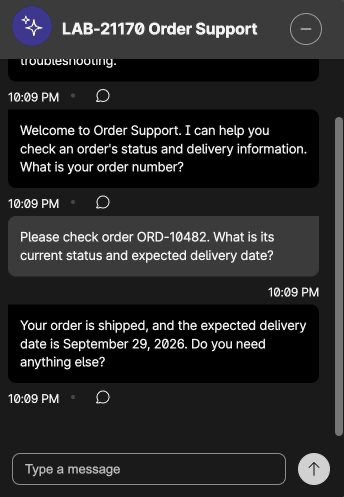
  <figcaption markdown="span">Before calling, a fresh **Preview** lookup returned **Shipped** and September 29, 2026. Compare your phone answer with the current Order Desk result.</figcaption>
</figure>

<figure markdown>
  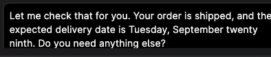
  <figcaption markdown="span">In the **Voice** session, the agent said the order had shipped and gave the September 29 delivery date.</figcaption>
</figure>

<figure markdown>
  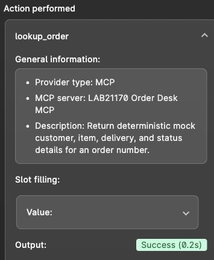
  <figcaption markdown="span">The matched **Voice** session ran `lookup_order` for `ORD-10482` successfully. The crop excludes the returned customer details.</figcaption>
</figure>

<figure markdown>
  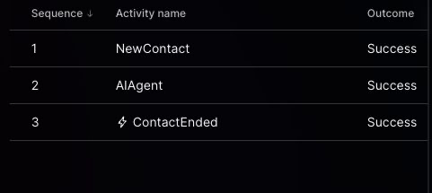
  <figcaption markdown="span">In **Debug**, the caller ended this call after the agent answered. Each activity shows **Success**.</figcaption>
</figure>

<figure markdown>
  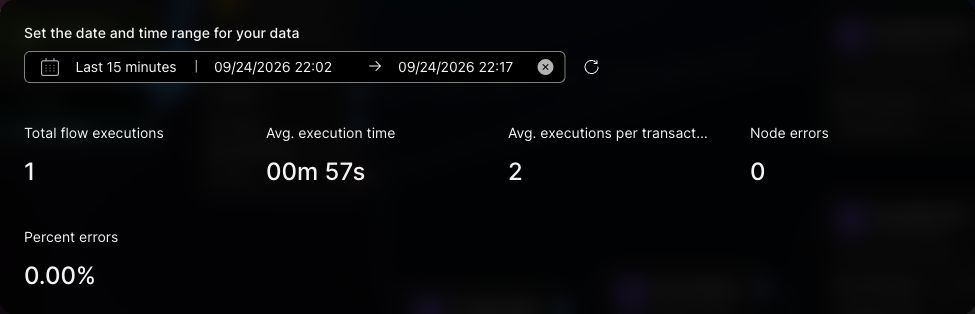
  <figcaption markdown="span">For the order-call window, **Analyze** counted one execution and zero node errors.</figcaption>
</figure>

<figure markdown>
  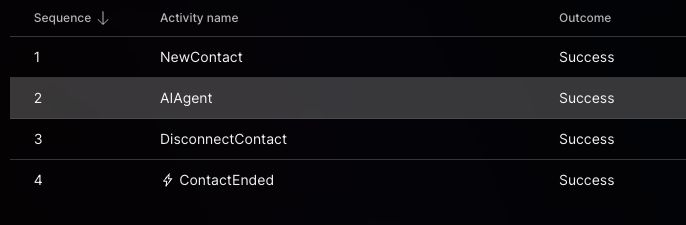
  <figcaption markdown="span">An earlier call exercised the **Handled → DisconnectContact** branch. Debug records the branch; it does not contain the spoken response.</figcaption>
</figure>

### Compare your general-support call

Compare your general-support call with the captures below. The test caller accepted the human handoff and heard queue music. **Debug** recorded `NewContact → AIAgent → EscalationMessage → HumanAgentQueue → PlayMusic_pgj → PleaseWait → PlayMusic_pgj → ContactEnded`, with **Success** at each step. The trace verifies queue treatment; it does not show a human agent answering.

<figure markdown>
  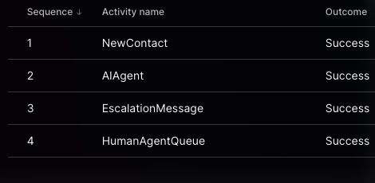
  <figcaption markdown="span">The accepted handoff reached `HumanAgentQueue`. Caller and interaction identifiers are excluded.</figcaption>
</figure>

<figure markdown>
  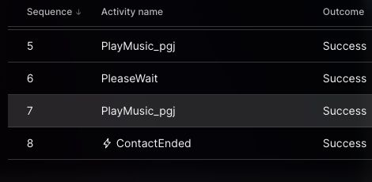
  <figcaption markdown="span">Queue music and the waiting message ran before the call ended.</figcaption>
</figure>

<figure markdown>
  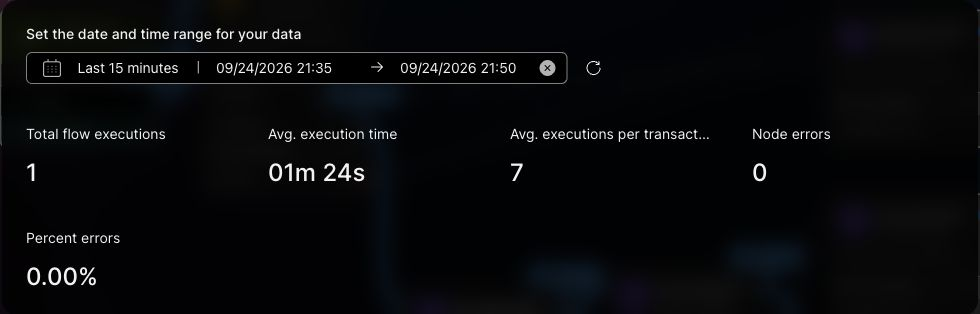
  <figcaption markdown="span">During the general-support call window, **Analyze** showed one execution and zero node errors.</figcaption>
</figure>

<figure markdown>
  
  <figcaption markdown="span">In your version history, confirm the newly published flow has **Latest**. This reference image shows version 5 with version 4 retained.</figcaption>
</figure>

**Target caller path:**

```text
Caller → ServiceDesk → AIAgent
  ├─ Order request → lookup_order (MCP) → response → Handled → disconnect
  ├─ General support → offer human → caller accepts → Escalated
  │    → EscalationMessage → Queue-1 → PlayMusic ↔ PleaseWait → human agent
  │                           └─ Failure → QueueErrorMessage → disconnect
  └─ Errored → AgentErrorMessage → disconnect
```

!!! success "Check both caller paths"
    - In **Debug**, confirm the published flow starts `NewContact → AIAgent`. Your final flow no longer contains the Flow Designer `WelcomeMessage`, numbered `SupportMenu`, or direct REST branch.
    - On the order call, listen for the spoken status and delivery information. In **Sessions**, confirm the `lookup_order` action succeeded.
    - On the general-support call, accept the human offer. Listen for `EscalationMessage` and queue treatment, then confirm `AIAgent → EscalationMessage → HumanAgentQueue` in **Debug**. An available test agent can answer.
    - If you test a controlled Queue Contact failure, confirm it reaches `QueueErrorMessage` and ends safely.
    - The **Errored** branch is connected to `AgentErrorMessage → DisconnectContact`; test it only with a controlled agent error.

!!! warning "Before marking this checkpoint complete"
    Complete both phone calls and inspect their paths in **Debug**. Confirm the order response and the human queue handoff on your published flow. Test Queue Contact **Failure** only with a controlled failure.

## Optional: inspect Contact Center through MCP

These optional beta services are separate from the Order Desk tool you used above. If your lab has access, follow the setup link for your approved client and the regional server URL shown for your tenant. Use Webex authentication; the Order Desk bearer does not connect to either Cisco service.

### Flow tools

1. Follow the [Contact Center MCP Server setup guide](https://developer.webex.com/create/docs/contact-center-mcp-server-beta). In **Control Hub → Apps → Agentic Apps**, confirm that **Contact Center MCP** and its read tools are allowed for your lab account.
2. In your connected MCP client, run `wxcc-list-flows` to find `ServiceDesk`, then `wxcc-get-flow` to open its **Latest** version.
3. Compare the returned nodes and links with your published Flow Designer canvas. Try `wxcc-view-config` for the entry point or queue if that tool is enabled.

### Operations tools

1. Follow the [Contact Center Operation MCP Server beta setup guide](https://developer.webex.com/create/docs/contact-center-operation-mcp-server-beta) and connect its regional server in your approved client. This service reads configuration and call history; it does not edit flows.
2. Run `wxcc-operations-list-flows` and find `ServiceDesk`. Run `wxcc-operations-explain-queue-routing` for `Queue-1`, then compare the queue name and routing settings with Control Hub.
3. If `wxcc-operations-get-contact-timeline` is enabled, use the test contact ID from **Debug** to inspect that call's recorded events. Compare them with the same call in Flow Designer.

Only use tools visible in your client's enabled catalog. Crop caller details, transcripts, and tokens from any screenshot you share.

[Continue to troubleshooting and completion](troubleshooting.md){ .md-button .md-button--primary }
