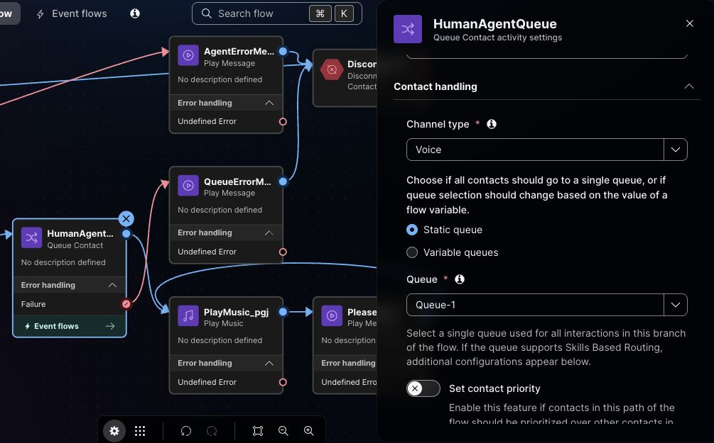
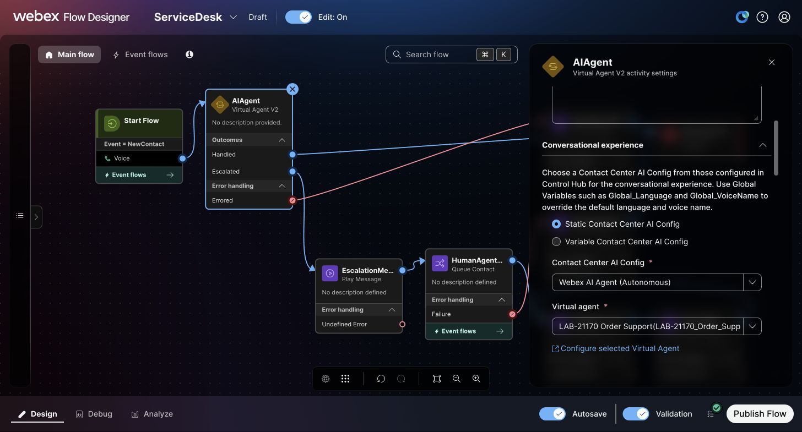
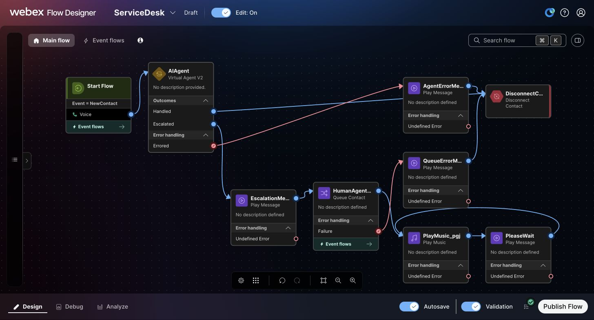
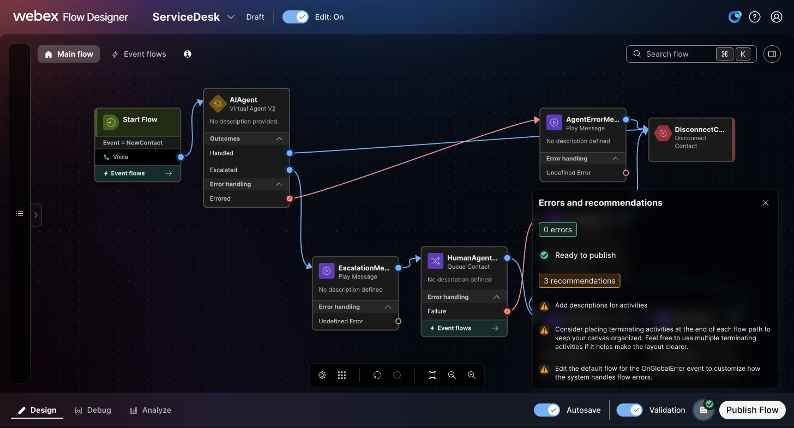
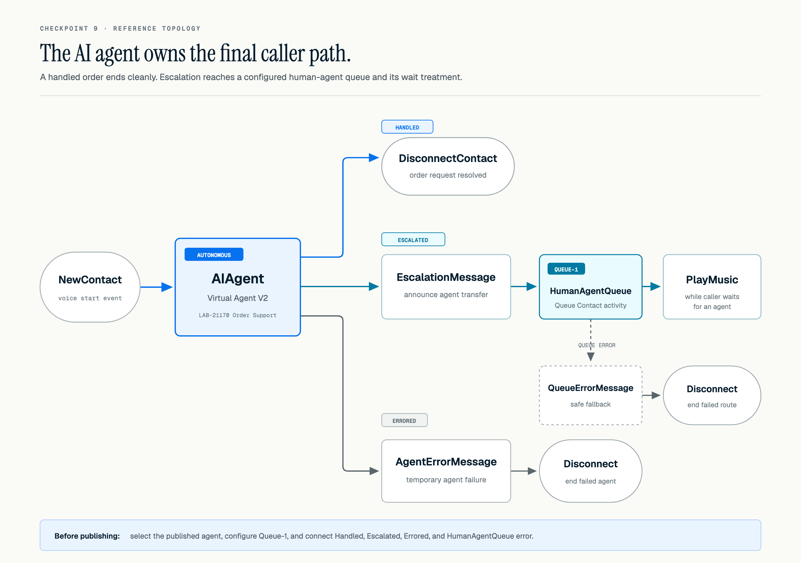
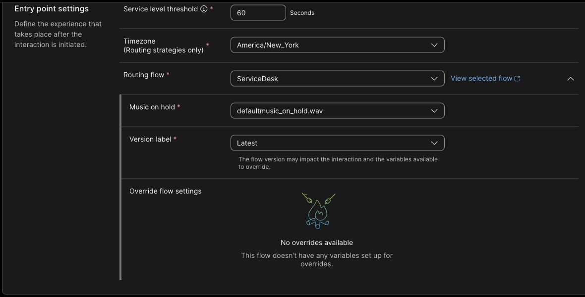
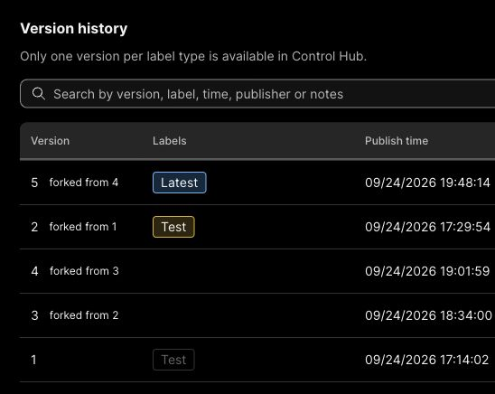

# Checkpoint 9: Attach the agent and test end to end

The published `ServiceDesk` version 5 sends callers directly to `LAB-21170 Order Support`. It passed Validation with **0 errors** and is labeled **Latest**. Control Hub shows **Entry Point-1** active and routed to `ServiceDesk` **Latest**. You still need to verify the order lookup and human queue handoff by phone.

Before starting, confirm that `lookup_order` succeeds in AI Agent Studio Preview and the agent shows **Published**. If the MCP action is missing, finish Checkpoint 6 first.

If an earlier test call said general support was unavailable, you heard the old version 3 menu. Version 4 connected digit `2` to `Queue-1`, though that fix still needs a phone check. Version 5 removes the menu altogether; version 4 remains in history for the menu exercise.

## Replace the starter caller path

1. Open `ServiceDesk` in Flow Designer and turn **Edit** on.
2. Disconnect `NewContact` from `WelcomeMessage`. Keep the queue and wait-treatment nodes for reuse. Delete the direct **HTTP Request** activity so its temporary Authorization header does not remain in the draft.
3. Find **Virtual Agent V2** under **Contact handling** and drag it onto the canvas.
4. Set **Activity label** to `AIAgent`.
5. Connect `NewContact` directly to `AIAgent`.
6. In the activity settings, set **Contact Center AI Config** to **Webex AI Agent (Autonomous)**.
7. For **Virtual agent**, select the published `LAB-21170 Order Support` agent. Reopen the activity to confirm both selections saved.
8. Add a **Disconnect Contact** activity labeled `DisconnectContact`, or reuse one already on your canvas.
9. Connect the `AIAgent` **Handled** outcome to `DisconnectContact`.
10. Add a **Play Message** activity and label it `EscalationMessage`. Enable text to speech, select **Cisco Cloud Text-to-Speech**, and enter: `I'll connect you with a human agent.`
11. Reuse `QueueContact_4b7` if it remains on the canvas. Remove its old incoming links from menu digit `2` and `OrderStatusMessage`, rename it `HumanAgentQueue`, and set **Voice → Static queue → Queue-1**. Connect `AIAgent` **Escalated → EscalationMessage → HumanAgentQueue**. If the activity is missing, add **Queue Contact** with those settings. If `Queue-1` is unavailable, stop here and check the assigned queue before publishing.

    <figure markdown>
      
      <figcaption>Set `HumanAgentQueue` to **Voice → Static queue → Queue-1**. Connect **Failure** to `QueueErrorMessage`.</figcaption>
    </figure>

12. From `HumanAgentQueue`'s normal output, connect **Play Music** (`PlayMusic_pgj` in this flow), then the **Play Message** activity `PleaseWait`. Connect `PleaseWait` back to Play Music so treatment repeats while the caller waits for an agent.
13. Add a **Play Message** activity labeled `QueueErrorMessage` with: `I can't connect you to a person right now. Please try again later.` Connect the Queue Contact **Failure** output to this message, then to `DisconnectContact`.
14. Add another **Play Message** activity and label it `AgentErrorMessage`. Enable text to speech, select **Cisco Cloud Text-to-Speech**, and enter: `Order support is temporarily unavailable. Please try again later.`
15. Connect the `AIAgent` **Errored** outcome to `AgentErrorMessage`, then connect `AgentErrorMessage` to `DisconnectContact`.
16. Remove unused starter IVR and API nodes. Wait for **Autosave**, turn on **Validation**, and resolve any errors. Confirm the final canvas has only the connected AI route and **0 errors**.

<figure markdown>
  
  <figcaption>Set **Contact Center AI Config** to **Webex AI Agent (Autonomous)** and **Virtual agent** to `LAB-21170 Order Support`.</figcaption>
</figure>

<figure markdown>
  
  <figcaption>Check the three AI outcomes, queue failure path, and `PlayMusic_pgj → PleaseWait → PlayMusic_pgj` loop.</figcaption>
</figure>

<figure markdown>
  
  <figcaption>Confirm **0 errors** and **Ready to publish**. The three recommendations do not block publication.</figcaption>
</figure>

<figure markdown>
  
  <figcaption>Use this branch diagram with the live canvas above. Loop `PleaseWait` back to Play Music.</figcaption>
</figure>

!!! info "Before you call"
    Version 5 is published as **Latest**, and **Entry Point-1** routes to `ServiceDesk` **Latest**. Validation confirms the wiring; the two phone tests below confirm what callers experience.

## Publish and test the final caller path

1. Select **Publish** after validation. **Latest** is applied automatically; add the offered **Test** label and a comment such as `AI agent with human queue` if useful. Confirm that version 5 appears as **Latest** in version history.
2. In Control Hub, open the assigned inbound **Entry Point** from Checkpoint 2 and confirm that **Routing flow** is `ServiceDesk` and **Version label** is `Latest`. In Flow Designer version history, confirm that **Latest** is on published version 5. If the entry point uses an older fixed label, update the routing assignment before calling.

    <figure markdown>
      
      <figcaption>Set **Routing flow** to `ServiceDesk` and **Version label** to `Latest`.</figcaption>
    </figure>

3. Call the same inbound phone number used in Checkpoints 2 and 3.
4. Say: `I need an update on order ORD-10482.`
5. If the agent asks for the order number, provide `ORD-10482`.
6. Confirm that the agent retrieves the order data through the external action and explains the status and delivery information.
7. Make a second call and say: `Please connect me to a human agent.` Confirm that the **Escalated** path plays `EscalationMessage` and enters `Queue-1`. If a test agent is available, answer the call in Agent Desktop. If no agent is available, confirm that the caller hears wait treatment rather than a false claim of transfer completion.
8. In **Debug**, inspect both Interaction IDs. Confirm the order call reached `AIAgent` and the human-request call followed `AIAgent → EscalationMessage → HumanAgentQueue → PlayMusic/PleaseWait`. Test Queue Contact **Failure** separately only if you can safely create a controlled failure.

<figure markdown>
  
  <figcaption>Confirm version 5 is **Latest**, published September 24, 2026 at 19:48:14 tenant time. Version 4 remains in history.</figcaption>
</figure>

**Target caller path:**

```text
Caller → ServiceDesk → AIAgent
                          ├─ Order request → lookup_order (MCP) → response → Handled → disconnect
                          ├─ Human request → Escalated → EscalationMessage → Queue-1 → PlayMusic ↔ PleaseWait → human agent
                          │                                                 └─ Failure → QueueErrorMessage → disconnect
                          └─ Errored → AgentErrorMessage → disconnect
```

!!! success "Confirm after publishing and calling"
    - The connected caller path is `NewContact → AIAgent`; the starter menu and REST branch are removed from published version 5.
    - A live caller does not hear the old Flow Designer `WelcomeMessage` or numbered `SupportMenu`; the AI agent's own welcome message may still play.
    - The agent uses `lookup_order` and speaks the returned order and delivery details.
    - An explicit request for a person reaches `Queue-1` and wait treatment; an available test agent can answer it.
    - A controlled Queue Contact failure, if tested, reaches `QueueErrorMessage` and ends safely.
    - `AgentErrorMessage` provides a clear fallback if the AI agent errors.

!!! warning "Finish the phone checks"
    The version 5 order call and human handoff have not yet been verified by phone. Complete both calls and inspect Debug before marking this lab complete. Test the queue-failure branch only with a controlled failure.

## Optional: inspect Contact Center through MCP

The Order Desk MCP is the **external order tool** your voice agent uses. Cisco's two Contact Center MCP services below let an approved client inspect flows or operations. They were **not used in this lab**. If your organization has beta access, use the approved MCP client, regional server URL, authentication method, and enabled tool catalog. Do not use the Order Desk bearer for either Cisco service.

### A. Contact Center MCP Server: Flow tools

The [Contact Center MCP Server](https://developer.webex.com/mcp/docs/contact-center-mcp-server) provides Flow Designer tools backed by the FlowV2 authoring contract. Follow the [beta setup guide](https://developer.webex.com/create/docs/contact-center-mcp-server-beta) for supported clients and authentication. Your administrator must allow **Contact Center MCP** under **Control Hub → Apps → Agentic Apps** and enable the tools you need.

For a read-only tour, use `wxcc-list-flows` and `wxcc-get-flow` to find a flow, `wxcc-view-config` to inspect configuration, and `wxcc-get-activity-definitions`, `wxcc-describe-activity`, and `wxcc-get-choices` to inspect activities. Compare the result with the Flow Designer canvas. If writes are enabled, make changes in an unpublished test draft, inspect the diff, and run `wxcc-validate-flow` before anyone publishes or assigns the flow. Check your enabled tool catalog; these names come from the published documentation.

### B. Contact Center Operation MCP Server: read-only tools

The [Contact Center Operation MCP Server beta](https://developer.webex.com/create/docs/contact-center-operation-mcp-server-beta) is a separate **read-only** service. It cannot create, update, publish, or delete a flow. Confirm access, the regional URL, and enabled tools before connecting.

Use `wxcc-operations-describe-org` and `wxcc-operations-describe-metrics` to inspect available fields, `wxcc-operations-list-flows` to find a flow, and `wxcc-operations-explain-queue-routing` to inspect queue configuration. If you have an approved test contact ID and the tool is enabled, `wxcc-operations-get-contact-timeline` can show arrival, IVR, queue, agent, and end events. If an artifact is delayed or missing, check the source timeline before drawing a conclusion.

Before sharing a screenshot, crop out tokens, caller numbers, transcripts, and customer details.

[Continue to troubleshooting and completion](troubleshooting.md){ .md-button .md-button--primary }
