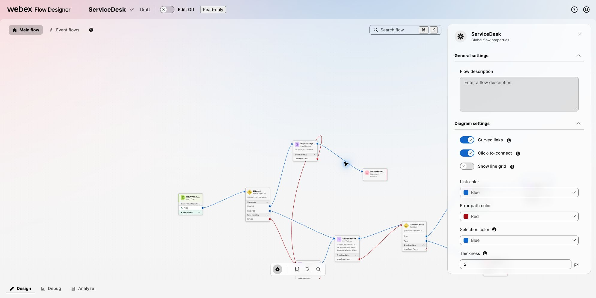

# Checkpoint 9: Attach the agent and test end to end

## Replace the starter caller path

1. Return to the `ServiceDesk` draft in Flow Designer.
2. Disconnect `NewContact` from `WelcomeMessage`. Leave the starter IVR and **HTTP Request** activities on the canvas as an unconnected reference.
3. Find **Virtual Agent V2** under **Contact handling** and drag it onto the canvas.
4. Set **Activity label** to `AIAgent`.
5. Connect `NewContact` directly to `AIAgent`.
6. In the activity settings, select the agent configured in AI Agent Studio.
7. Connect the activity's **Handled** outcome to the normal completion path.
8. Connect **Escalated** to the facilitator-designated queue or transfer path.
9. Connect **Errored** to the flow's error-handling path.
10. Save and validate the flow.

<figure markdown>
  
  <figcaption>The final caller path connects NewContact directly to Virtual Agent V2.</figcaption>
</figure>

## Publish and test the final caller path

1. Publish a new flow version. The inbound channel created in Checkpoint 2 already routes to `ServiceDesk`; confirm that it uses the latest published version if the channel presents a version choice.
2. Call the same inbound phone number used in Checkpoints 2 and 3.
3. Say: `I need an update on order ORD-10482.`
4. If the agent asks for the order number, provide `ORD-10482`.
5. Confirm that the agent retrieves the order data through the external action and explains the status and delivery information.
6. Test an escalation or unsupported request and verify that it follows the configured escalation path.

**Completed path:**

```text
Caller → Flow Designer entry → AI agent → external Order Desk service via MCP → order response
```

!!! success "Checkpoint 9 complete"
    The live phone call reaches the AI agent directly, the agent retrieves order `ORD-10482` through MCP, and the caller hears the order and delivery response.

Publish only the flow versions required by this guide. A human still decides whether to change organization-wide defaults or reuse the lab configuration outside the assigned sandbox.

## Optional admin stretch: Add another MCP

Run this section only if the facilitator enables it and provides the exact Webex Contact Center MCP endpoint and authorization method.

1. In MCP Lab, open **Add another MCP**.
2. Paste the approved MCP server address.
3. Choose the authentication method supplied by the facilitator.
4. Select **Discover tools**.
5. Review every discovered tool and its policy label.
6. Enable only the bounded flow-management tools required for the exercise.
7. Connect the MCP and return to the AI agent workspace.
8. Request one small, reversible flow change.
9. Stop at the approval gate and review the exact proposed change.
10. Approve only the bounded change you intend to test.
11. Read the updated flow back in Flow Designer and verify the result.

!!! danger
    Do not use delete, remove, destructive, or unrecognized tools. If the endpoint, authorization prompt, or tool contract is not the one provided by the facilitator, stop and ask for help.

[Continue to troubleshooting and completion](troubleshooting.md){ .md-button .md-button--primary }
