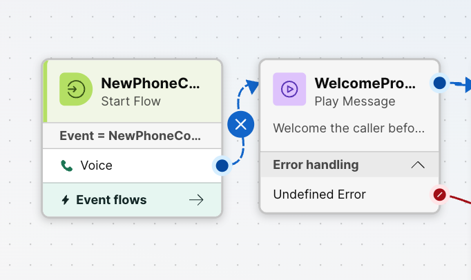
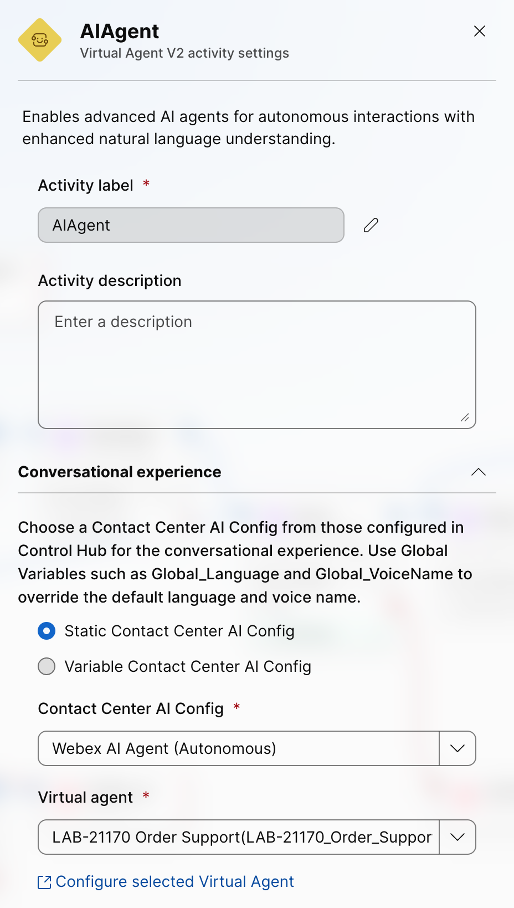
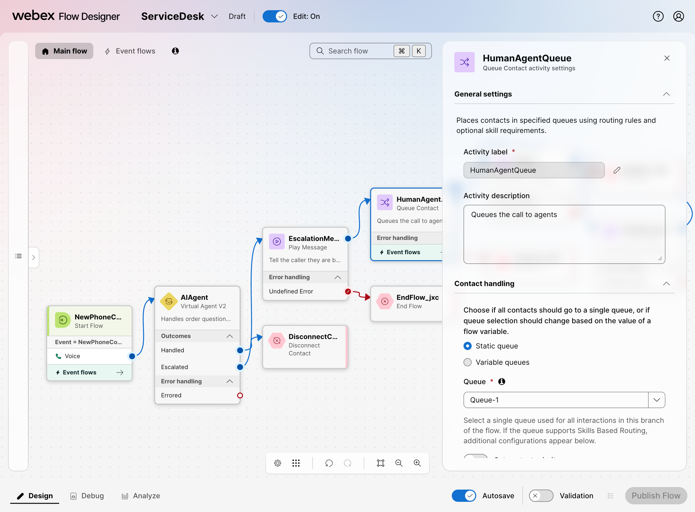
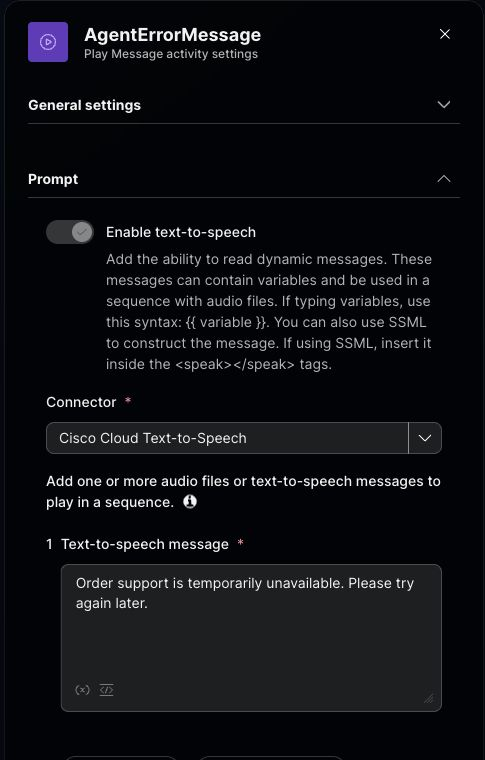
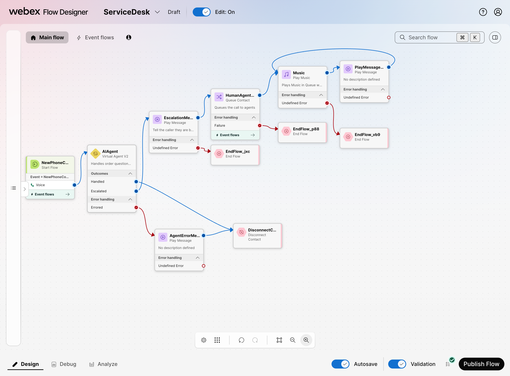
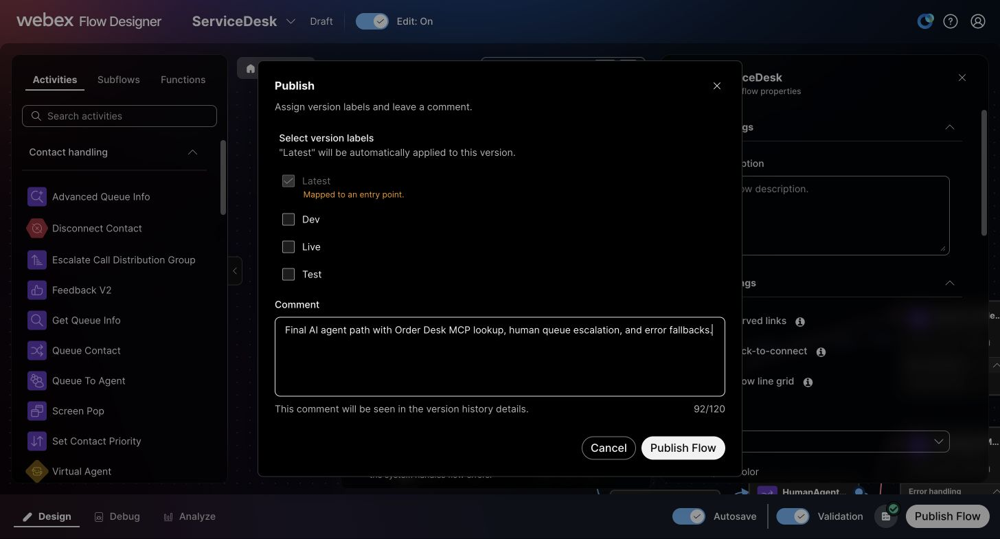
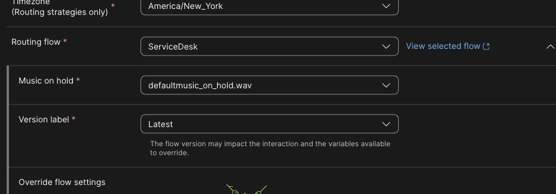
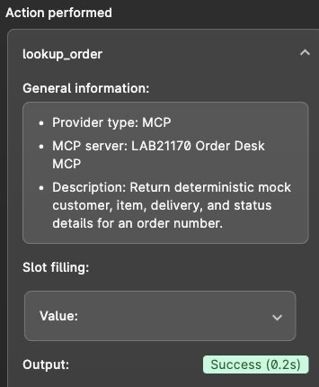
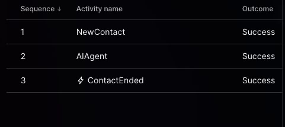
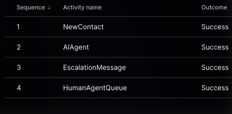

# Checkpoint 9: Attach the agent and test end to end

Replace the starter's menu and direct REST branch with your published AI agent. Repurpose its welcome message for the human handoff, and keep its queue and wait treatment. After publishing, verify the order lookup and human handoff by phone. Your published version number may differ from the reference captures below.

Before starting, confirm that `lookup_order` succeeds in AI Agent Studio Preview and the agent shows **Published**. In Preview, ask for general support, accept the offer of a human agent, and check **Sessions** for **Agent handover**. This checks the agent action; the phone test below checks the voice queue. If the MCP action is missing, finish Checkpoint 6 first.

## Replace the starter caller path

1. Return to the `ServiceDesk` Flow Designer tab you used in Checkpoint 3 and turn **Edit** on. If you closed the tab, open [Control Hub](https://admin.webex.com/), go to **Contact Center → Customer Experience → Flows → Manage Flows**, and open your imported `ServiceDesk` flow. If you gave the flow a different name on import, open that flow instead.
2. Hover over the connector from `NewPhoneContact` to `WelcomePrompt` and click the **X** that appears on the line. Keep `WelcomePrompt` on the canvas; you will reuse it for the human handoff.

    <figure markdown>
      
      <figcaption markdown="span">Click the **X** on the connector, not the activity.</figcaption>
    </figure>

3. Find **Virtual Agent V2** under **Contact handling** and drag it onto the canvas.
4. Drag from the blue output port on `NewPhoneContact` to the **Virtual Agent V2** activity before configuring it.
5. Select the new activity and set **Activity label** to `AIAgent`. Keep **Static Contact Center AI Config** selected, choose **Webex AI Agent (Autonomous)** for **Contact Center AI Config**, and choose your published `LAB-21170 Order Support` for **Virtual agent**. Wait for **Autosave**, then reopen the activity to confirm both selections persisted.

    <figure markdown>
      { width="420" }
      <figcaption markdown="span">Set the activity label, AI config, and published virtual agent after connecting the start activity. Select the image to enlarge it.</figcaption>
    </figure>

6. Add a **Disconnect Contact** activity labeled `DisconnectContact`, or reuse one already on your canvas. Connect the `AIAgent` **Handled** outcome to it.
7. Select the imported `WelcomePrompt` **Play Message** activity. Change its **Activity label** to `EscalationMessage` and its description to `Tell the caller they are being connected to a human agent.` Keep **Cisco Cloud Text-to-Speech** selected and replace the existing welcome text with: `I'll connect you with a human agent.` This activity already has a text-to-speech prompt, so you do not need to add another Play Message or audio row.

    <figure markdown>
      
      <figcaption markdown="span">Replace the prompt in the reused `WelcomePrompt` before connecting it to the queue.</figcaption>
    </figure>

8. Hover over the connector from `EscalationMessage` to `SupportMenu` and click its **X**. Delete the old `SupportMenu`, `GetOrder`, `OrderStatusMessage`, and `MenuFallbackMessage` activities. This also removes the direct HTTP request and its temporary Authorization header. Keep the imported `Queue`, `Music`, `PlayMessage_c24`, and their connected End Flow activities.
9. Reuse the imported `Queue` (**Queue Contact**) activity. Rename it `HumanAgentQueue` and confirm **Voice → Static queue → Queue-1**. Connect `AIAgent` **Escalated → EscalationMessage → HumanAgentQueue**. If `Queue-1` is unavailable, stop here and check the assigned queue before publishing.

    <figure markdown>
      
      <figcaption markdown="span">Confirm **Static queue** and **Queue-1** in the reused Queue Contact. This capture was taken while wiring the flow; compare the completed layout with the image after step 13.</figcaption>
    </figure>

10. Keep the imported `HumanAgentQueue → Music → PlayMessage_c24 → Music` waiting loop as it is. The existing `PlayMessage_c24` prompt already tells the caller to wait; do not rename it. Leave the Queue Contact **Failure** output connected to its existing **End Flow** activity. An agent may answer before every waiting activity plays.
11. Add a **Play Message** activity labeled `AgentErrorMessage`. Enable text to speech, select **Cisco Cloud Text-to-Speech**, and enter: `Order support is temporarily unavailable. Please try again later.` If the new activity includes an empty **Audio file** row, remove that row so it does not block validation.

    <figure markdown>
      
      <figcaption markdown="span">Set the AI agent **Errored** prompt.</figcaption>
    </figure>

12. Connect the `AIAgent` **Errored** outcome to `AgentErrorMessage`, then connect `AgentErrorMessage` to `DisconnectContact`.
13. Wait for **Autosave**, turn on **Validation**, and resolve any errors. Confirm **0 errors** and check the final paths: `NewPhoneContact → AIAgent`; **Handled → DisconnectContact**; **Escalated → EscalationMessage → HumanAgentQueue → Music → PlayMessage_c24**; and **Errored → AgentErrorMessage → DisconnectContact**. The imported Queue **Failure** link still reaches its End Flow activity.

    <figure markdown>
      
      <figcaption markdown="span">Final draft layout after reconnecting all three AI outcomes. The three **End Flow** activities on red links are the starter's retained error paths; the blue **Handled** and **Errored** paths meet at `DisconnectContact`. Select the image to enlarge it.</figcaption>
    </figure>

!!! info "Before you call"
    Confirm that your published flow is **Latest** and your assigned entry point routes to `ServiceDesk` **Latest**. Validation confirms the wiring; the two phone tests below confirm what callers experience. Use a phone or a Webex desktop client with external calling enabled. Studio Preview and browser-only **Call on Webex** cannot verify the inbound queue path.

## Publish and test the final caller path

1. Select **Publish Flow** after validation. In the dialog, **Latest** is applied automatically; optionally select **Test** and enter a comment such as `AI agent with human queue`. Select **Publish Flow**, then confirm the new version is **Latest** in version history.

    <figure markdown>
      
      <figcaption markdown="span">Check **Latest**, add an optional label and comment, then select **Publish Flow**.</figcaption>
    </figure>

2. In Control Hub, go to **Contact Center → Customer Experience → Channels** and reopen the assigned **Inbound Telephony** entry point from Checkpoint 3. Confirm that **Routing flow** is `ServiceDesk` and **Version label** is `Latest`. In Flow Designer version history, confirm that **Latest** is on your newly published version. If the entry point uses an older fixed label, update the routing assignment before calling.

    <figure markdown>
      
      <figcaption markdown="span">Set **Routing flow** to `ServiceDesk` and **Version label** to `Latest`.</figcaption>
    </figure>

3. Call the same inbound phone number used in Checkpoints 2 and 3.
4. Say: `I need an update on order ORD-10482.`
5. If the agent asks for the order number, provide `ORD-10482`.
6. Confirm that the agent retrieves the order data through the external action and explains the status and delivery information.
7. Make a second call and say: `I need general support.` When the agent offers a human handoff, say: `Yes, please connect me to a human agent.` Confirm that `EscalationMessage` plays and the call enters `Queue-1`. If a test agent is available, answer in Agent Desktop. Otherwise, listen for the wait treatment.
8. In **Debug**, inspect both Interaction IDs. Confirm the order call reached `AIAgent` and the general-support call followed `AIAgent → EscalationMessage → HumanAgentQueue`. If the caller waited, confirm the trace continued through `Music → PlayMessage_c24`. The Queue Contact **Failure** branch retains its imported End Flow connection.

### Compare your order call

For the order call, check **Voice Sessions** for a successful `lookup_order` request with `orderNumber` set to `ORD-10482`. In **Debug**, confirm the call reached `AIAgent` and ended after the answer. Compare the spoken status and delivery date with the current Order Desk result, which may differ from older captures. If the agent ends the call, Debug may show `Handled → DisconnectContact → ContactEnded`.

<figure markdown>
  
  <figcaption markdown="span">The matched **Voice** session ran `lookup_order` for `ORD-10482` successfully. The crop excludes the returned customer details.</figcaption>
</figure>

<figure markdown>
  
  <figcaption markdown="span">In **Debug**, the caller ended this call after the agent answered. Each activity shows **Success**.</figcaption>
</figure>


### Compare your general-support call

For the general-support call, accept the human handoff and listen for queue music. In **Debug**, confirm `AIAgent → EscalationMessage → HumanAgentQueue → Music → PlayMessage_c24` if the caller waits long enough for the message. Queue music confirms wait treatment; the trace does not show a human agent answering.

<figure markdown>
  
  <figcaption markdown="span">The accepted handoff reached `HumanAgentQueue`. Caller and interaction identifiers are excluded.</figcaption>
</figure>


**Target caller path:**

```text
Caller → ServiceDesk → AIAgent
  ├─ Order request → lookup_order (MCP) → response → Handled → disconnect
  ├─ General support → offer human → caller accepts → Escalated
  │    → EscalationMessage → HumanAgentQueue (Queue-1)
  │      ├─ Waiting → Music ↔ PlayMessage_c24 (until a human answers)
  │      └─ Failure → existing End Flow
  └─ Errored → AgentErrorMessage → disconnect
```

!!! success "Check both caller paths"
    - In **Debug**, confirm the published flow starts `NewPhoneContact → AIAgent` (the start event may display as `NewContact` in the interaction trace). Your final flow contains the reused `EscalationMessage`, but no `SupportMenu`, `GetOrder`, or `OrderStatusMessage`.
    - On the order call, listen for the spoken status and delivery information. In **Sessions**, confirm the `lookup_order` action succeeded.
    - On the general-support call, accept the human offer. Listen for `EscalationMessage` and queue treatment, then confirm `AIAgent → EscalationMessage → HumanAgentQueue` in **Debug**. An available test agent can answer.
    - The imported Queue Contact **Failure** output still leads to its End Flow activity; no new queue-error message is needed.
    - The **Errored** branch is connected to `AgentErrorMessage → DisconnectContact`; test it only with a controlled agent error.

!!! warning "Before marking this checkpoint complete"
    Complete both phone calls and inspect their paths in **Debug**. Confirm the order response and the human queue handoff on your published flow.

## Optional: explore Contact Center MCP

After completing the phone tests, ask your facilitator whether your sandbox has access to **Webex Contact Center MCP**. If it does, follow the [read-only bonus exercise](bonus_contact_center_mcp.md) to connect with your sandbox Webex account, find `ServiceDesk`, and compare the returned flow with your canvas. This is a separate connection from Order Desk; no flow changes or publishing are part of the bonus.

[Continue to troubleshooting and completion](troubleshooting.md){ .md-button .md-button--primary }
