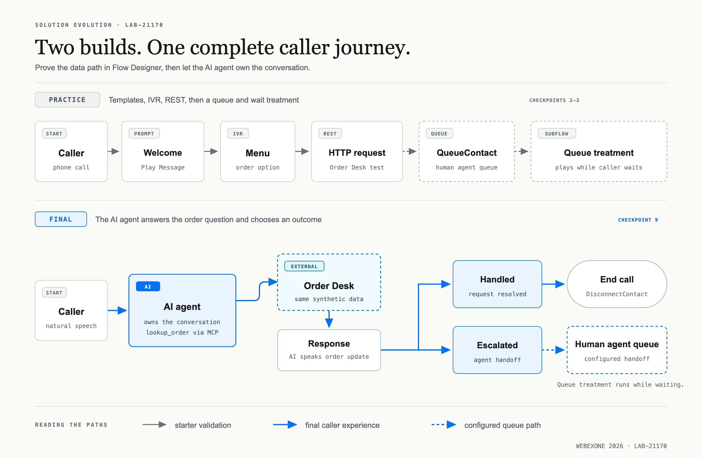

# Overview

## What you will build

You operate a customer service contact center for an online retailer. A customer calls for an update on order `ORD-10482`. Your job is to build the contact-center experience that handles that request safely and returns current order and delivery information.

You will build two versions of the caller path:

```text
Practice path:
  Caller → welcome message → menu → Order Desk REST test
         → human agent queue → queue treatment

Final path:
  Caller → AI agent → external Order Desk system → response
         ├─ Handled → end
         └─ Escalated → human agent queue → queue treatment
```

The starter IVR teaches the core Flow Designer activities, gives you a direct REST response to compare with the finished experience, and introduces queue treatment. In the target final version, you bypass the menu and connect the caller directly to the AI agent. A handled request ends cleanly; an escalation follows the human-agent queue path you configure in the lab. That final caller path does not use a press-one/press-two menu.

<figure markdown>
  
  <figcaption>The starter IVR is a temporary learning and data-validation path. The target final call goes directly to an AI agent with an approved external MCP tool and can escalate to the human queue.</figcaption>
</figure>

The two stages use the same simulated Order Desk data. The first exposes the mechanics; the second gives the caller a natural conversation without requiring the agent to construct or parse a REST request.

## Your role

You are the Webex Contact Center administrator and automation developer. You will:

- administer the assigned sandbox in **Control Hub**;
- build and publish the call flow in **Flow Designer**;
- prepare the order-support agent in **AI Agent Studio**;
- confirm the external MCP registration in **Developer Portal**;
- inspect and test the simulated external service in **MCP Lab**; and
- call the assigned phone number to validate each published version.

During the final test, you speak as the caller. The AI agent plays the order-support assistant.

## Product journey

| Layer | Product | Open | What it contributes |
| --- | --- | --- | --- |
| Organization | **Control Hub** | [admin.webex.com](https://admin.webex.com/) | Administer the organization, assigned entry point, and queue. |
| Runtime | **Flow Designer** | [Open from Control Hub](https://admin.webex.com/) or use the [direct lab URL](https://flow-control.produs1.ciscoccservice.com/) | Build and publish flows, test the REST branch, and connect the agent's outcomes. [developer.webex.com](https://developer.webex.com/) provides developer documentation; it is not the Flow Designer canvas. |
| Conversation | **AI Agent Studio** | [Launch from Control Hub](https://admin.webex.com/) via **Contact Center → Customer Experience → AI Agents** | Set the agent's instructions, response behavior, and approved actions. Control Hub opens the studio in a new tab. |
| Developer access | **Developer Portal** | [developer.webex.com](https://developer.webex.com/) | Register the external MCP data source before the agent uses it. |

MCP Lab and Order Desk support the exercise, but they are not Webex products. MCP Lab provides the temporary sandbox assignment and the synthetic Order Desk REST and MCP endpoints.

## Lab sequence

You will build and validate one layer at a time:

1. Redeem the sandbox assignment and bookmark the lab workspaces.
2. Build a first flow from the **Simple Flow to Queue** template, point it to the assigned queue, publish it, and call the assigned number.
3. Explore **Flow Debugging** for an individual call; make two or three more calls and explore aggregate **Flow Analytics**.
4. Build the starter IVR, then add queue wait treatment and a callback option using the **Comprehensive Call Flow** template as a reference; test the routed version by phone.
5. Publish the Order Desk REST branch in Flow Designer, then verify its response by phone, Debugging, and Analytics.
6. Refactor the HTTP request into a subflow and use a Function to parse and normalize its response.
7. Inspect the Order Desk MCP tool contract and exercise automatic reads and an approval-gated write in MCP Lab.
8. Register the external MCP in Developer Portal and enable it in Control Hub.
9. Create an autonomous order-support agent, replace any starter content, attach the approved MCP `lookup_order` action, preview it, and publish it.
10. Replace the starter caller path with the published AI agent and call the final flow, including a human-escalation test.
11. **Bonus:** Explore the Webex Contact Center MCP service and its Flow tools, then explore the separate Webex Contact Center Operations MCP service and tools when they are available in the lab sandbox.

This order lets you see the raw API response before the agent uses the same business data through a structured MCP tool.

## Before you start

Bring the event-provided **MCP Lab token** and use a supported browser. MCP Lab supplies the sandbox URL, sign-in details, Order Desk endpoints, temporary bearer token, assignment expiration, and sample order number after you redeem the token.

Keep separate browser tabs open for Control Hub, Flow Designer, Developer Portal, AI Agent Studio, and MCP Lab.

!!! warning "Protect your lab credentials"
    Keep credentials inside the assigned sandbox or the lab's **Test tenant details** panel. Never paste a bearer token, client secret, or sandbox password into a slide, chat, ticket, screenshot, or source file.

## Current guide

This online guide is the current version for the updated queue-treatment, HTTP subflow, Function, and MCP checkpoints. Earlier Word and PDF walkthroughs remain archived in the repository but do not include these updates.

[Start Checkpoint 1](lab1_getting_started.md){ .md-button .md-button--primary }
