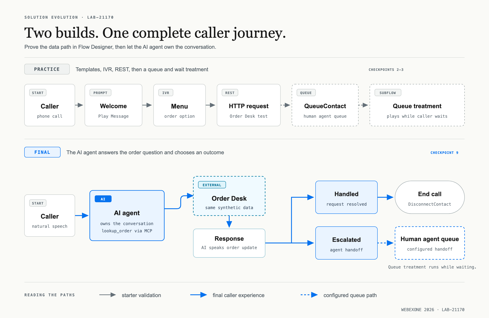

# Overview

## What you will build

You run the contact center for a mock online retailer. A caller wants an update on order `ORD-10482`. Import a starter IVR, add your lab's temporary Order Desk bearer, then replace the direct-REST practice path with an AI agent that can look up the order and connect the caller to a person when needed.

```text
Practice path:
  Caller → welcome message → menu
         ├─ 1 order support → Order Desk REST test → status → Queue-1 → wait treatment
         └─ 2 general support ─────────────────────────→ Queue-1 → wait treatment

Final path:
  Caller → AI agent
         ├─ order request → Order Desk MCP → response → Handled → end
         ├─ general support → offer human → Escalated → Queue-1 → wait treatment
         └─ Errored → spoken error message → disconnect
```

In the practice flow, digit `1` looks up an order through REST before joining `Queue-1`; digit `2` joins the queue directly. In the final flow, the caller goes straight to the AI agent. A handled request ends, an escalation enters the human queue, and an error plays a clear fallback before disconnecting. The final path has no numbered menu.

<figure markdown>
  
  <figcaption markdown="span">Practice digit 2 bypasses REST and joins the queue. The final path uses the approved Order Desk MCP action; dashed queue links are configured in later checkpoints.</figcaption>
</figure>

See [Checkpoint 9's reference topology](lab5_end_to_end.md) for the final outcomes and queue-error path.

Both paths use the same simulated Order Desk data, so you can compare the REST result with the agent's answer.

## Your role

You will:

- check the assigned sandbox in **Control Hub**;
- import, inspect, and publish the call flow in **Flow Designer**;
- prepare the order-support agent in **AI Agent Studio**;
- confirm the external MCP registration in **Developer Portal**;
- test the simulated Order Desk service in **MCP Lab**; and
- call the assigned phone number to validate each published version.

In the final phone test, you speak as the caller.

## Lab tools

| Layer | Product | Open | What you do |
| --- | --- | --- | --- |
| Organization | **Control Hub** | [admin.webex.com](https://admin.webex.com/) | Check your organization, entry point, and queue. |
| Runtime | **Flow Designer** | [Open from Control Hub](https://admin.webex.com/) or use the [direct lab URL](https://flow-control.produs1.ciscoccservice.com/) | Import and publish the starter, test REST, and connect the AI agent's outcomes. |
| Conversation | **AI Agent Studio** | [studio.aiagent-us1.cisco.com](https://studio.aiagent-us1.cisco.com/) for this ProdUS1 lab, or launch via **Control Hub → Contact Center → Customer Experience → AI Agents** | Set instructions, approved actions, and response behavior. |
| Developer access | **Developer Portal** | [developer.webex.com](https://developer.webex.com/) | Register the external MCP. This is not the Flow Designer canvas. |

**MCP Lab** supplies your temporary assignment and the synthetic Order Desk REST and MCP endpoints. MCP Lab and Order Desk are lab services, not Webex products.

## Lab sequence

Work through the checkpoints in order:

1. Redeem the sandbox assignment and bookmark the lab workspaces.
2. Download and import the credential-free `ServiceDesk` starter. Inspect its menu, REST lookup, queue, and fallback paths.
3. Add your temporary Order Desk bearer to `GetOrder`, publish, and verify the direct-REST result by phone and in Debug/Analyze when a calling method is available.
4. Connect Order Desk in MCP Lab with the default tools enabled, then test only `lookup_order`.
5. Register the external MCP in Developer Portal and enable it in Control Hub.
6. Create an autonomous order-support agent, replace any starter content, attach the approved MCP `lookup_order` action, preview it, and publish it.
7. Replace the starter caller path with the published AI agent. Call once for an order update and again for human escalation.
8. **Optional:** [Inspect your flow and edit a separate draft through Contact Center MCP](bonus_contact_center_mcp.md) if your facilitator confirms sandbox access. Start by reading `ServiceDesk`, then optionally patch one activity description in an unpublished copy. Keep the original flow and routing unchanged. You can also [build the starter assets by hand](optional_flow_designer_deep_dive.md) for additional Flow Designer practice.

## Before you start

Bring the event-provided **MCP Lab token** and use a supported browser. After redemption, select **Test tenant** for your sandbox sign-in details, Developer Portal and Order Desk MCP addresses, and temporary Order Desk bearer token. To see the sample order and REST request, select **Inspect orders** in MCP Lab. Do not expect an assignment-expiration time in the tenant-details panel.

Have a phone that can call the assigned inbound number, or a Webex desktop client with external calling enabled. The browser-only Webex calling page may offer only **Call on Webex** and cannot complete the phone checkpoints. Studio Preview tests the agent action, but does not replace a call through the entry point and queue.

Keep Control Hub, Flow Designer, Developer Portal, AI Agent Studio, and MCP Lab in separate tabs.

!!! warning "Protect your lab credentials"
    Keep credentials inside the assigned sandbox or the lab's **Test tenant** panel. Never paste a bearer token, client secret, or sandbox password into a slide, chat, ticket, screenshot, or source file.

[Start Checkpoint 1](lab1_getting_started.md){ .md-button .md-button--primary }
